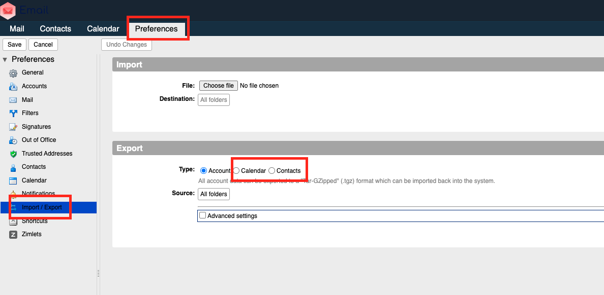
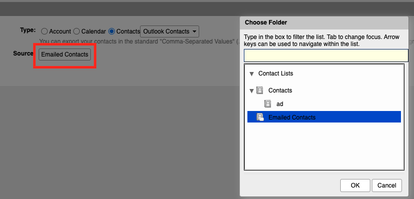
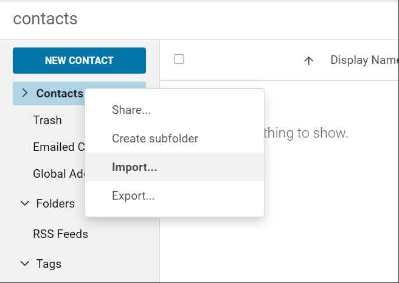
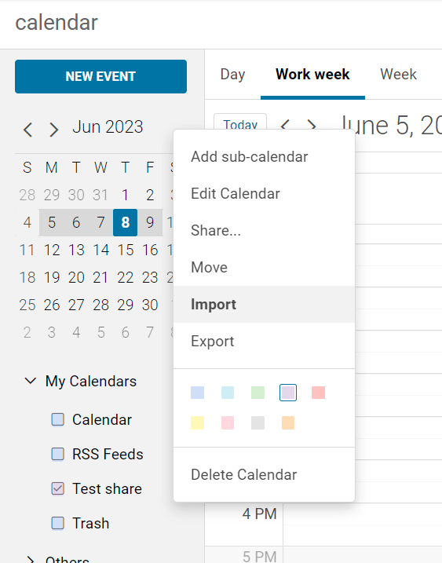

Per esportare od importare i contatti e calendari dall’interfaccia web di Zimbra procedere nel seguente modo:

### Visualizzazione Classica:

Cliccare su **Preferenze –> Import/Export** e selezionare la tipologia desiderata

Per i contatti selezionare la cartella desiderata, non è possibile esportare la root

### Visualizzazione Moderna

Cliccare su **Contatti** o **Calendari**, individuate il calendario o la cartella contatti desiderata e cliccando col tasto destro scegliete se importare o esportare:

#### Contatti

#### Calendari

