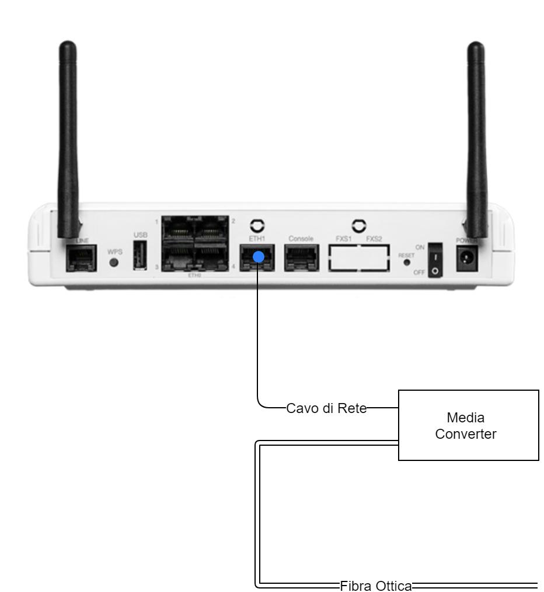

## Introduzione

In questa guida verrà illustrato come attivare la linea Radio tramite il collegamento del router direttamente all'alimentatore del modulo radio.

  

## Prerequisiti

Una volta acquistato il servizio RADIO, seguirà l'intervento di un tecnico per l'installazione degli apparati, previa appuntamento con il referente indicato in fase di ordinamento del servizio. Terminato l'intervento il tecnico avrà installato un modulo radio (antenna) sul tetto dell'edificio e una alimentatore (IDU) all'interno dell'edificio (generalmente nella sala CED). Di seguito lo schema generale dell'impianto:

  

Alimentatore Modulo Radio (IDU)

  

  

Una volta terminato l'intervento tecnico vi troverete il modulo Radio collegata alla presa "**Gigabit Data+Power**" e la porta "**Gigabit Data**" libera o con al massimo un cavo ethernet scollegato all'altra estremità.

## Guida passo-passo

Ora vi illustreremo come collegare il nostro router alla presa "**Gigabit Data**" dell'alimentatore del modulo radio.

### Router Aethra

All'interno della scatola del router Aethra troverete un cavo RJ45 (cavo ethernet o di rete), prendete questo cavo e collegate, una estremità alla presa **ETH1** del router Aethra e l'altra alla presa "**Gigabit Data**" dell'alimentatore del modulo radio.

- La porta etichettata come **LINE** è dedicata all'eventuale aggiunta di una seconda connettività.
- Tutte e 4 le porte etichettate come **ETH0** del router Aethra sono dedicate alla LAN del cliente. 

Una volta collegato il cavo come indicato e acceso il router, dopo alcuni minuti di boot, il led frontale etichettato come "**LINE**" da spento dovrebbe accendersi e rimanere stabile di colore verde. Se dopo diversi minuti dovesse rimanere spento oppure acceso ma di colore rosso, contattare il nostro servizio tecnico per verifiche sulla linea.

- Le porte dedicate alla LAN del cliente per questo router sono tutte e quattro le porte etichettate come "**ETH0**", per la precisione le porte "**1X**", "**2X**", "**3X**" e "**4X**"

### Router Cisco

All'interno della scatola del router Cisco troverete un cavo RJ45 (cavo ethernet o di rete), prendete questo cavo e collegate, una estremità alla presa **GE0/0** e l'altra, alla presa "**Gigabit Data**" dell'alimentatore del modulo radio.

- La porta etichettata come **VDSL/ADSLoPOTS** è dedicata all'eventuale aggiunta di una seconda connettività.
- La porta etichettata come **GE0/1** è dedicata alla LAN del cliente.

Una  volta collegato il cavo come indicato e acceso il router, dopo alcuni minuti di boot, la connettività dovrebbe essere funzionante. Se così non dovesse essere, contattate il nostro supporto tecnico per verifiche sulla linea.

- L'unica porta dedicata alla LAN del cliente per questo router è la porta etichettata come "**GE0/1**"

  

  

> [!NOTE]
> **Sommario**
> 
> 
> - [Introduzione](#introduzione)
> - [Prerequisiti](#prerequisiti)
> - [Guida passo-passo](#guida-passo-passo)
> -   [Router Aethra](#router-aethra)
> -   [Router Cisco](#router-cisco)
> * * *
> **Articoli collegati**
> 
> 
> - Page:
> [Attivazione linea FTTC/ADSL](/wiki/spaces/KB/pages/1966257612/Attivazione+linea+FTTC+ADSL)
> - Page:
> [Attivazione linea FIBRA P2P](/wiki/spaces/KB/pages/1966257539/Attivazione+linea+FIBRA+P2P)
> - Page:
> [Attivazione linea FTTH](/wiki/spaces/KB/pages/1966257466/Attivazione+linea+FTTH)
> - Page:
> [Attivazione linea Radio senza DCE](/wiki/spaces/KB/pages/1966257386/Attivazione+linea+Radio+senza+DCE)
> - Page:
> [Attivazione linea Radio con DCE Mikrotik](/wiki/spaces/KB/pages/1966257313/Attivazione+linea+Radio+con+DCE+Mikrotik)