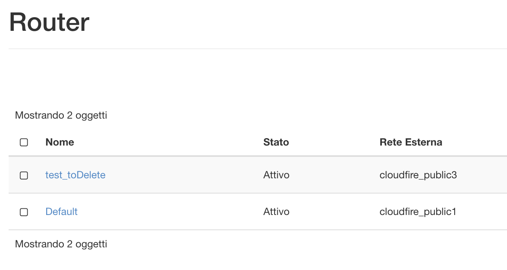
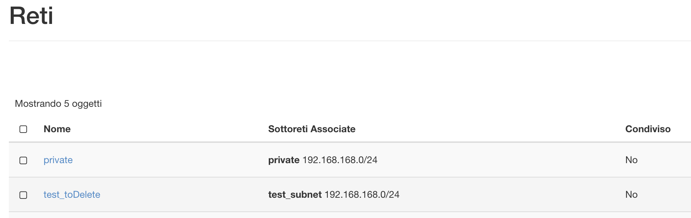
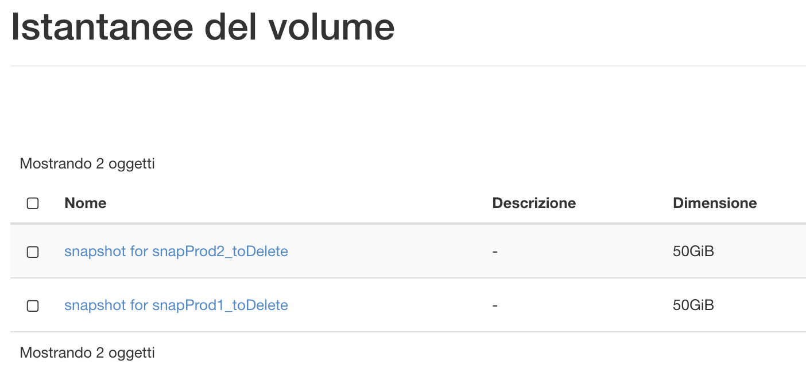
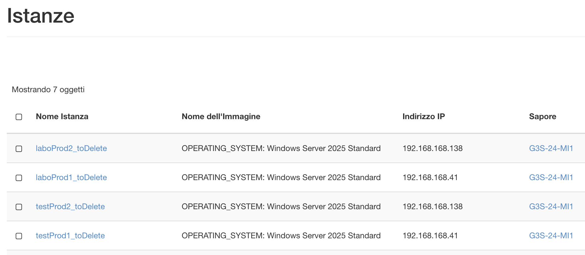
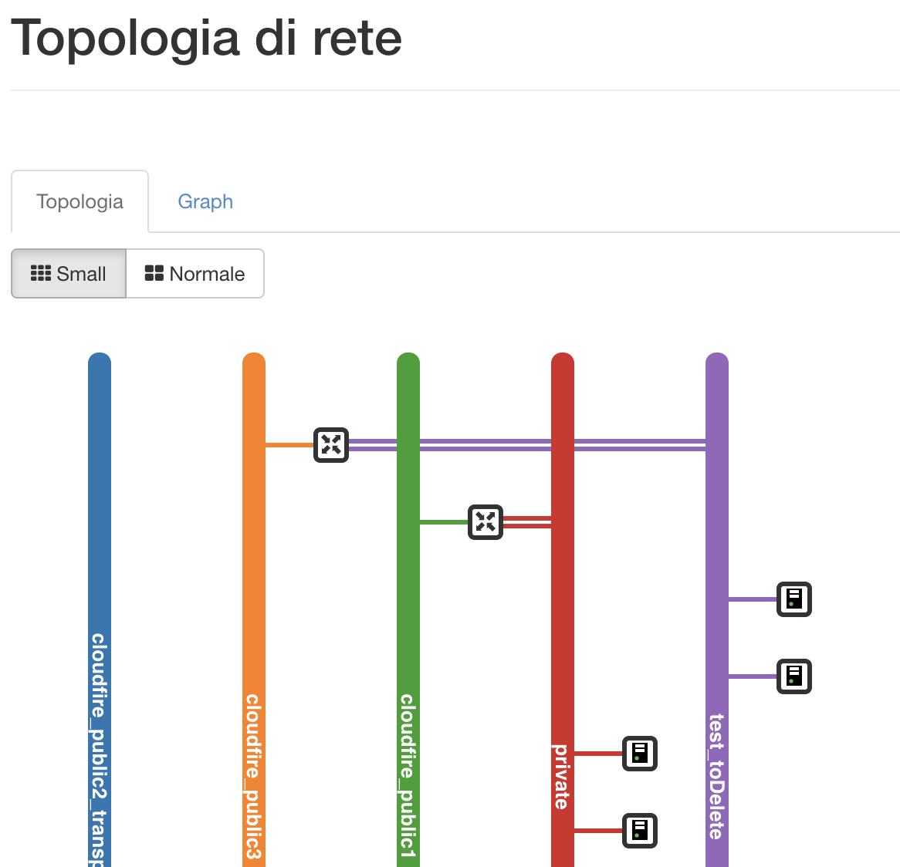

Per creare un ambiente di labo speculare alla produzione su OpenStack, senza utilizzare software esterni, si può procedere nel seguente modo:

- Creare un **nuovo Router**, per separare logicamente due subnet identiche;  

- Creare la Network, e conseguente Subnet, di labo;  

> [!INFO]
> La subnet di labo **deve essere** **la stessa** di quella di produzione, quindi **preparare le porte** con gli indirizzi IP statici delle VM di produzione che si vogliono testare.  
> Dichiarare **lo stesso gateway** della rete di produzione.

- All’interno del router di labo **aggiungere l’interfaccia**, selezionando la nuova subnet appena creata e in automatico verrà assegnato l’IP dichiarato come gateway (+ un secondo IP dal DHCP);
- A questo punto **creare gli snapshot** delle VM che si vogliono mettere in labo;  

- A partire dagli snapshot creare le nuove VM in parallelo, assegnando ad esse gli **IP corretti** della subnet di labo e i **security group necessari**;
- Si andrà quindi ad avere una configurazione speculare alla rete di produzione, ma isolata sotto un altro router e un altro IP pubblico.  

  
