## Coriolis

### Accesso Coriolis

accedere alla web page di coriolis utilizzando l'IP preso in DHCP con credenziali user : **admin** - password :  **CFCoriolis2019!**

In about-coriolis (in alto a destra, icona account) copiate l'appliance id e fornite il dato al supporto Cloudfire per l'attivazione licenza demo o produzione. 

  

Collegarsi a Coriolis Endpoints > Editare default con credenziali servizio public IP:

Username: ES. 19CF000000  
Password :  
Project name : ES.  19CF000000 - XXXXX  
Save & Validate

## Aggiungere Endpoint VMWare

Compilare con ip password vcenter. 

Aggiunto i target necessari andare nel menu **Replicas > Create a Replica**

  

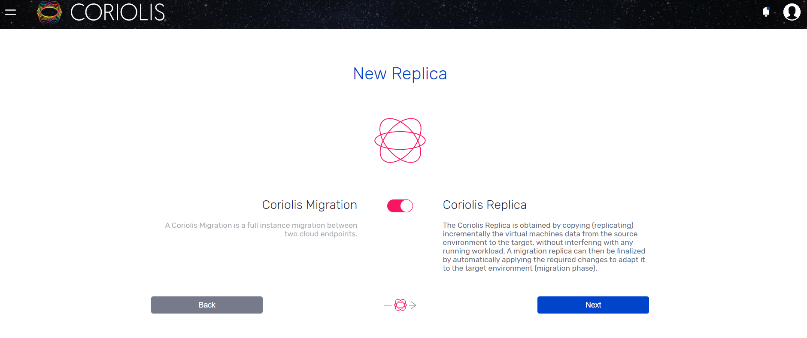

  

Next per procedere con la replica "Coriolis Replica"

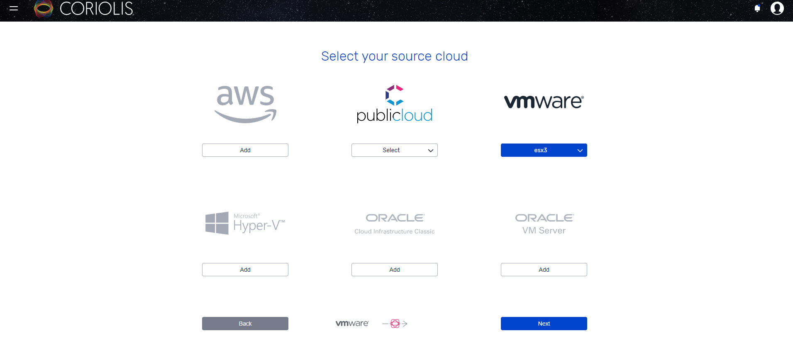

Selezionare la "Source", in questo caso un endpoint vmware chiamato esx3 come l'host puntato.

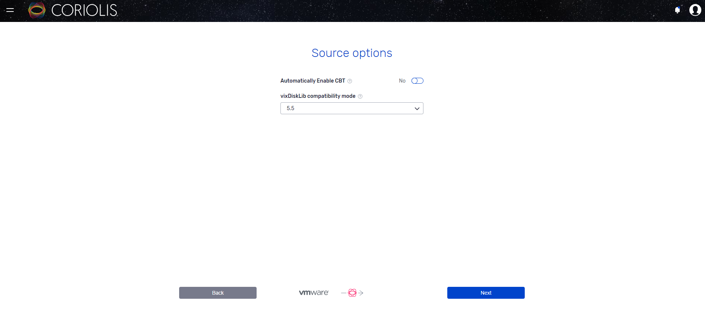

Selezionare la compatibilità della libreria in base alla versione di VmWare sugli host/vCenter

Inoltre forzare l'abilitazione del CBT nel caso non fosse attivo sulla macchina replicata (se sottoposta a backup incrementali questo è già in essere).

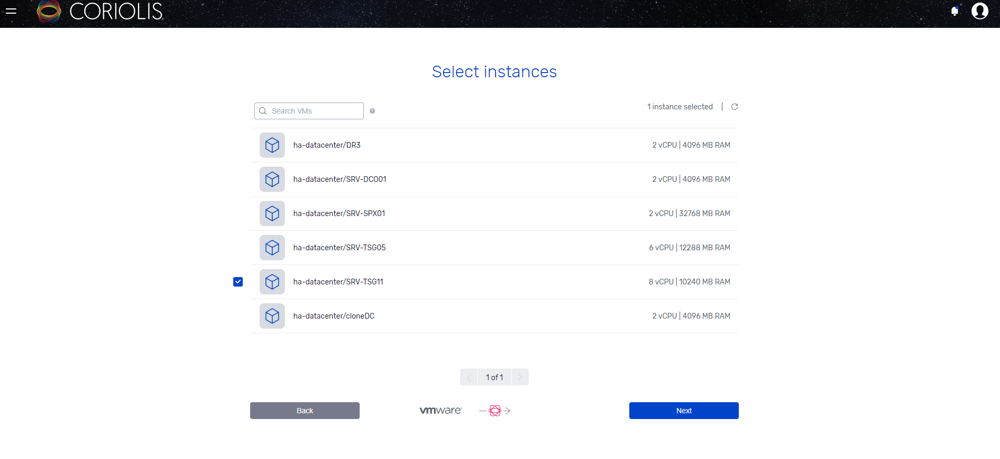

Selezionare la o le VM da replicare.

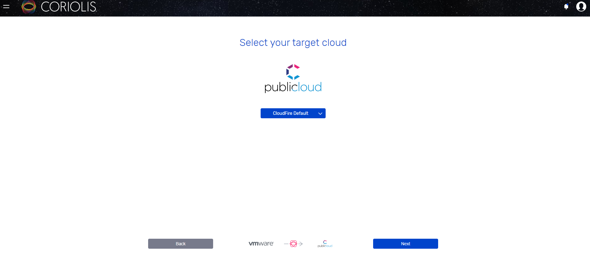

Selezionare l'endpoint di destinazione

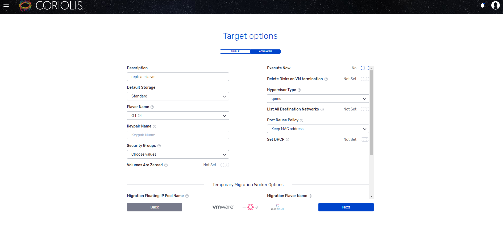

Definire quindi nelle Target options (ADVANCED) se eseguire o meno la replica subito.

Definire qual'è lo storage di Default che verrà utilizzato (tipo di storage di destinazione).

Impostare qemu come tipo di Hypervisor.

Definire il Flavor che soddisfi i requisiti richiesti della macchina di partenza.

Decidere se mantenere o meno il MAC Address (necessario in alcuni casi per software che fanno binding della licenza al mac address).

Forzare o meno il DHCP sulla macchina in Openstack as a Service.

Selezionare il security group da applicare all'istanza replicata (il default è assegnato automaticamente).

Selezionare il keypair name da assegnare nel caso sia un'istanza linux based.

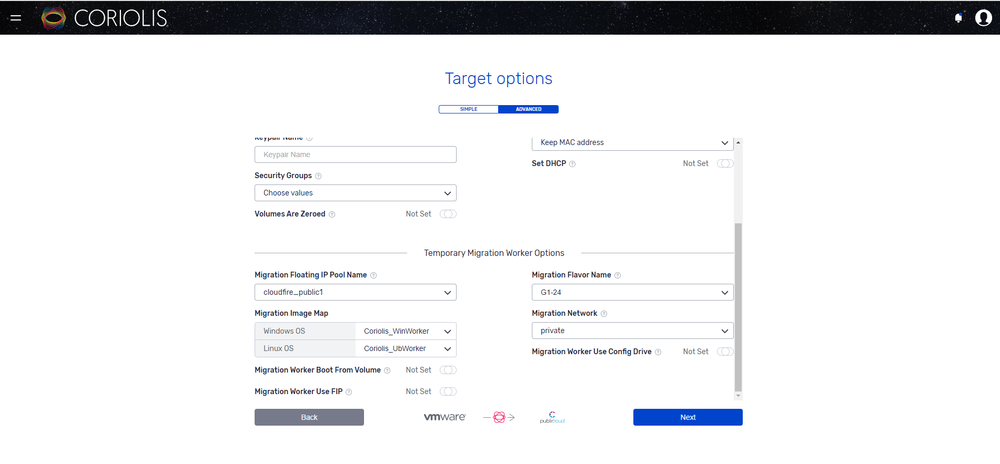

cloudfire\_public1 sarà il pool di allocazione del floating ip.

Migration flavor name, che definirà le risorse della macchina temporanea "Worker".

Definire la mappatura delle immagini per la migrazione (come da immagine).

Selezionare la network di destinazione, facendo attenzione che abbia accesso a internet.

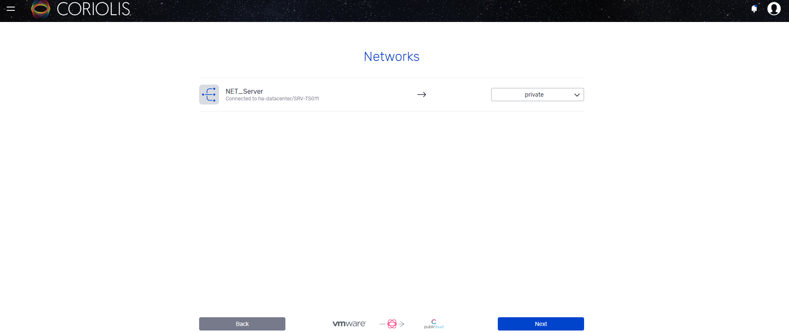

Specificare la mappatura delle singole schede di rete.

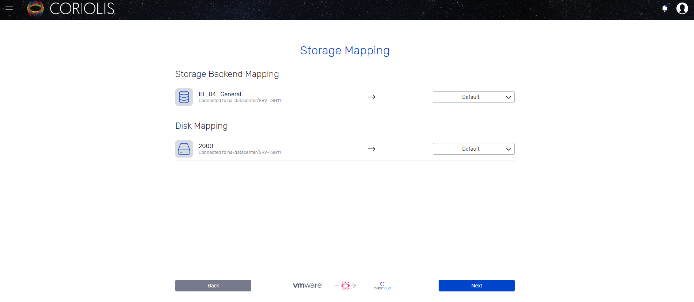

Specificare la mappatura dei dischi. Se lasciate Default, verrà utilizzato quello specificato nel punto precedente: "Target oprions".

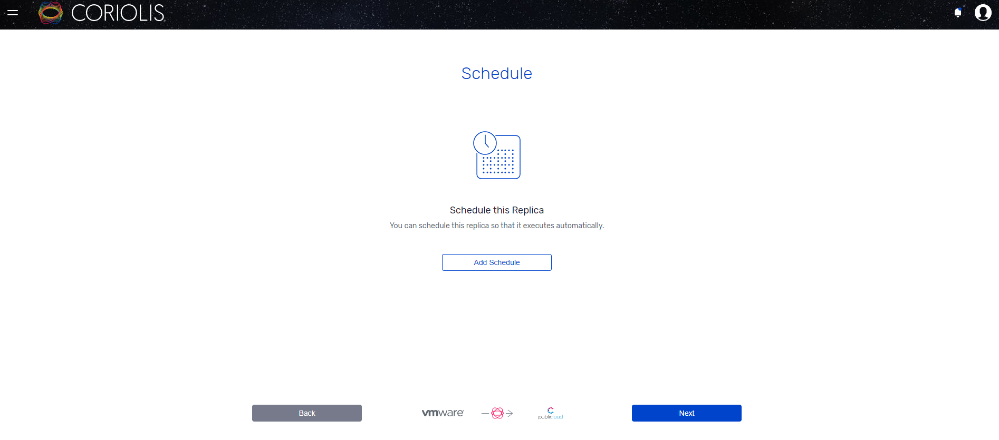

Specificare una schedulazione, nel caso si intendesse effettuare più repliche incrementali prima della migrazione.

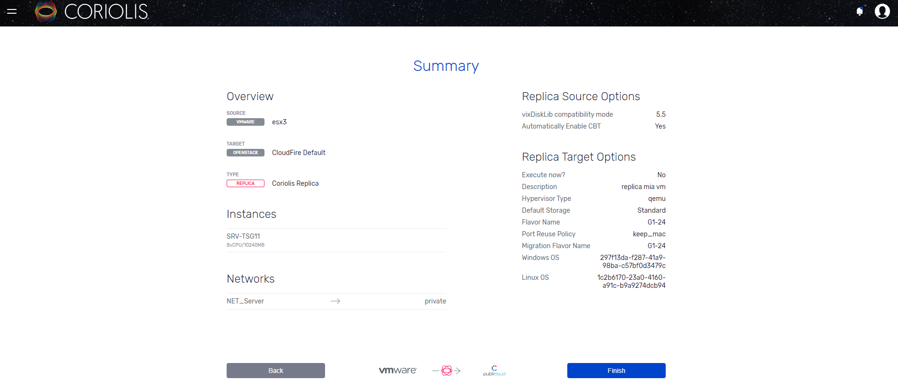

Visualizzare il riepilogo e proseguire.

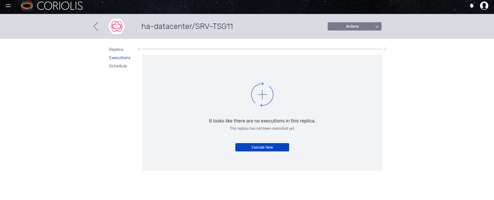

A questo punto potete lanciare la replica.

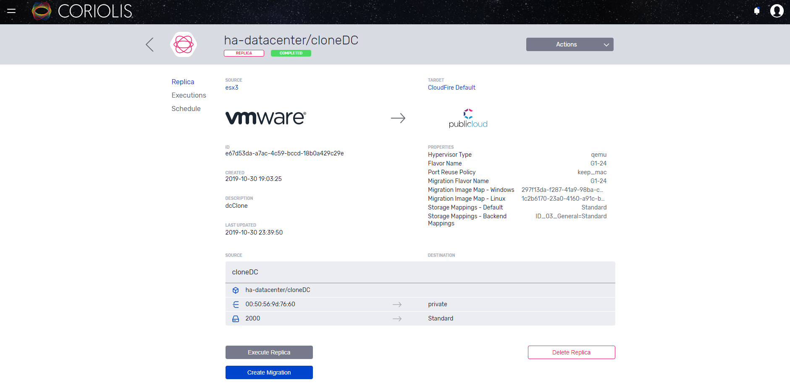

A replica completata, quando siete pronti alla definitiva migrazione potete procedere con la sua creazione: "Create Migration".

Ciò porterà alla creazione dell'istanza in cloud.