## Introduzione

In questa guida vi illustreremo come eseguire il deploy di Firewall Sophos su Openstack as a Service

## Guida passo-passo

- Dalla vostra dashboard di gestione **Openstack as a Service** spostarsi nel setto menù **Compute → Instances** e cliccare su **Launch Instance**

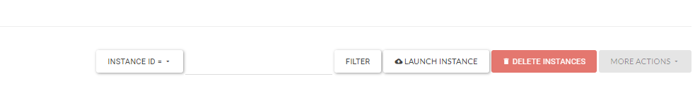

- In questa prima schermata inserire l'**Instance Name** ed eventualmente una **Description** e in seguito cliccare su **Next**
- Nella schermata seguente, nella sezione **Select Boot Source** selezionare **Image,** potete lasciare invariata la sezione **Volume Size** e a vostra discrezione se selezionare **Yes** o **No** sull'opzione **Delete Volume on Instance Delete.**Dall'elenco sottostante cliccare sulla freccia che punta verso l'alto in corrispondenza dell'immagine **SECURITY: Sophos 18.0.3 MR-3 Part 1.**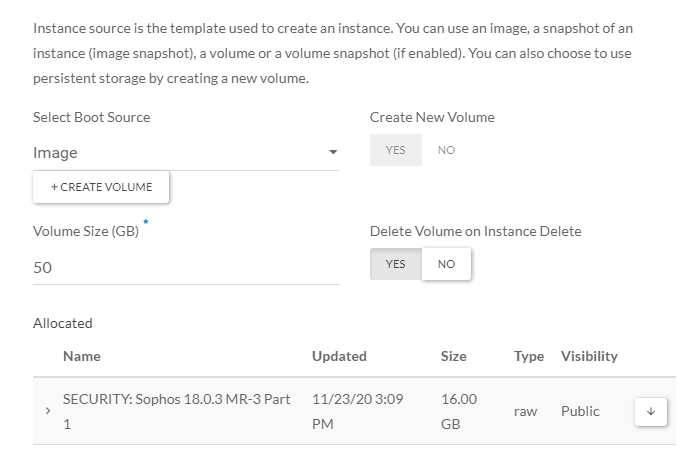
- Cliccate su **Next**
- Nella schermata seguente vi si chiederà di scegliete il **Flavor**, cliccate sulla freccia verso l'alto in corrispondenza del **Flavor G1-24**.

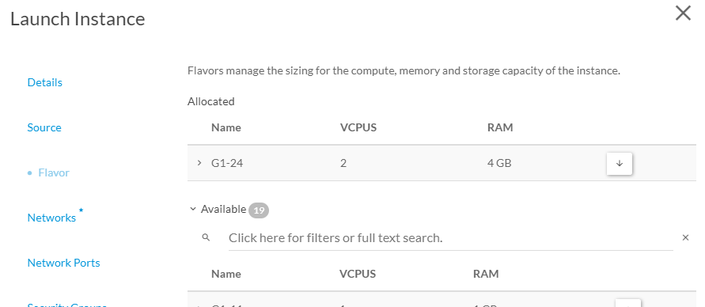

Ora vi sarà richiesto di aggiungere le network alla vostra appliance Sophos.

> [!INFO]
> **ATTENZIONE, in questa sezione dovete obbligatoriamente fare le seguenti 2 operazioni:**
> 1. Rispettate l'ordine di inserimento delle Network indicate di seguito.
> 2. Inserire almeno 2 network.
> Questo per evitare problemi durante la creazione dell'istanza.

- Selezionate come **Prima** Network la rete che verrà associata all'interfaccia di **LAN** del firewall.Selezionate come **Seconda** Network la rete che verrà associata all'interfaccia di **WAN** del firewall (essendo una security appliance questa rete dovrebbe essere la **cloudfire\_public2\_trasparent**)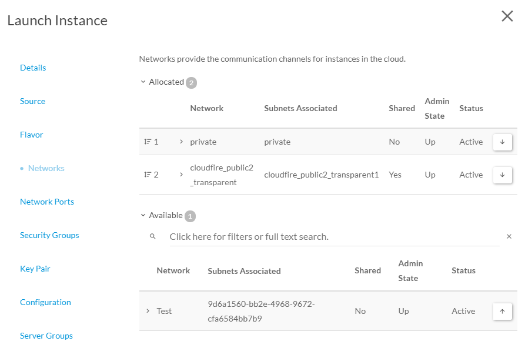
- Fatto questo, il resto del Wizard può essere bypassato e quindi potete tranquillamente cliccare su **Launch Instance**
- Terminato lo spawning dell'istanza cliccate sul a menù a tendina in corrispondenza di essa e spegnerla cliccando su **Shut off Instance**

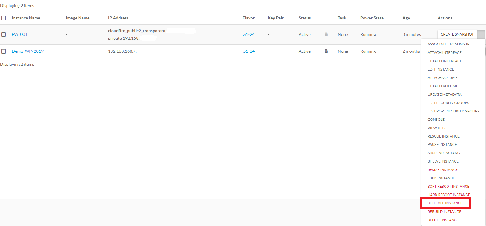

- Ora dobbiamo creare il volume secondario (dedicato ai report) e collegarlo all'istanza appena creata. Spostatevi nel sotto menù **Volumes → Volumes** e cliccate su **+Create Volume**

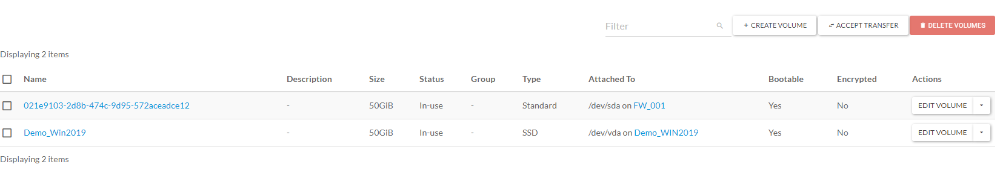

- Date un nome al nuovo volume, specificate **Image** come **Volume Source** e di seguito, nella sezione **Use Image as a source,** selezionate **SECURITY: Sophos 18.0.3 MR-3 Part 2,** lasciate pure il resto invariato

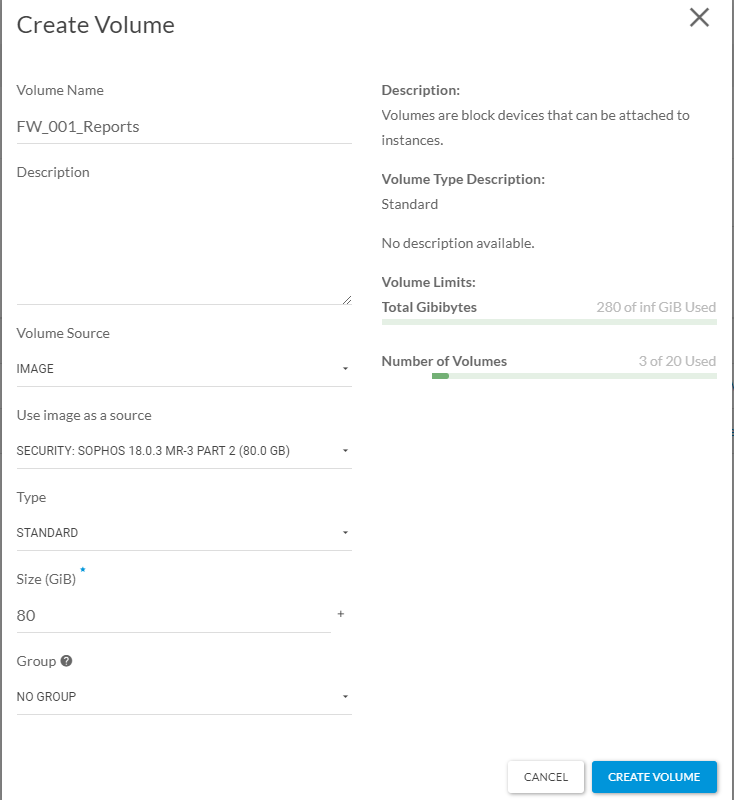

- Cliccate su **Create Volume**
- Una volta creato il volume dobbiamo collegarlo all'istanza appena create per cui cliccate sul menù a tendina in corrispondenza di questo Volume e cliccate su **Manage attachements**

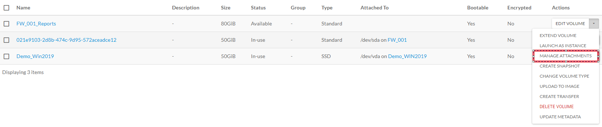

- Nella finestra che apparirà selezionate l'istanza Sophos creata in precedenza e poi cliccate su **Attach Volume**

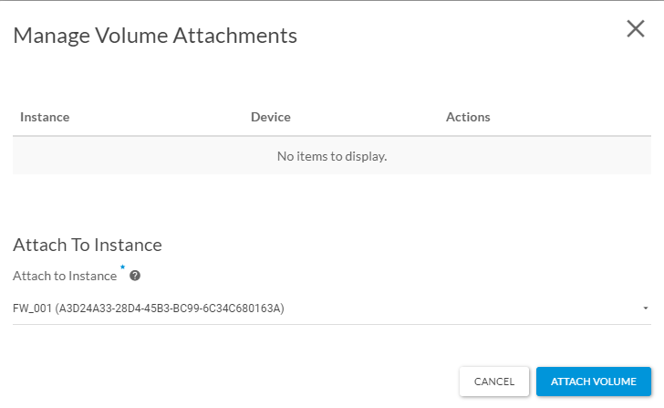

***Ora possiamo avviare nuovamente la nostra istanza.*** 

- Torniamo al sotto menù **Compute → Istances** e clicchiamo su **Start Instance** in corrispondenza della nostra istanza Sophos. Attendere qualche secondo e poi, sempre dal menù a tendina, selezionare **Console.**  
Il boot della macchina dovrebbe terminare correttamente e restituirvi il seguente output: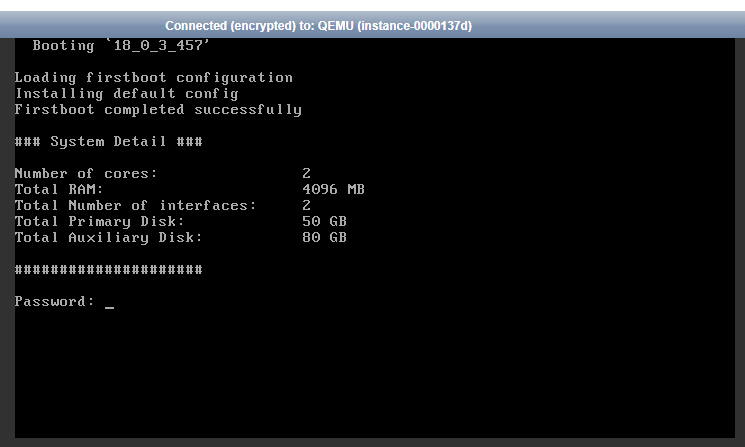
- Inserendo la password di default (**admin**) e accettando l'eula di seguito, accederete al menù di gestione del firewall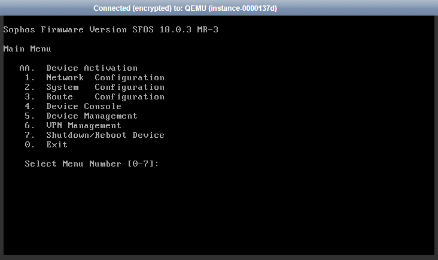

Ora la macchina è attiva e funzionante, ma per avviare il wizard via web dobbiamo abilitare l'accesso dall'esterno all'istanza, per cui selezionando il menù **4** entrerete nella console del device e dovrete inserire il seguente comando e dare invio:

```
system appliance_access enable
```

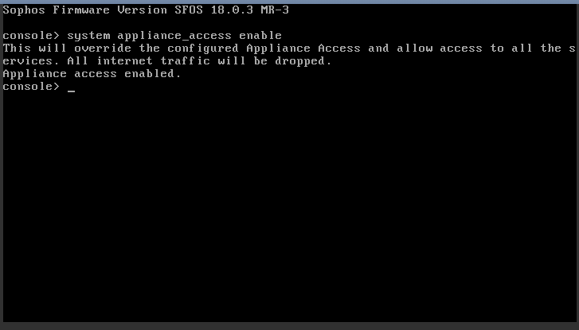

- In secondo luogo, tornando alla dashboard del **Openstack as a Service,** spostatevi nel sotto-menù **Network→Security Groups** e cliccate su **Manage Rules** in corrispondenza del gruppo **default.**Una volta al suo interno aggiungete una regola cliccando su **Add Rule** in modo da poter abilitare il vostro IP come trusted, in modo che la piattaforma vi permetta di accedere alla web-GUI.  
  
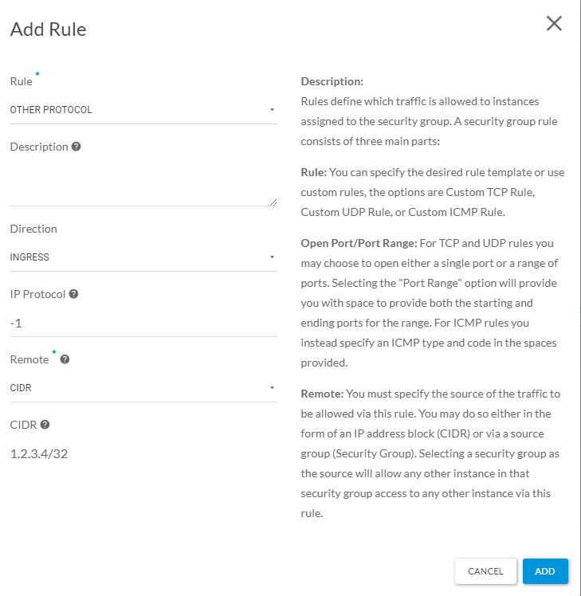
- In questo esempio, i campi sono compilati per lasciare aperte tutte le porte e protocolli dall'IP 1.2.3.4.Fatto questo aprite il vostro browser e collegatevi, all'URL di gestione del firewall, che sarà: ['**https://ip\_pubblico\_assegnato:4444**']('https://ip_pubblico_assegnato:4444'.)
- Una volta collegati alla web-GUI del firewall eseguite il wizard. Unica cosa obbligatoriamente da modificare, in fase di configurazione delle interfacce di rete:
1.   selezionare come modalità di funzionamento **This firewall (Route mode)**
2.   come IP inserire l'IP privato assegnato all'istanza e relativa sub-net
3.   Disabilitare **Enable DHCP.**

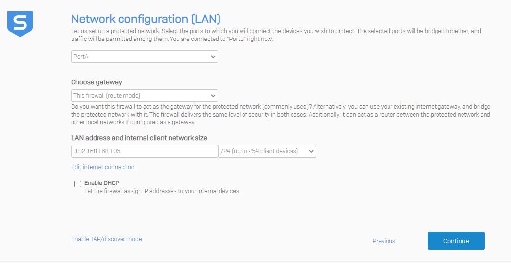

- Terminato il wizard l'appliance si riavvierà perdendo l'opzione di accesso remoto, per cui una volta riavviato tornate in **Console** (punto precedente) e ridate il comando **system appliance\_access enable.**
- Ora potete accedere alla configurazione finale del Firewall e per far funzionare correttamente l'interfaccia di **LAN.**Spostatevi nel menù **Network** ed editate l'interfaccia di **LAN.**Nelle **Advanced settings** modificate l'MTU ed abbassatela a **1450** e cliccate su **Save.**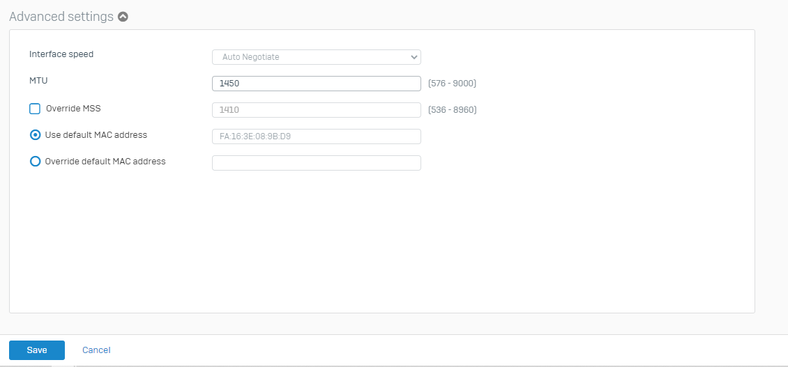
- Tornate sulla dashboard del **Openstack as a Service,** nel sotto menù **Compute → Instances**, cliccate sul nome della vostra istanza Sophos, spostatevi nel form **Interfaces** e cliccate su **edit** in corrispondenza dell'intefaccia di LAN. Fatto questo de-selezionate l'opzione **Port Security.**  
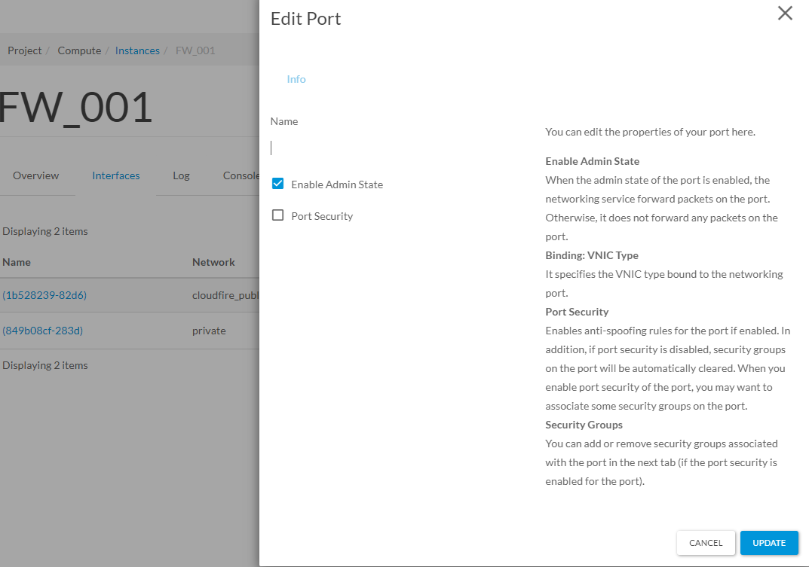
  
Così facendo dovreste vedere la porta di LAN **Connected,** e se avete una macchina sulla stessa subnet dovreste poter pingare l'interfaccia ed entrare in web-GUI dall'IP di **LAN.**

***La configurazione di base è completata, piccolo tips rimasto in sospeso:***

- Ora l'appliance è ancora temporaneamente accessibile dall'IP pubblico grazie al comando **system appliance\_access enable,** se la volete rendere permanentemente raggiungibile vi basterà modificare i permessi nella sezione **Administration → Device Access.**
- Se invece volete renderla inaccessibile vi basterà, o riavviarla oppure rientrare in console e dare il comando **system appliance\_access disable.** In questo caso si consiglia di rimuovere anche la regola aggiunta nel **Security Group deault.**

  

  

> [!NOTE]
> **Sommario**
> 
> 
> 
> - [Introduzione](#introduzione)
> - [Guida passo-passo](#guida-passo-passo)
> * * *
> **Articoli collegati**
> 
> 
> - Page:
> [Recovery VM su Openstack as a Service via Acronis Cyber Backup Service](/wiki/spaces/KB/pages/2012610561/Recovery+VM+su+Openstack+as+a+Service+via+Acronis+Cyber+Backup+Service)
> - Page:
> [Security](/wiki/spaces/KB/pages/1966254934/Security)
> - Page:
> [VPNaaS - Sonicwall Firewall](/wiki/spaces/KB/pages/1966248911/VPNaaS+-+Sonicwall+Firewall)
> - Page:
> [Migrazione VM su Openstack as a Service via Acronis Universal Restore](/wiki/spaces/KB/pages/1966248673/Migrazione+VM+su+Openstack+as+a+Service+via+Acronis+Universal+Restore)
> - Page:
> [Deploy Sophos Firewall su Openstack as a Service](/wiki/spaces/KB/pages/1966248396/Deploy+Sophos+Firewall+su+Openstack+as+a+Service)