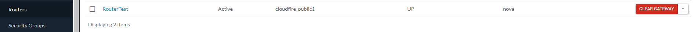
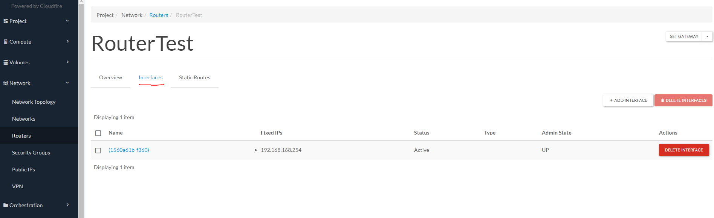
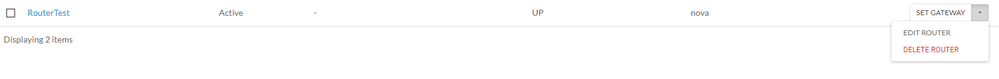
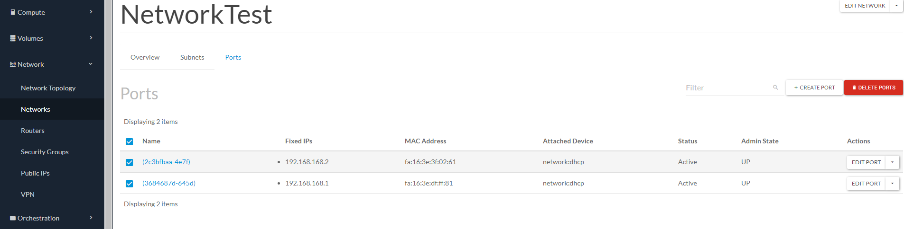
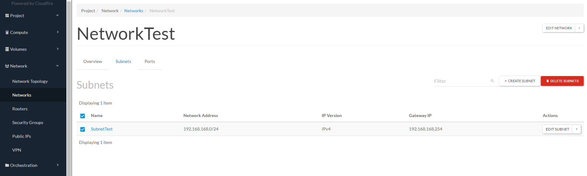

Data la stretta codipendenza degli elementi nell’ambiente Openstack as a Service, l’eliminazione di un router e della rete annessa prevede una sequenza obbligata.

Premessa: si presuppone che non vi siano macchine attive sulla network di cui componenti andremo a toccare; il minimo requisito è quello di non avere floating (public) ip assegnati a macchine in una qualsiasi subnet “attaccata” al router.

Portatevi nella sezione Network -> Routers

Effettuate il “CLEAR GATEWAY” cliccando sul bottone rosso relativo al vostro router.

Spostatevi all’interno del router cliccando sul suo Nome e spostatevi sotto “Interfaces”.

Quindi procedete con il delete dell’interfaccia (corrispondente al gateway della subnet).

Ora portatevi nuovamente in Network -> Routers e potete procedere con la cancellazione del router con la specifica voce del relativo menù contestuale.

A questo punto potete recarvi nella sezione Network -> Networks

Sotto Ports, selezionate tutte le porte e procedete con la cancellazione: “DELETE PORTS”

Sotto Subnets effettuate la stessa operazione di cancellazione.

Ora, finalmente, sotto Network -> Networks potete selezionare la Rete e procedere con la sua eliminazione.