## Introduzione

Procedura di recupero di una VM via Acronis Universal Restore su Public Cloud.

- [Introduzione](#introduzione)
- [Prima di cominciare](#prima-di-cominciare)
- [Guida passo-passo](#guida-passo-passo)
-   [Metodo 1 - Agente installato su Nuova VM](#metodo-1-agente-installato-su-nuova-vm)
-   [Metodo 2 - Immagine Acronis Universal Restore.](#metodo-2-immagine-acronis-universal-restore)
  
  -   Filter by label

## Prima di cominciare

Visto che questa procedura prevede la creazione di una nuova macchina e il successivo recupero del punto di ripristino su di essa si consiglia di salvarsi le info riguardanti la rete della macchina da recuperare per cui **porta** e **security group** applicati.

- **Porta:** dalla dashboard del public cloud spostarsi nella sezione **Network → Networks,** selezionare la rete corrispondente e spostarsi su **ports.** Copiatevi le varie info relative alla porta: IP e Mac-Address.  
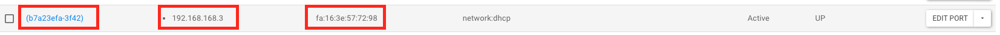

> [!WARNING]
> Se la macchina ha il **Floating IP** salvatevi l’IP in modo da portelo assegnare poi alla nuova macchina.

- **Security groups:** dalla dashboard del public cloud spostarsi nella sezione **Compute → Instances** dal menù a tendina selezionare **Edit Security Groups** e salvarsi quelli applicati alla macchina in modo da assegnarli poi alla nuova.  
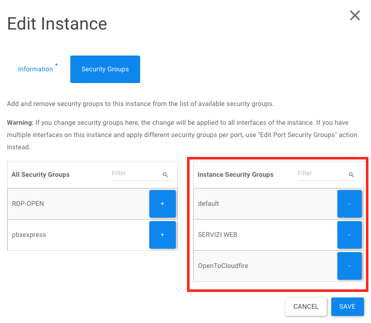

## Guida passo-passo

### Metodo 1 - Agente installato su Nuova VM

- Creare una nuova VM all’interno del progetto Public Cloud con le stesse caratteristiche della macchina da recuperare (S.O, Flavor e dischi), e su una rete che possa navigare.
- Installare sulla nuova VM l’agente di Acronis e registrarlo sullo stesso tenant dove sono presenti i backup della macchina da recuperare.
- Una volta registrata la nuova VM spostarsi sulla dashboard di Acronis e procedere come segue:
- Spostarsi nella sezione **Backup Storage** e selezionare il punto di ripristino che si vuole recuperare e cliccare su recover → entire machine.  
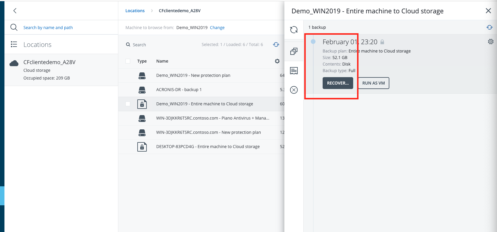
- Nella schermata che appare selezionare:
-   Recover to: **Physical machine**
-   Target machine: **La macchina nuova appena registrata sul tenant**
-   Disk Mapping: **di default dovrebbe mapparli correttamente**  
  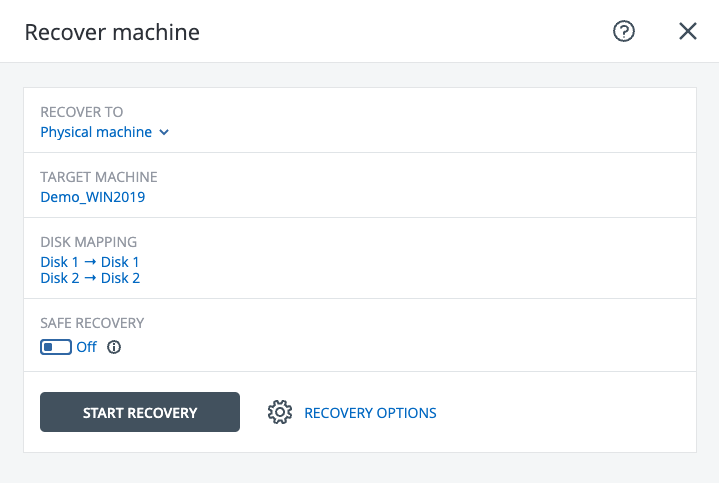

- Cliccate su **Start recovery**
- Partirà il processo di recupero della macchina, potete controllarne lo stato dalla sezione **Monitoring → Activities.**
- Una volta terminato il recovery la macchina verrà riavviata e ripartirà dallo stato presente nel punto di ripristino utilizzato.

### Metodo 2 - Immagine Acronis Universal Restore.

- Creare un’istanza a partire dall’immagine “Acronis\_BaaS\_UniversalRestore\_15”, dimensionamento identico alla macchina che dovete recuperare (sia a livello di flavor che di disco) e network con libero accesso a internet e senza l’utilizzo di “Key Pair” per l’autenticazione.  
  
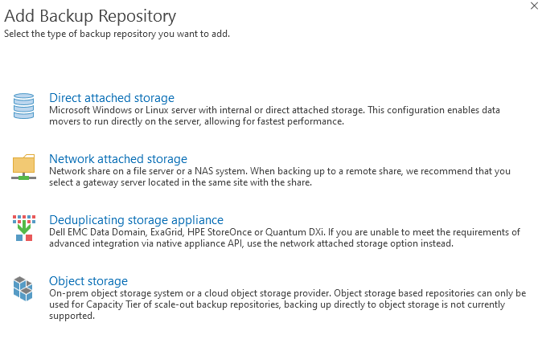

> [!INFO]
> Tutte le operazioni sono eseguite via console su Public Cloud.

- Selezionare “**Manage this machine locally**”.  
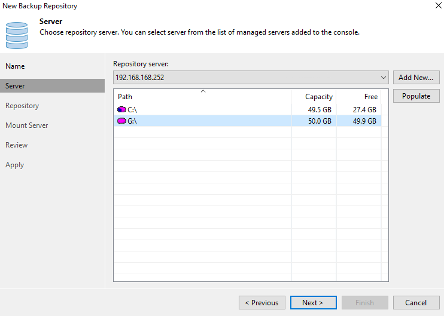
- Recarsi sotto “**Tools**” -> “**Configure Network**” e verificare che l’ip sia assegnato correttamente all’interfaccia di rete. In caso contrario impostatelo manualmente affinché sia concorde alle impostazioni della porta di rete su cui risiede.  
a questo punto potete procedere con il restore della VM.  
- Cliccare quindi su “**Recover**”.  

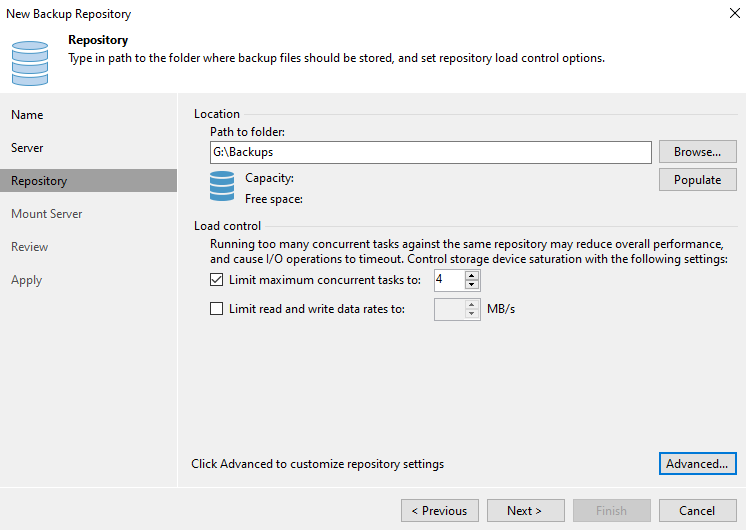

- Sotto “**What to recover**” cliccate sulla sezione “**Required**”.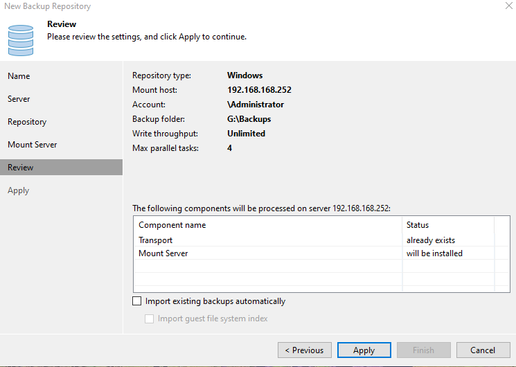

- Qui cliccate su “**Browse…**” e nella schermata successiva, in “**Cloud storage**” effettuate il login con le vostre credenziali di Acronis Smart Backup.  
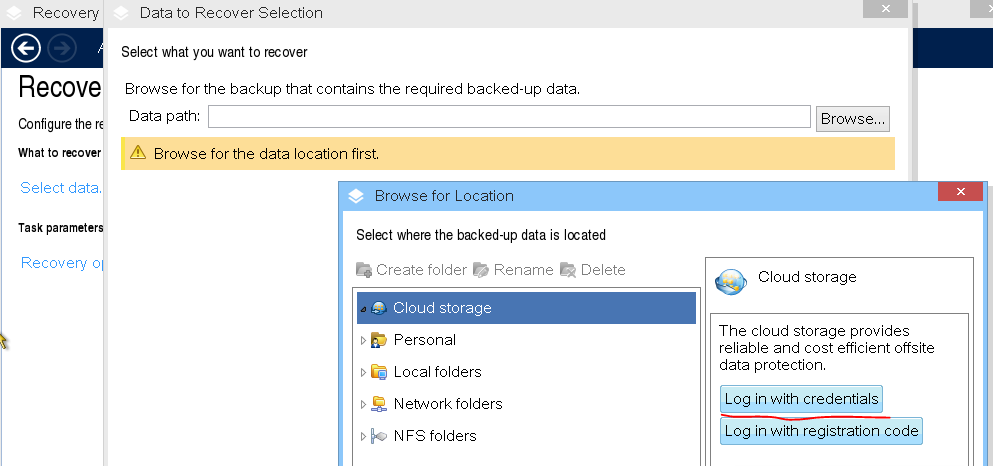

- Potrete quindi selezionare la cartella in cloud corrispondente al vostro tenant e cliccare su OK per proseguire.
- Qui selezionate l’archivio relativo alla macchina da recuperare, il recovery point che vi interessa, visualizzate il tipo di “**Backup contents**” come “**Disks**” e selezionate il disco da recuperare.  
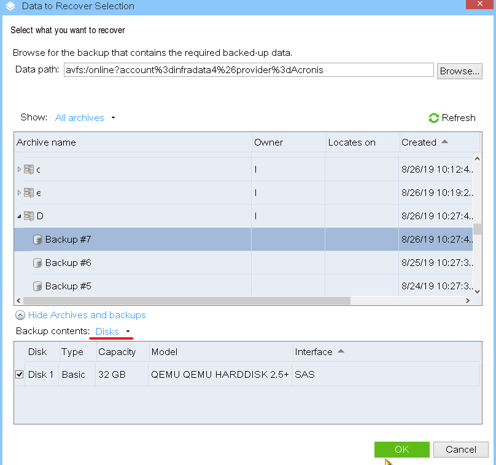
- In caso di un solo disco/volume di destinazione, l’assegnazione origine-destinazione avviene automaticamente. Altrimenti se si vuole personalizzare l’assegnazione, lo si può fare nell’opzione specifica a sinistra.  
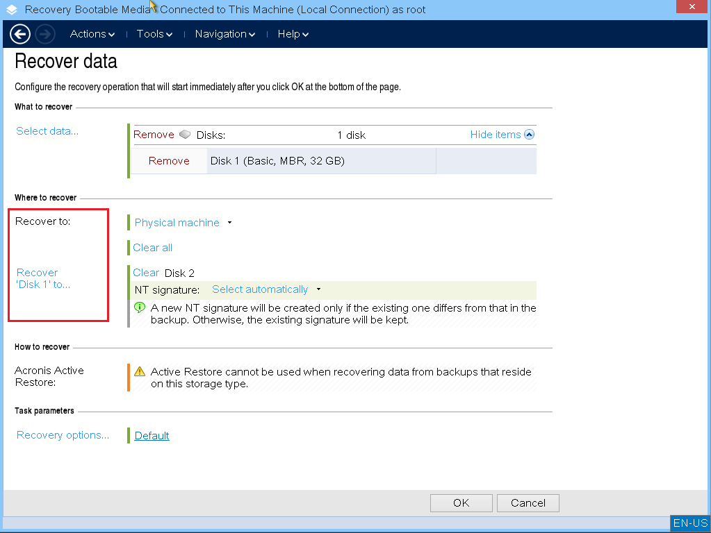

- Cliccare quindi **ok** per far partire il task.
- Alla fine del recovery job (**Result Succeeded**), potete chiudere la schermata e riavviare la macchina. Che dovrebbe ripartire con il sistema operativo all’utlimo recovery point aggiornato.  
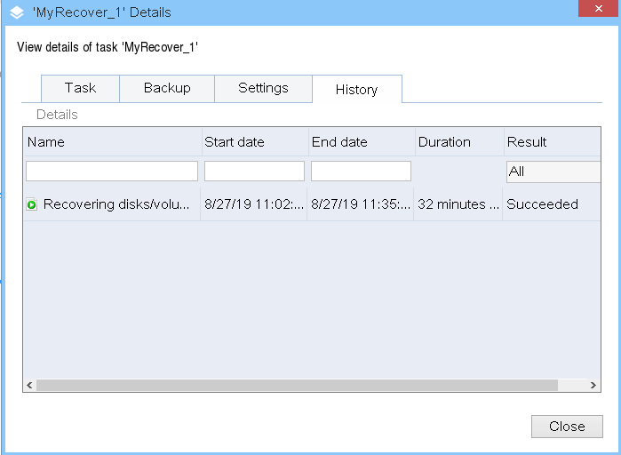

  

> [!NOTE]
> **Sommario**
> 
> 
> - [Introduzione](#introduzione)
> - [Prima di cominciare](#prima-di-cominciare)
> - [Guida passo-passo](#guida-passo-passo)
> -   [Metodo 1 - Agente installato su Nuova VM](#metodo-1-agente-installato-su-nuova-vm)
> -   [Metodo 2 - Immagine Acronis Universal Restore.](#metodo-2-immagine-acronis-universal-restore)
>   
>   -   Filter by label
> * * *
> **Articoli collegati**
> 
> 
> ##### Filter by label
> 
> There are no items with the selected labels at this time.