## Introduzione

In questa guida vi illustreremo come realizzare un tunnel VPN tra un firewall locale Fortigate e il servizio VPN offerto da Openstack as a Service

## Prerequisiti

Per evitare problemi di NAT è consigliabile che la WAN del FortiGate sia configurata con un IP Pubblico e quindi non sia presente NAT tra il firewall stesso e il router d''accesso a Internet.

## Guida passo-passo

### Configurazione VPNaaS

Eseguite l'accesso al vostro progetto **Openstack as a Service** e spostatevi nel sotto-menù **Network → VPN.**

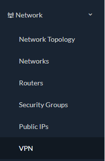

Nella compilazione delle varie Policy **Name** e **Description** potete compilarli a vostra discrezione.

- All'interno del form **IKE Policies** cliccate su **\+ ADD IKE POLICY** e compilate i campi come segue:

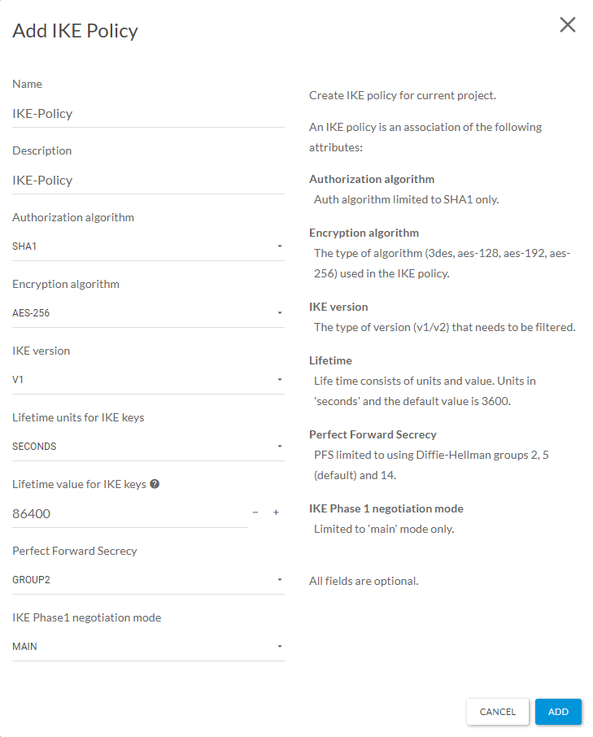

- Cliccate su **ADD** e passate al form **IPsec Policies**.

**All'interno del form IPsec Policies cliccate su +ADD IPSEC POLICY e compilate i campi come segue:**

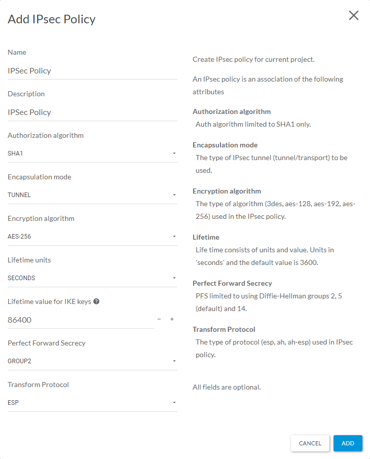

- Cliccate su **ADD** e passate al form **VPN Services.**

**All'interno del form VPN Services cliccate su +ADD VPN SERVICE e compilate i campi:**

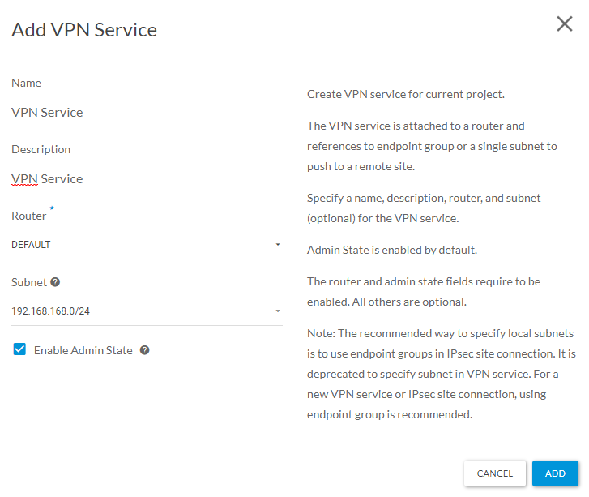

- Come **Router** selezionate il Router Virtuale posto davanti alla rete privata in cloud che volete connettere in VPN.Come **Subnet** selezionate la rete privata in cloud che volete connettere in VPN.
- Cliccate su **ADD** e passate al form **Endpoint Groups.**

**All'interno del form Endpoint Groups dovrete creare 2 endpoint, uno per la rete locale e una per la rete in cloud.**

- Cliccate su **+ENDPOINT GROUP.**  
Endpoint per la rete remota (subnet locale dietro al vostro FortiGate):

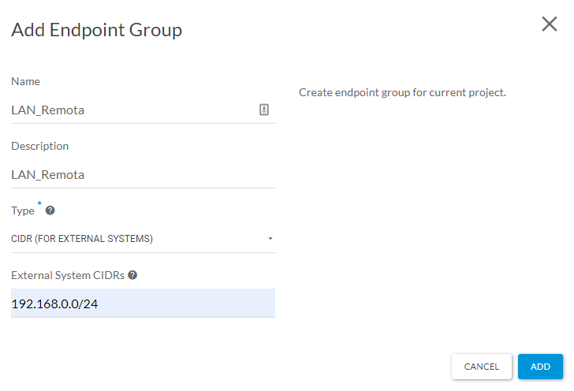

> [!INFO]
> Nel campo **External System CIDRs** inserire l'indirizzo di rete della rete LAN dietro al vostro FortiGate

#### Endpoint per la rete in cloud (subnet locale dietro il router del Openstack as a Service)

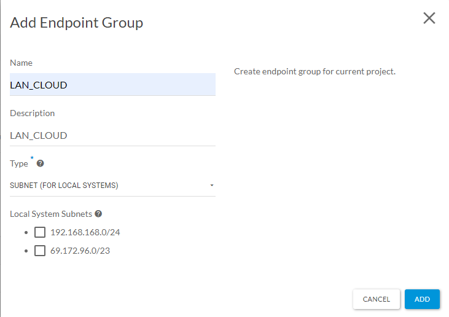

Infine spostatevi nel form **IPsec Site Connections,** cliccate su **+ADD IPSEC CONNECTION** e compilate i campi come seguono:

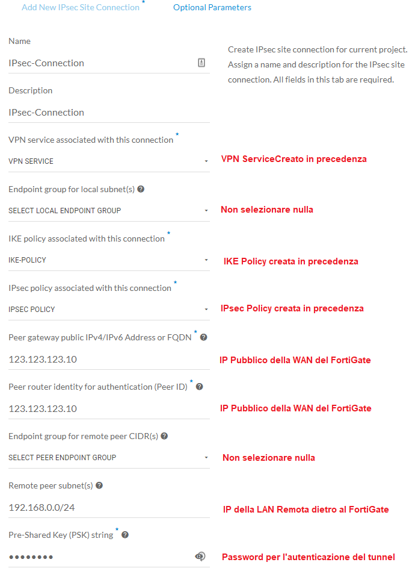

Cliccate su **ADD**  e passate alla configurazione del vostro FortiGate.

### Configurazione FortiGate

#### **Abilitare la funzione di Policy-based IPsec VPN.**

Entrare nella GUI del vostro FortiGate, spostarsi nel sotto-menù **System → Feature Visibility** e abilitare l'opzione **Policy-based IPsec VPN:**

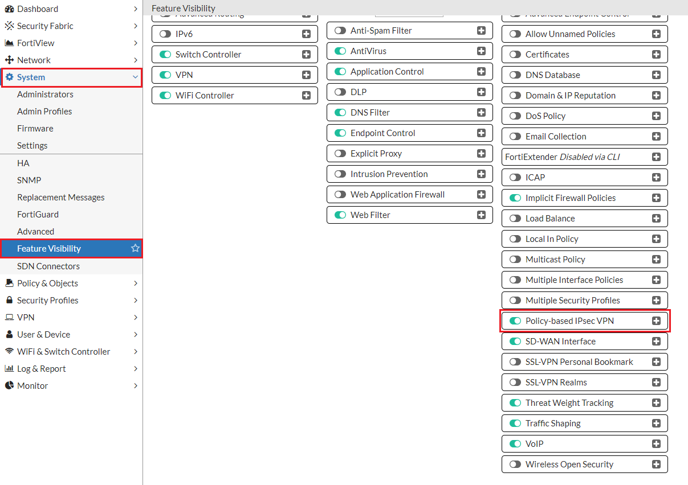

#### Creare l'oggetto "address per la rete remota"

Spostarsi nel sotto-menù **Policy & Objects → Addresses,** cliccare su **+Create New** ed inserire l'indirizzo IP della subnet privata in cloud.

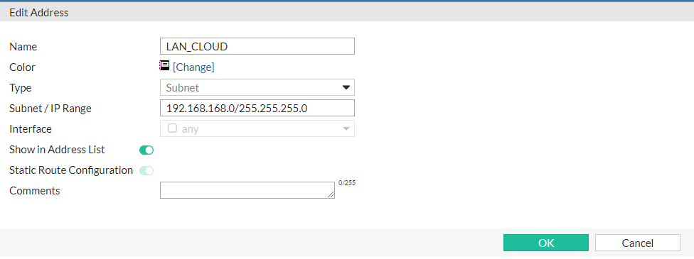

#### Creare il tunnel VPN

Spostarsi nel sotto-menù **VPN → IPsec Wizard,** cliccate su **Custom** ed inserite il nome del vostro Tunnel VPN: 

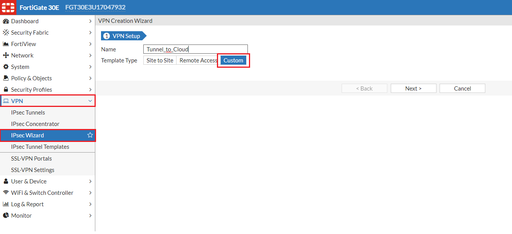

Cliccate su **Next** e compilate i vari form come segue:

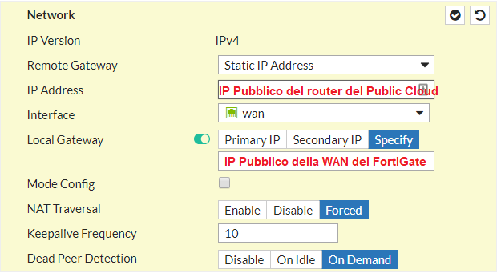

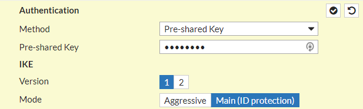

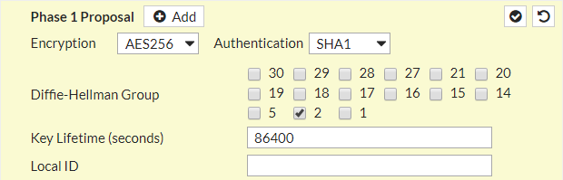

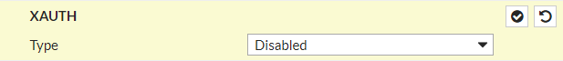

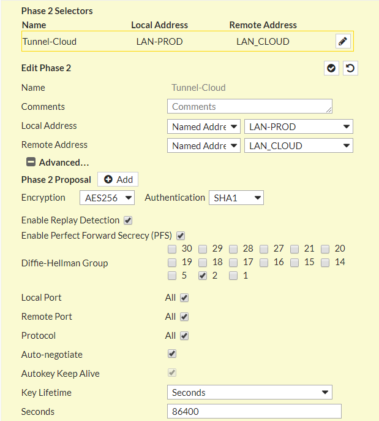

#### Creare le ACL per permettere il traffico Cloud ↔ LAN attraverso il Tunnel

Spostarsi nel sotto-menù **Policy & Objects → IPv4 Policy,** cliccare su **+Create New** e compilare i campi come segue:

**LAN → Cloud**

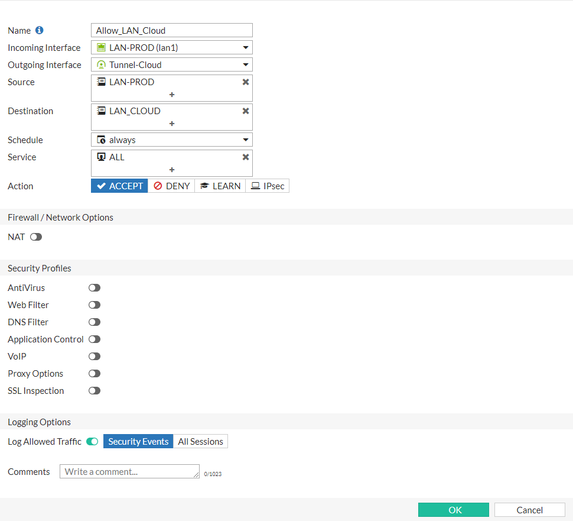

Creare una seconda ACL per il traffico inverso:

**Cloud → LAN**

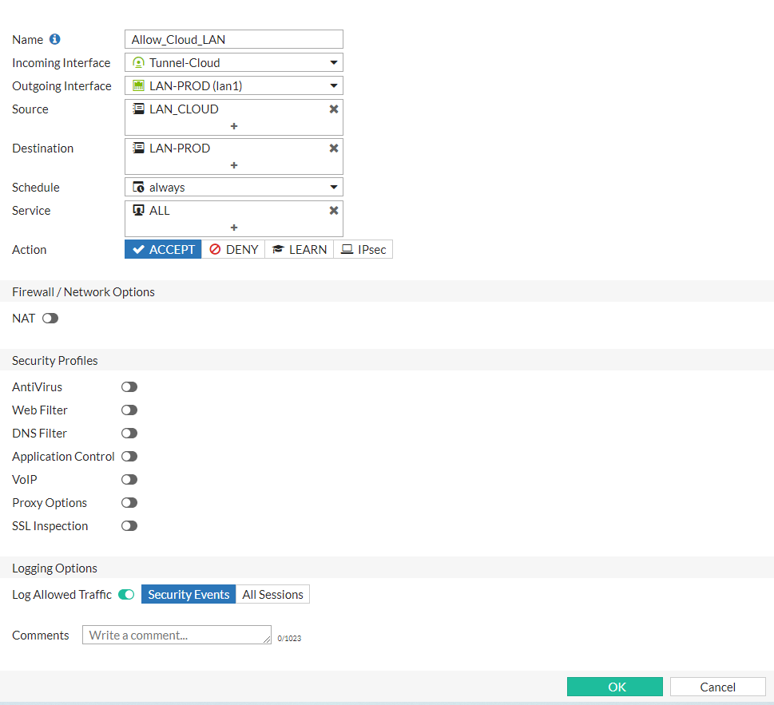

#### Creare rotta statica per traffico VPN

Spostatevi nel sotto-manù **Network → Static Routes,** cliccate su **\+ Create New** e compilate i campi come segue:

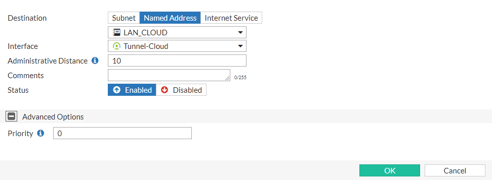

> [!INFO]
> Se durante la creazione della rotta dovesse richiedervi il **Gateway,** lasciate quello di default cioè **0.0.0.0**

Terminate entrambe le configurazioni per verificare che il tunnel sia correttamente **Up & Running** potete controllare qua:

- **FortiGate:** sotto-menù **VPN → IPsec Tunnels,** nella colonna **Status** dovreste vedere il simbolo 
  
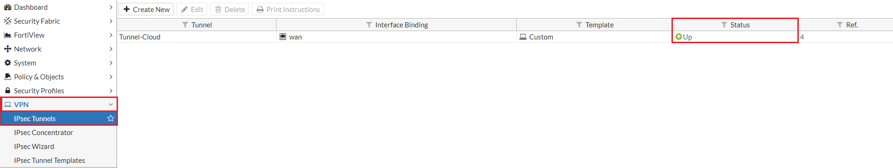
- Oppure nel sotto-menù **Monitor → IPsec Monitor,** nella colonna **Status** dovreste vedere il simbolo 
- **Openstack as a Service:** nel sotto-menù **Network → VPN** all'interno del form **IPsec Site Connection** in corrispondenza della colonna Status dovreste vedere 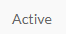

> [!NOTE]
> **Sommario**
> 
> 
> 
> - [Introduzione](#introduzione)
> - [Prerequisiti](#prerequisiti)
> - [Guida passo-passo](#guida-passo-passo)
> -   [Configurazione VPNaaS](#configurazione-vpnaas)
>   
>   -   [Endpoint per la rete in cloud (subnet locale dietro il router del Openstack as a Service)](#endpoint-per-la-rete-in-cloud-subnet-locale-dietro-il-router-del-openstack-as-a-service)
> -   [Configurazione FortiGate](#configurazione-fortigate)
>   
>   -   [Abilitare la funzione di Policy-based IPsec VPN.](#abilitare-la-funzione-di-policy-based-ipsec-vpn)
>   
>   -   [Creare l'oggetto "address per la rete remota"](#creare-loggetto-address-per-la-rete-remota)
>   
>   -   [Creare il tunnel VPN](#creare-il-tunnel-vpn)
>   
>   -   [Creare le ACL per permettere il traffico Cloud ↔ LAN attraverso il Tunnel](#creare-le-acl-per-permettere-il-traffico-cloud-lan-attraverso-il-tunnel)
>   
>   -   [Creare rotta statica per traffico VPN](#creare-rotta-statica-per-traffico-vpn)
> * * *
> **Articoli collegati**
> 
> 
> - Page:
> [VPNaaS - FortiGate Firewall](/wiki/spaces/KB/pages/1966249067/VPNaaS+-+FortiGate+Firewall)
> - Page:
> [VPNaaS - Sonicwall Firewall](/wiki/spaces/KB/pages/1966248911/VPNaaS+-+Sonicwall+Firewall)