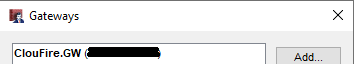
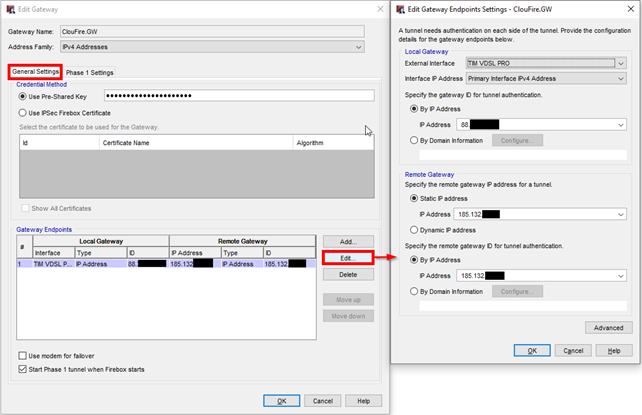
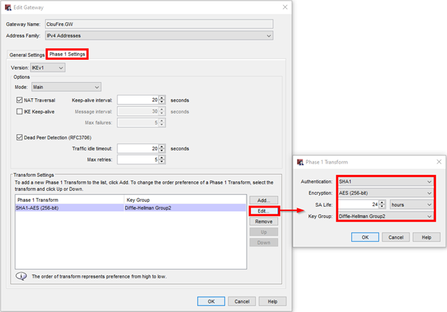
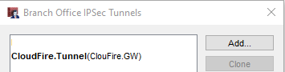
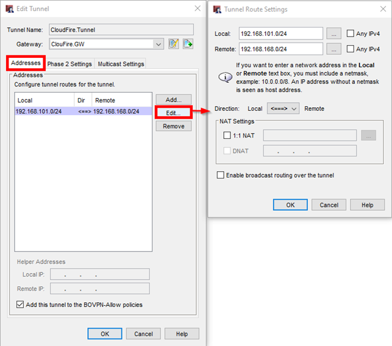
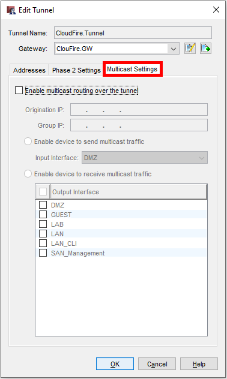
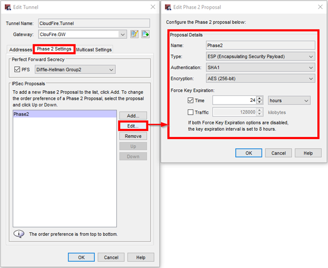
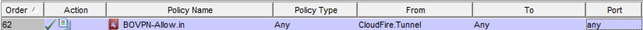
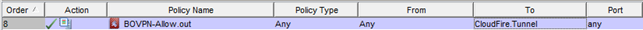

## Introduzione

Configurazione Watchguard presso cliente per attivazione tunnel con servizio VPNaaS Cloudfire.

## Guida passo-passo

### Definizione Gateway: VPN → Branch Office Gateways

### Definizione Tunnel: VPN → Branch Office Tunnels

> [!WARNING]
> Personalizzare i "Phase 2 Settings" poichè la configurazione di default non è corretta:

Al termine della configurazione vengono create 2 regole che consentono tutto il traffice Da e Verso il tunnel Cloudfire (N.B. di default non è attivo il logging)

  

  

  

> [!NOTE]
> **Sommario**
> 
> 
> 
> - [Introduzione](#introduzione)
> - [Guida passo-passo](#guida-passo-passo)
> -   [Definizione Gateway: VPN → Branch Office Gateways](#definizione-gateway-vpn-branch-office-gateways)
> -   [Definizione Tunnel: VPN → Branch Office Tunnels](#definizione-tunnel-vpn-branch-office-tunnels)
>   
>   -   Filter by label
> * * *
> **Articoli collegati**
> 
> 
> ##### Filter by label
> 
> There are no items with the selected labels at this time.