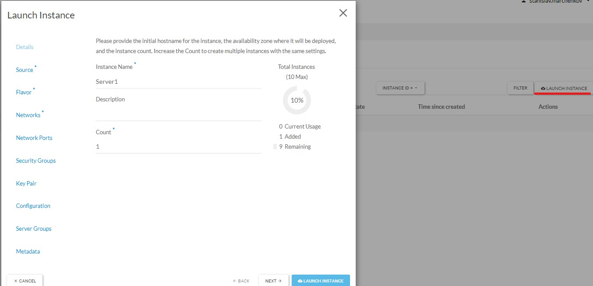
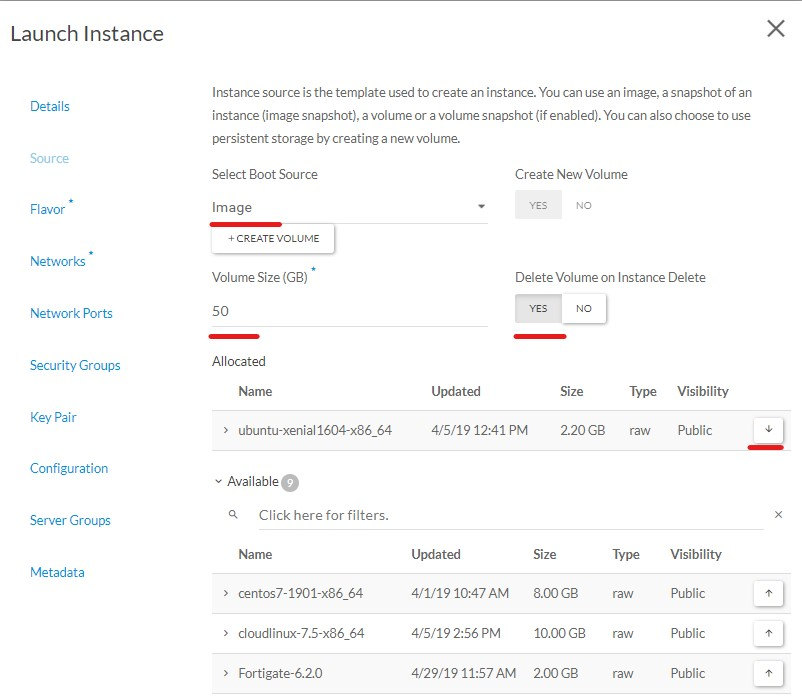
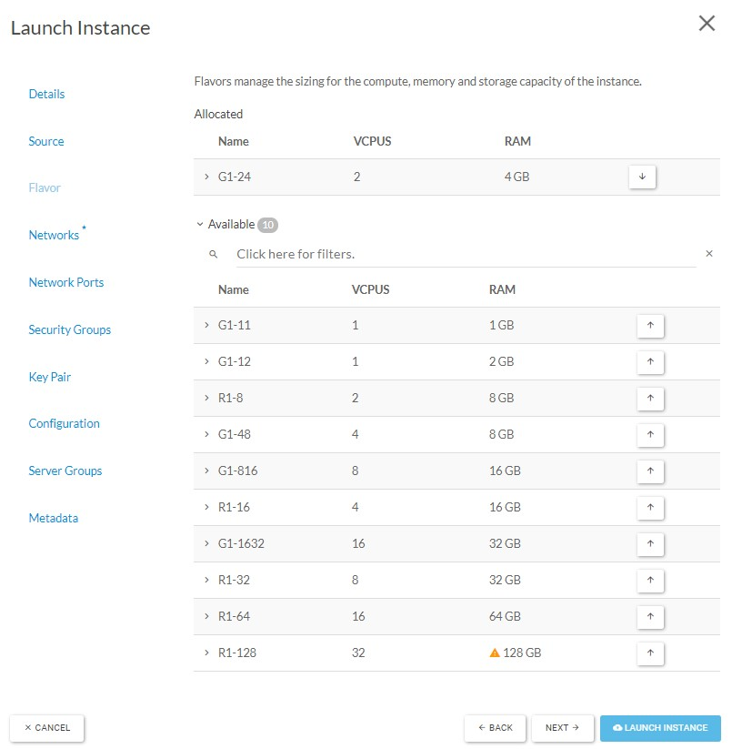
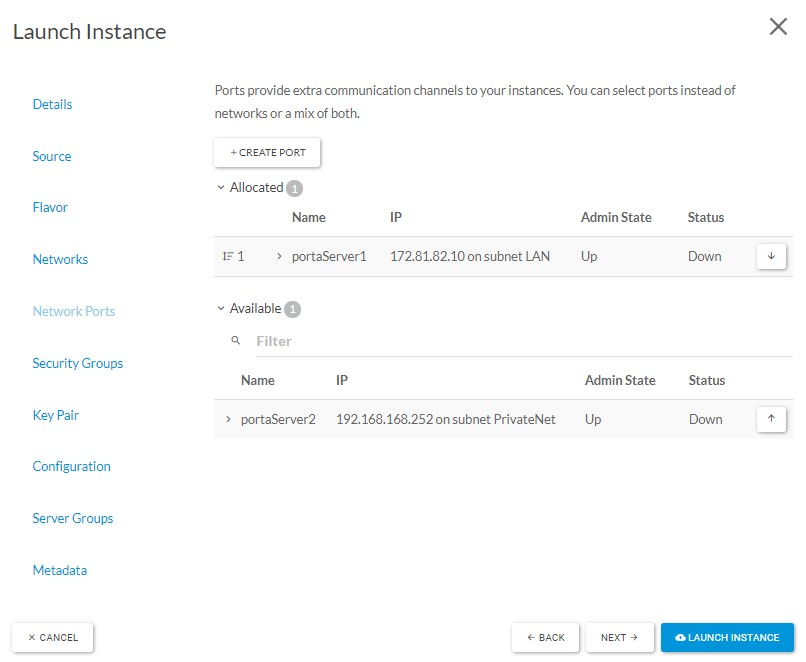
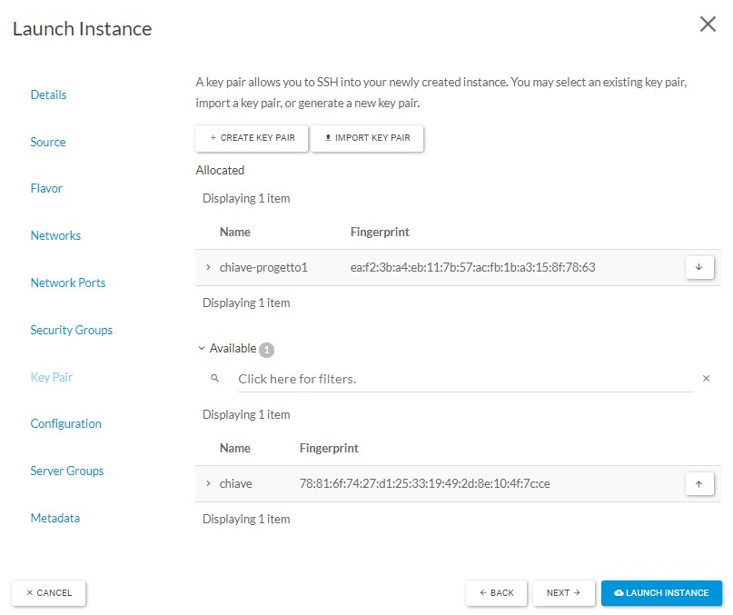
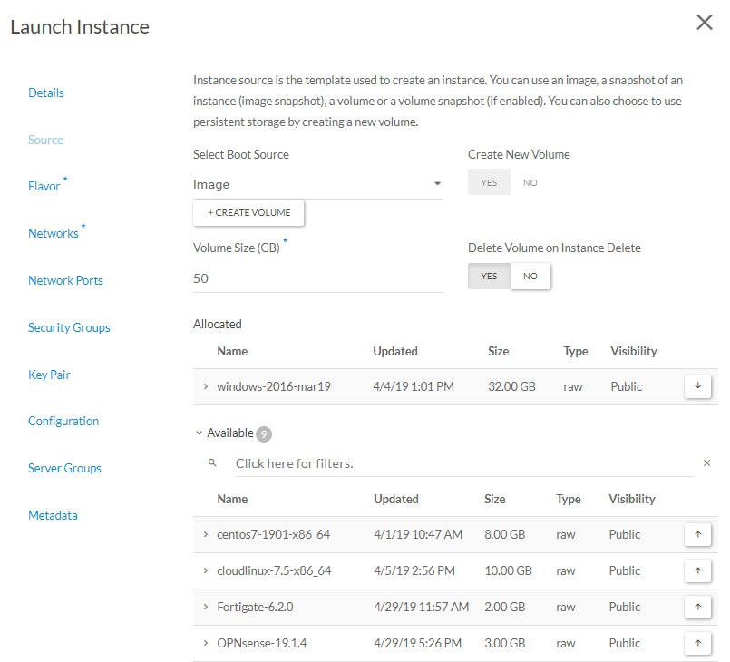
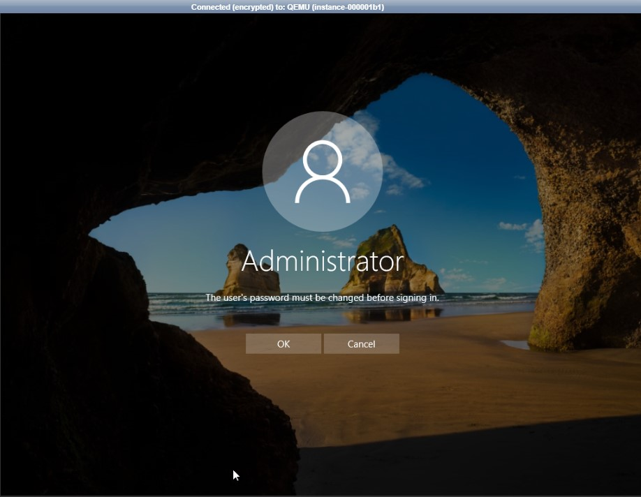
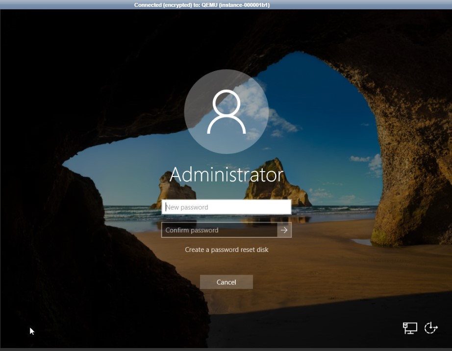

## Introduzione

Di seguito le indicazioni per creare le vostre istanze in cloud. Con in esempio due macchine: ubuntu 16 server e windows server 2016.  

## Prerequisiti

Accesso come amministratore del progetto.

Nel caso specifico il walkthrough presuppone i componenti di rete già definiti e configurati correttamente per lo scopo ( implementati con la guida [Gestione reti, porte, ip pubblici, router e security group.](https://kb.cloudfire.it/pages/viewpage.action?pageId=31262593))

E' specificato sempre anche il caso base (con i soli componenti di default).

## Guida passo-passo

## Creazione Istanza Ubuntu

> [!INFO]
> Prima di eseguire i passaggi si consiglia di leggere tutto l'elenco delle operazioni per organizzare al meglio il deployment.

- Portarsi in ***"Compute" > "Instances"***
- Cliccare **"LAUNCH INSTANCE"**

- Definire il nome e il "**Count**"

> [!INFO]
> Se superiore a 1, utilizzando successivamente l'assegnazione dinamica in DHCP in relazione a una rete (e non una porta di rete specifica), con un singolo wizard creerete più istanze identiche.
> I dati obbligatori sono contrassegnati da un "\*".

- In "*Source*" ci sono diversi campi importanti.
- Con "***Select Boot Source***" potete decidere da dove partire nella creazione della vostra istanza:
-   da un "Istance Snapshot": La funzionalità intesa da questa voce è gestita dal campo "Image" visto che è lì che finiscono gli snapshot di istanze
-   da un "Volume": procedura definita in [Gestione Volumi](../primi-passi-openstack-as-a-service/gestione-volumi.md)
-   da un "Volume Snapshot": unisce i due concetti precedenti.
-   oppure per una partenza "pulita" come in questo caso selezionate un'immagine.

> [!WARNING]
> **ATTENZIONE!** Selezionare “Create new volume: yes” solo nel caso in cui si vada poi a scegliere un flavor di tipo **“S”** cioè **“Scalable Storage”** se invece si ha intenzione di utilizzare il **“Direct Attached Storage”** impostare “Create new volume: no”.  
> Si rimanda alla seguente guida per maggiori dettagli:  
> [https://cloudfireit.atlassian.net/l/cp/rRXsHyMK](https://cloudfireit.atlassian.net/l/cp/rRXsHyMK)

- Porto su con il simbolo della freccia Ubuntu 16.04, impostando l'immagine sotto "**Allocated**"
- La dimensione minima del volume di boot è di 50GB, ma può essere aumentata.
- Mi sposto su "**YES**" sotto "*Delete Volume on Instance Delete*" in quanto voglio che la cancellazione dell'istanza corrisponda alla cancellazione del volume di sistema.

> [!WARNING]
> **ATTENZIONE!** Il cambio della tipologia dello storage (PREMIUM, STANDARD e LTS) e l'ampliamento del volume di boot è particolarmente macchinoso quindi si consiglia ti effettuare le dovute considerazioni prima di procedere.
> Per partire con un volume diverso dallo STANDARD per il sistema operativo seguire la guida [Gestione Volumi](../primi-passi-openstack-as-a-service/gestione-volumi.md) , utilizzando quindi un "Volume" personalizzato come sorgente per il boot.

- Il passo successivo è "**Flavor**" che caratterizza le risorse dell'istanza per quanto riguarda il numero di CPU e i GB di RAM allocati. Anche qui porto sotto "allocated" la combinazione desiderata. 
- Sotto "**Networks**" con lo stesso metodo è possibile portare sotto "**Allocated**" la rete da cui volete una porta assegnata dinamicamente all'istanza. Io mi sposto invece sotto "**Network Ports**" dove seleziono la porta preparata appositamente per la mia istanza.

- Nella sezione successiva, "**Security Groups**", troverete il gruppo di regole "default" assegnato direttamente all'istanza. Qui potete allocare i vostri gruppi creati ad hoc. Nel mio caso rimuovo il gruppo "default" in quanto ho già un "Security Group" specifico assegnato alla "Network Port" utilizzata nel punto precedente.

> [!WARNING]
> Anche se non si tratta di un campo contrassegnato come obbligatorio, per una macchina Linux è fondamentale specificare la coppia di chiavi. Vedi [Key Pairs](../primi-passi-openstack-as-a-service/key-pairs.md).

- Posso quindi procedere con "**LAUNCH INSTANCE**"
- Essendo una macchina Ubuntu con l'immagine di base della dimensione di 2.2GB, il tempo di *deployment* è piuttosto breve.
- L'istanza Ubuntu creata in questo modo è accessibile *solamente via SSH* con la chiave indicata: non vi è la possibilità di utilizzare la console in quanto non si hanno utente e password!  
Per un accesso in SSH è inoltre necessario aggiungere una RULE per l'accesso dal vostro IP nel Security Group che avete assegnato all'istanza o alla porta ( guida: [Gestione reti, porte, ip pubblici, router e security group.](../primi-passi-openstack-as-a-service/gestione-reti-porte-ip-pubblici-router-e-security-group.md) )
- Oppure potete eseguire il passaggi di [Cloud-Init, utente con password e configurazioni aggiuntive.](../primi-passi-openstack-as-a-service/cloud-init-utente-con-password-e-configurazioni-aggiuntive.md) in fase di creazione per ritrovarvi con un utenza da utilizzare via console.

> [!NOTE]
> Ricorda: La chiave caricata è abbinata all'utente di default "Ubuntu"

## Variazioni creazione istanza Windows

Le differenze rispetto alla creazione dell'istanza Linux sono minime.

> [!INFO]
> La scelta dell'immagine mostra uno degli aspetti: l'immagine stessa è molto più grande rispetto ad Ubuntu, portando il tempo di deployment a 5-10 minuti.

- In questo caso non ho bisogno di specificare "**Key Pairs**" ne di definire una "Configuration" custom per impostare un utente.
- Quando Windows avrà terminato tutte le procedure di inizializzazione potrete effettuare l'accesso in console come **Administrator**, e qui vi verrà chiesto di impostare la *vostra password.*  

  

  

  

  

> [!NOTE]
> **Sommario**
> 
> 
> 
> - [Introduzione](#introduzione)
> - [Prerequisiti](#prerequisiti)
> - [Guida passo-passo](#guida-passo-passo)
> - [Creazione Istanza Ubuntu](#creazione-istanza-ubuntu)
> - [Variazioni creazione istanza Windows](#variazioni-creazione-istanza-windows)
> -   Filter by label
> * * *
> **Articoli collegati**
> 
> 
> ##### Filter by label
> 
> There are no items with the selected labels at this time.