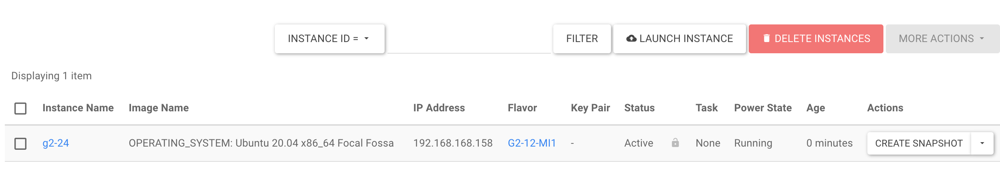
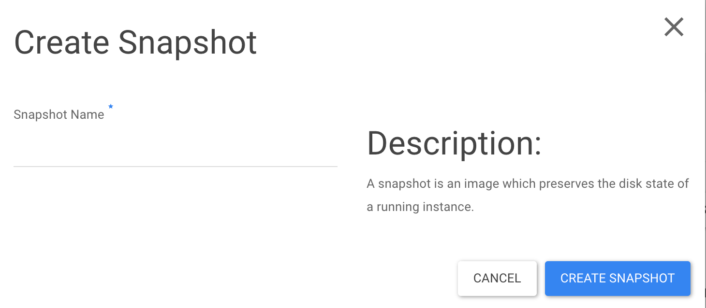
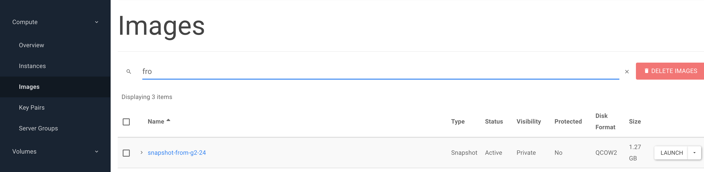
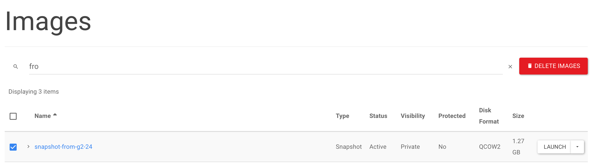
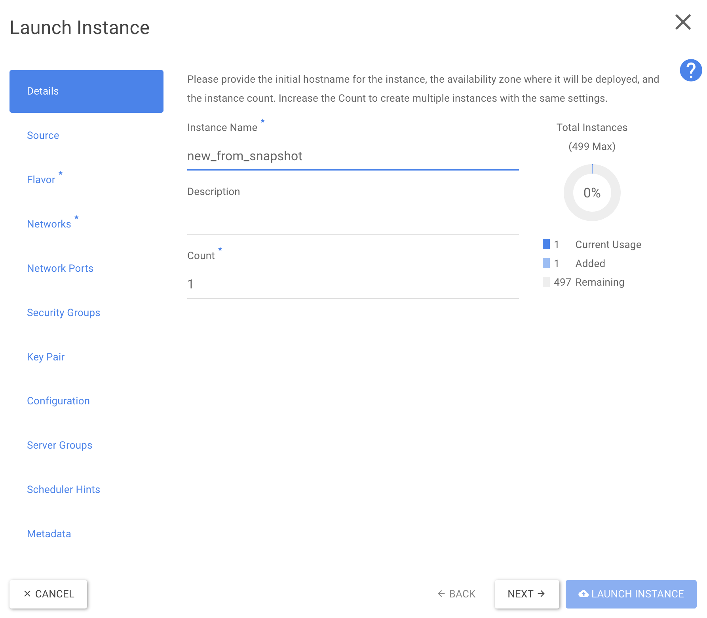
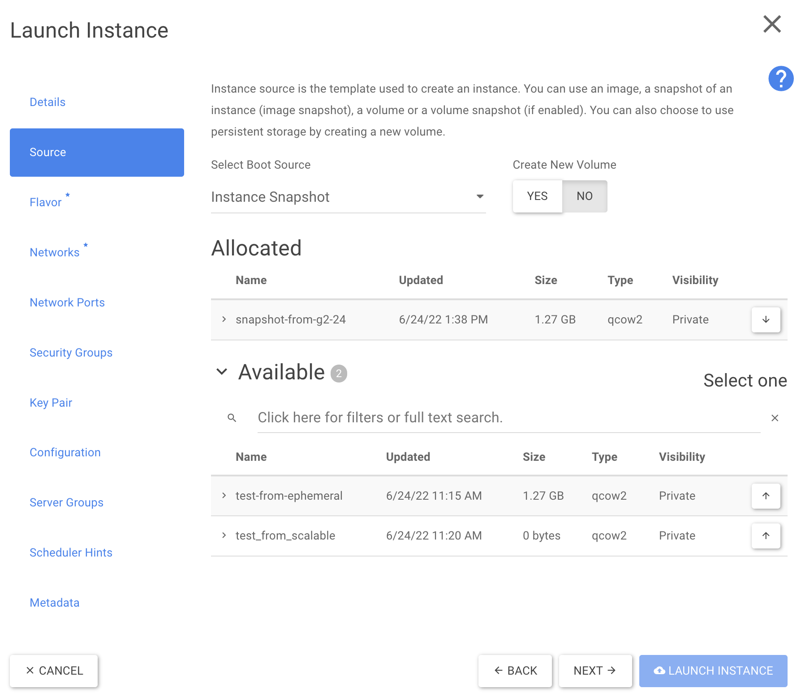
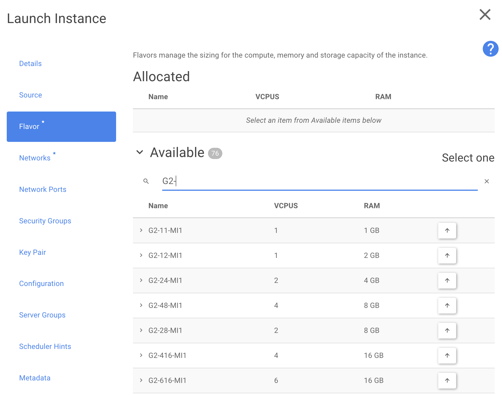

La presente guida ha il compito di spiegare la procedura da seguire in caso di migrazione tra un Flavor DAS a Flavor Scalable Storage.

> [!INFO]
> La procedura di **Backup** è l’unica procedura da utilizzare.

## Backup

Per eseguire il backup di un' istanza G2/C2 (con disco Direct Attached Storage):

1. Dal menu istanze cliccare su **snapshot**

2\. Compilare il campo **snapshot name** e creare lo snapshot (es. snapshot-from-g2-24)  

3\. Verificare che nella sezione **Images** sia presente l’immagine di tipo *snapshot* appena creata

> [!NOTE]
> La dimensione dell'immagine è pari allo spazio occupato dall'istanza nel momento dell’esecuzione dello snapshot.

## Ripristino da Backup

Con *ripristino da backup* si intende creare una nuova istanza partendo dallo snapshot eseguito nello step precedente.

1. Portarsi nella sezione **Images** e selezionare lo snapshot di backup da ripristinare

2\. Cliccare su **launch** per far partire il wizard di creazione istanza

Si noti come, nello step **Source** la voce “Select Boot Source” sia impostata su *Instance Snapshot* e che lo snapshot “Allocated” sia effettivamente quello da cui si è cliccato launch.

> [!CAUTION]
> Ricorda di selezionare ***yes*** nel cursore **Create New Volume** in caso di utilizzo flavor **G2S/C2S** e di selezionare ***no*** in caso di utilizzo flavor **G2/C2**

3\. Nello step **Flavor** è possibile scegliere di cambiare *famiglia* di flavor (passare da DAS a Scalable Storage)

 Una volta conclusa tale procedura, l’istanza Direct Attached Storage è stata convertita in istanza Scalable Storage.