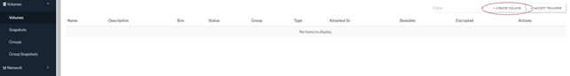
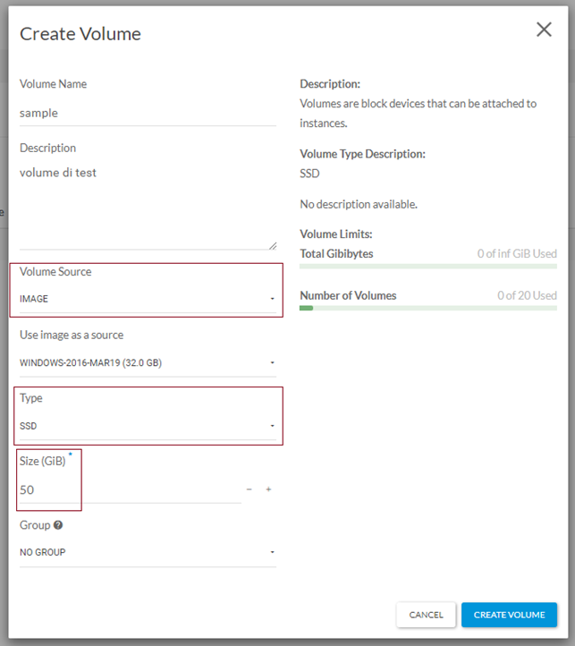
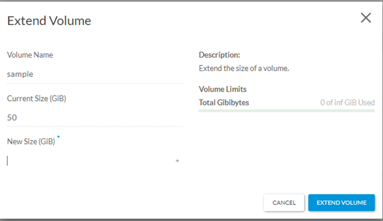
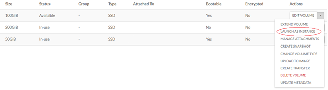
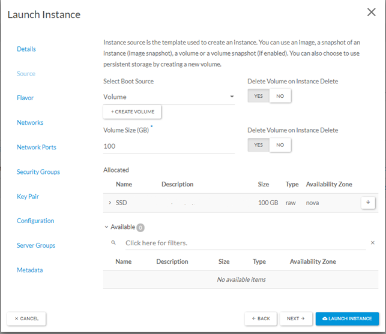

## Introduzione

La gestione dei volumi ha una logica specifica per cui vi sono due modalità per approcciarsi a quelli che volgarmente rappresentano i dischi per l'istanza virtuale.

Il discorso è analogo alle reti e alle "porte".

E' possibile gestire un volume in creazione dell'istanza oppure predisporlo prima, rendendolo disponibile all'istanza in fase di creazione (per quanto riguarda il volume di boot/SO) o successivamente (collegamento disco secondario).

> [!INFO]
> La creazione del volume insieme all'istanza porta ad avere un disco standard della dimensione scelta. Se si vuole un disco Premium si consiglia la creazione del volume a priori "ad hoc". Di seguito anche la procedura per cambiare il tipo di volume.

## Prerequisiti

Accesso e ruolo administrator nella gestione del vostro Public Cloud.

## Creazione Volume ad hoc.

- Recarsi sotto *Volumes* e cliccare "**\+ CREATE VOLUME**":  

- Qui avviene la creazione del volume, indicandone il nome, un eventuale descrizione, la sorgente, il tipo e la dimensione;
- La source può essere "empty volume" se si desidera un disco vuoto oppure un'immagine (un sistema operativo di partenza da cui inizializzare direttamente un'istanza);
- Il tipo definisce la tipologia di disco: **STANDARD**, **PREMIUM** o **LTS**, e la dimensione del volume da creare.

- Attendere la conclusione della creazione dopo aver premuto "**CREATE VOLUME**"

## Gestione del volume

A creazione terminata, il vostro volume sarà disponibile per varie operazioni specificate nella tendina "**Actions**" relativa:

- ***Estensione della dimensione***: qui è possibile specificare la nuova dimensione (maggiore rispetto all'originale) e procedere con "**EXTEND VOLUME**".Per predisporre la nuova allocazione di spazio dovrete effettuare l'estensione anche a livello di file system.  

- ***Launch as Instance***: nel caso in cui il volume sia stato creato a partire da un immagine.

> [!INFO]
> Se si lancia un'istanza a partire dal volume, quel volume avrà bisogno di specifiche operazioni per effettuare l'ampliamento e il cambio del tipo, in quanto considerato volume di root (ovvero del sistema operativo) non avendo quindi l'opzione "*detach*". Alternativamente potete aprire una segnalazione per richiedere tali modifiche al nostro team.

- In questo caso si aprirà la finestra relativa alla creazione istanza con diversi parametri già compilati.

- La boot source sarà "**Volume**" con il volume richiesto già sotto "**Allocated**".

> [!INFO]
> La "**Volume Size**", pur essendo obbligatorio non influirà sulla dimensione del volume che avete creato

  

> [!NOTE]
> **Sommario**
> 
> 
> 
> - [Introduzione](#introduzione)
> - [Prerequisiti](#prerequisiti)
> - [Creazione Volume ad hoc.](#creazione-volume-ad-hoc)
> - [Gestione del volume](#gestione-del-volume)
> -   Filter by label
> * * *
> **Articoli collegati**
> 
> 
> ##### Filter by label
> 
> There are no items with the selected labels at this time.