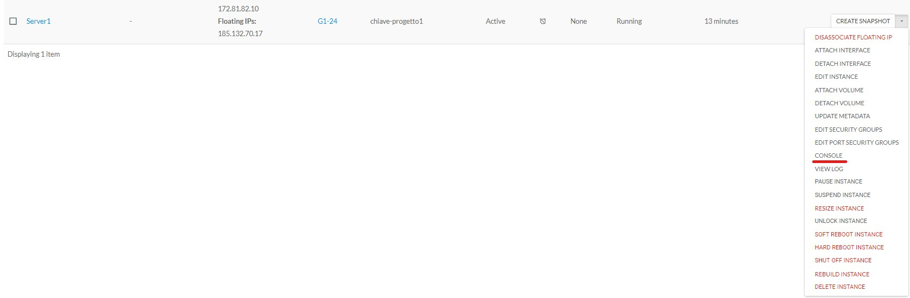
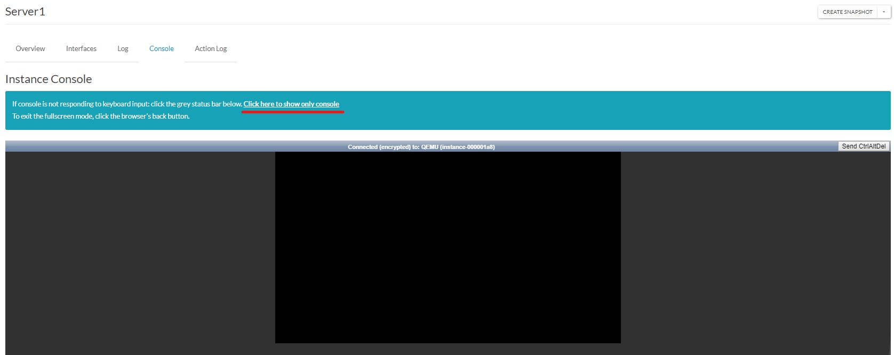
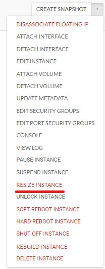
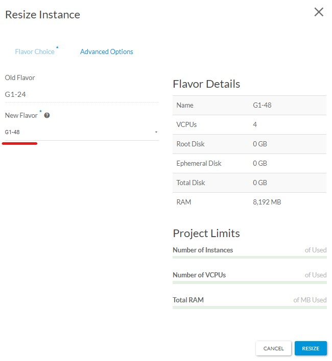
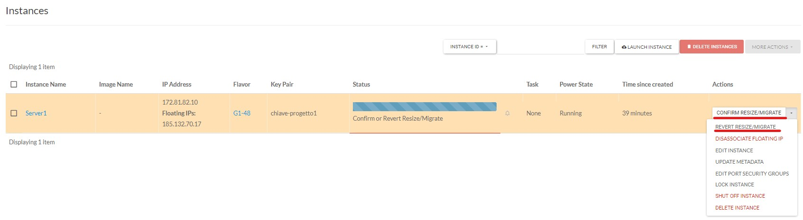
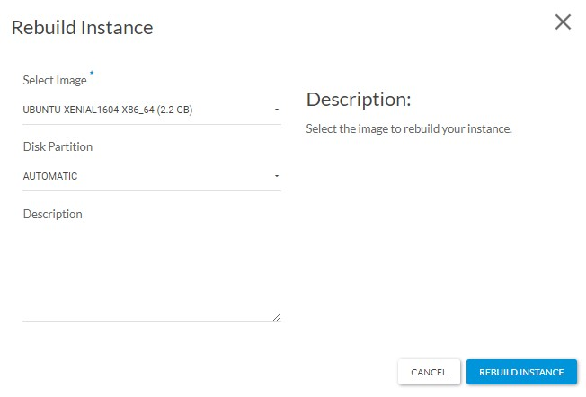

## Introduzione

Di seguito alcune delle operazioni per la gestione delle vostre istanze in cloud. 

## Prerequisiti

Accesso come amministratore del progetto.

## Lock dell'istanza

Il ***"LOCK INSTANCE" / "UNLOCK INSTANCE"*** sono opzioni che si alternato nel menù in base allo stato corrente dell'istanza.

Quando l'istanza è in stato di **LOCK** tutte le operazioni che comportano un'interruzione di servizio non sono funzionali: anche un RESIZE fallirà.

Questo flag può essere utilizzato per prevenire disruption accidentali.

## Accesso alla console

Vi sono due modi per accedere alla console di un'istanza:

1. Arrivare alla schermata contenente la console dal menù a tendina relativo all'istanza
2. Oppure cliccando il nome dell'istanza.

> [!INFO]
> Cliccando il link evidenziato si apre una finestra dedicata per un interazione migliore con il sistema sottostante.

## Resize/cambio "Flavor"

- Dal menu delle "Actions" dell'istanza cliccare "**RESIZE INSTANCE**":

- Nella schermata del resize sarà sufficiente selezionare il nuovo "**Flavor**", di cui avrete i dettagli sulla destra a conferma delle nuove risorse allocate.

> [!WARNING]
> ATTENZIONE!!! L'operazione comporta un riavvio dell'istanza, che partirà appena cliccato "RESIZE"

- E' necessario un ultimo step

L'istanza sarà in attesa di una conferma o di un "**REVERT**" dell'operazione di resize appena effettuata.

In caso di "**REVERT RESIZE/MIGRATE**" segue un nuovo reboot.

## Rebuild

L'operazione di REBUILD ( "**REBUILD INSTANCE**" nel menù "Actions" relativo all'istanza ) porta alla seguente schermata

Qui è possibile scegliere un'immagine di partenza (uguale o nuova) per ricreare l'istanza con tutti gli altri parametri di sistema inalterati:

Manterrà quindi tutte le impostazioni del wizard di creazione tranne il "**Flavor**" che fa fede all'ultimo eventuale resize effettuato.

  

> [!NOTE]
> **Sommario**
> 
> 
> 
> - [Introduzione](#introduzione)
> - [Prerequisiti](#prerequisiti)
> - [Lock dell'istanza](#lock-dellistanza)
> - [Accesso alla console](#accesso-alla-console)
> - [Resize/cambio "Flavor"](#resizecambio-flavor)
> - [Rebuild](#rebuild)
> -   Filter by label
> * * *
> **Articoli collegati**
> 
> 
> ##### Filter by label
> 
> There are no items with the selected labels at this time.