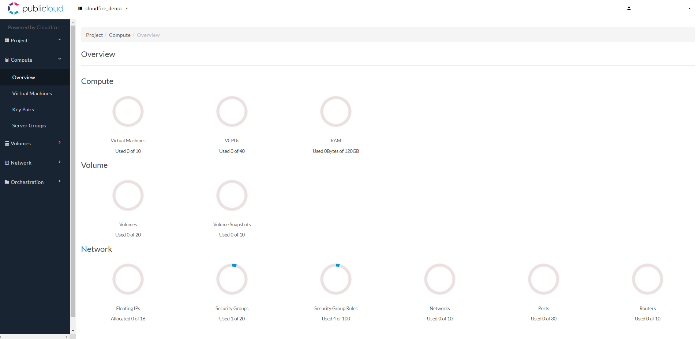
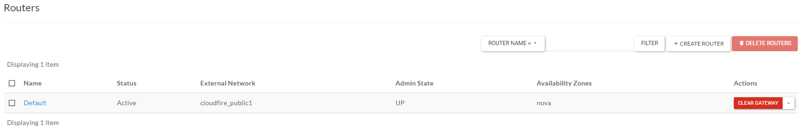
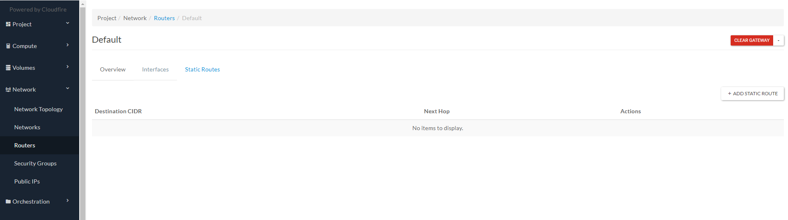
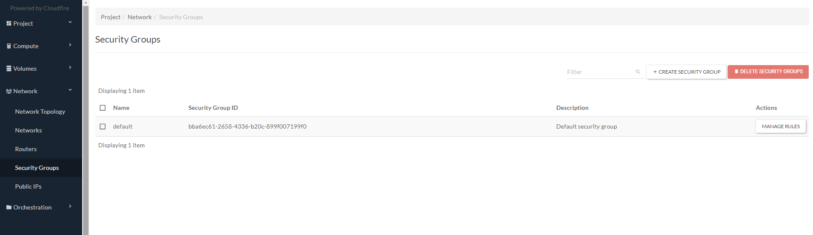
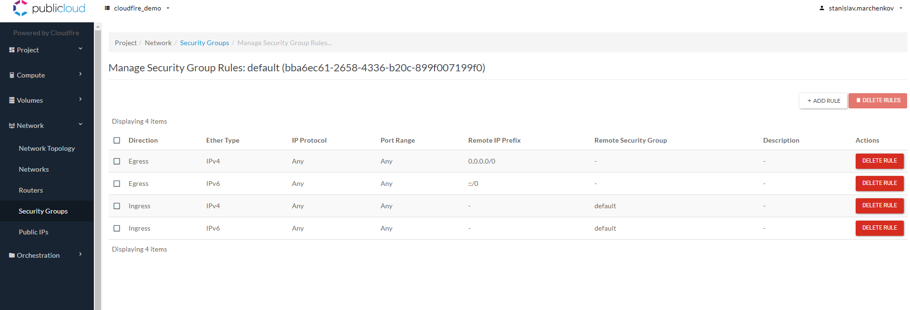
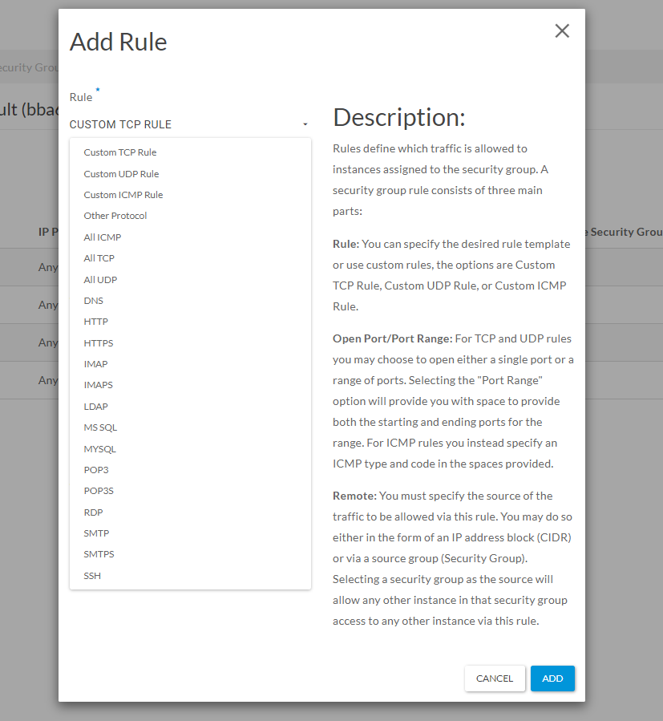
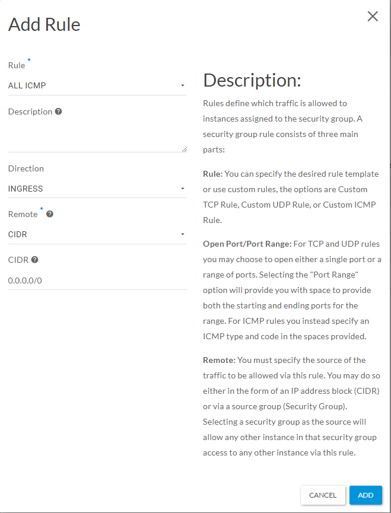
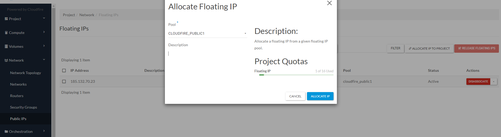

## Introduzione

La console del prodotto Openstack as a Service permette di gestire istanze virtuali, basate su vari sistemi operativi; la definizione di una rete privata e l'esposizione dei servizi a bordo delle VM tramite IP pubblici dedicati applicati a router virtuali che permettono apertura di porte specifiche.

### Prerequisiti

Utenza dedicata del servizio "Openstack as a Service".

### Panoramica passo-passo

Effettuate il login sul sito [public.cloudfire.it](http://public.cloudfire.it) con le credenziali specifiche del servizio per ritrovarvi nella schermata di "Overview"

Qui trovate il riassunto di tutti i contatori relativi al vostro servizio ("usato" di "totale") :

#### COMPUTE

- Il numero complessivo delle vostre istanze in essere: "Virtual Machines"

- Virtual CPU allocate, su tutte le VMs

- RAM allocata complessivamente su tutte le istanze

#### VOLUME

- Numero di volumi (dischi) allocati

- Numero di snapshot in essere sui dischi in uso: "Volume Snapshots"

#### NETWORK

- Numero di IP pubblici utilizzati: "Floating IPs" 

- Numero di set di regole definiti, ovvero "maschere" che definiscono le aperture di porte : Security Groups ...

- ... composte da Security Group Rules singole che hanno un contatore dedicato

- Numero complessivo di reti definite ai fini infrastrutturali: Networks

- Il numero di "Ports" definisce le schede di rete delle istanze

- Il contatore "Routers" si riferisce alle istanze di router virtuali in essere, usati per collegare reti private e per la gestione degli IP pubblici

  

Nei prossimi 3 punti è condensato il funzionamento base della rete nella comunicazione esterna. 

Nel progetto vi ritroverete con diverse configurazioni di default come ad esempio il primo router-gateway chiamato "Default" e la subnet privata di default (192.168.168.0/24)

Nella sezione "Routers" ritroverete quest'ultimo e potrete creare nuovi router per la comunicazione verso l'esterno (ed eventualmente intra-reti private).

Cliccando sul nome del router si entra nell'**overview** dell'oggetto in questione:

- Si possono aggiungere/eliminare le interfacce;
- Si possono impostare rotte statiche.

All'interno di "Security Groups" potete visualizzare/aggiungere/cancellare set di regole d'ingresso e d'uscita applicati alle istanze.

All'interno di "**Security Groups**" potete visualizzare/aggiungere/cancellare set di regole d'ingresso e d'uscita applicati alle istanze.

Cliccando "**MANAGE RULES**" di uno dei Security Groups si arriva a visualizzare e gestire le regole del ***SET***.

Aggiungendo quindi una regola si definisce in modo capillare un apertura porta.

Si seleziona il tipo di regola: custom o relativa a un protocollo "well known" (per esempio accetto tutti i pacchetti ICMP)

- Indico la "Direzione": entrata o uscita

- Identificativo della parte remota: un CIDR oppure l'inclusione di un altro Security Group

- e specifico nel mio caso il CIDR: 0.0.0.0/0 che corrisponde a "any"
- Infine cliccare "ADD".

Nella sezione Public IPs è possibile prendere possesso di uno o più IP pubblici da utilizzare.

- Cliccare **"ALLOCATE IP TO PROJECT**" e confermare cliccando "**ALLOCATE IP**", così verrà fornito un nuovo ip del pool pubblico selezionato in modo randomico.

- Sempre in questa sezione (sotto "Actions") gli IP possono essere associati/disassociati a/da una porta (per la mappatura a IP locale) e rilasciati completamente in caso di mancato utilizzo. 

  

> [!NOTE]
> **Sommario**
> 
> 
> 
> - [Introduzione](#introduzione)
> -   [Prerequisiti](#prerequisiti)
> -   [Panoramica passo-passo](#panoramica-passo-passo)
>   
>   -   [COMPUTE](#compute)
>   
>   -   [VOLUME](#volume)
>   
>   -   [NETWORK](#network)
>     
>   
>     -   Filter by label
> * * *
> **Articoli collegati**
> 
> 
> ##### Filter by label
> 
> There are no items with the selected labels at this time.