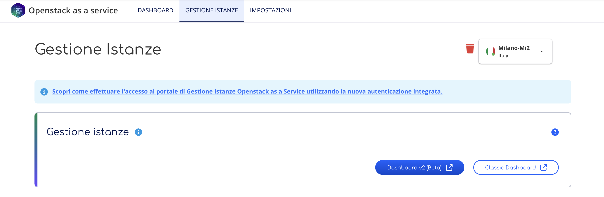
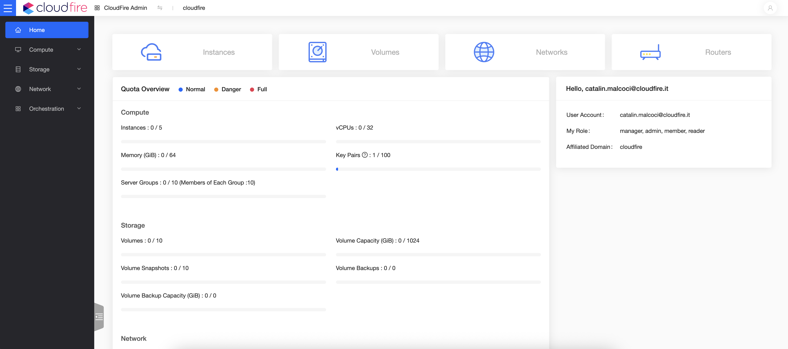
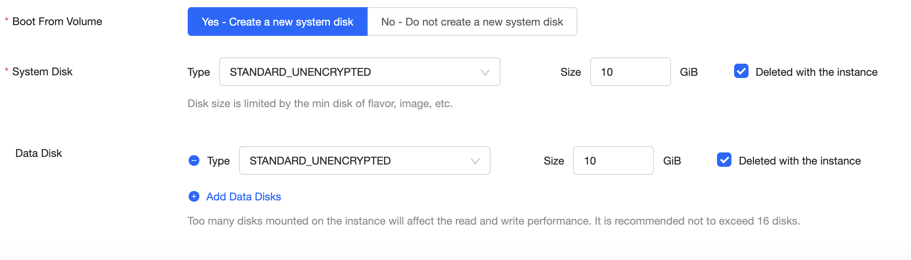

Dopo aver attivato Openstack as a Service nella region MI2, per la gestione del servizio si potrà scegliere tra la **Dashboard v2** e la **Classic Dashboard**, quella standard disponibile anche per MI1.  

### Dashboard v2

La nuova Dashboard v2 offre [le stesse funzionalità della Classic](../../primi-passi-openstack-as-a-service.md), ma con un’interfaccia utente completamente rivista.

Altra novità presente è la possibilità di poter scegliere la tipologia di Scalable Storage e di poter aggiungere dischi esterni direttamente nella fase di deploy dell’istanza:

