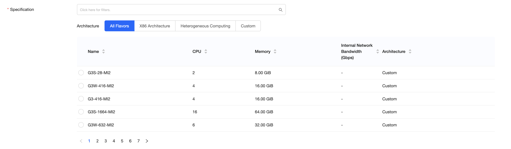

Le tipologie di flavor disponibili nella region MI2 sono i seguenti:

- **G3**
- **G3S**
- **G3W**

Non sono più presenti i flavor di tipo G2/G2S e C2/C2S.

### G3

Flavor di nuova generazione, basati su processore *AMD Epyc 7313P*, con storage di tipo DAS.  
Consigliati per applicativi business critical che richiedono il massimo delle **performance** disponibili.

### G3S

Flavor di nuova generazione, basati su processore *AMD Epyc 7313P*, con Scalable Storage.  
Consigliati per applicativi business critical che necessitano di **resilienza** dei dati nativa.

### G3W

Flavor di nuova generazione, basati su processore *AMD Epyc 7313P*, con Scalable Storage.  
Da utilizzare per applicativi basati su sistema operativo **Windows**. La licenza del sistema operativo è inclusa in modalità SPLA all’interno del canone mensile del flavor.

> [!INFO]
> È possibile effettuare il deploy di una VM con sistema operativo Windows utilizzando un flavor G3S. È necessario però caricare un’immagine personale con il SO desiderato e utilizzare la propria licenza in modalità **BYOL**.