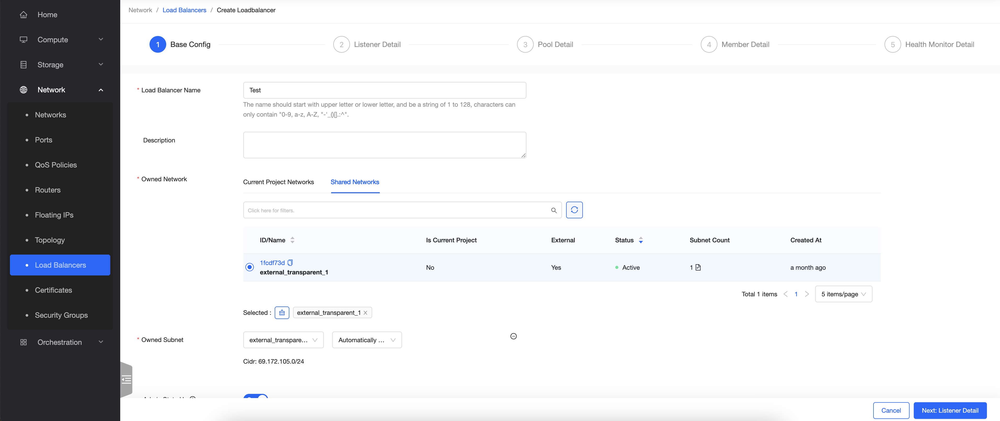
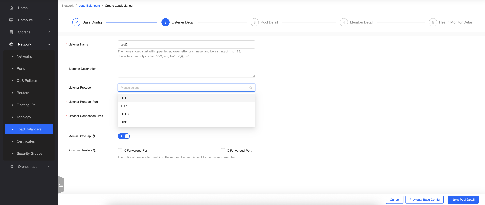
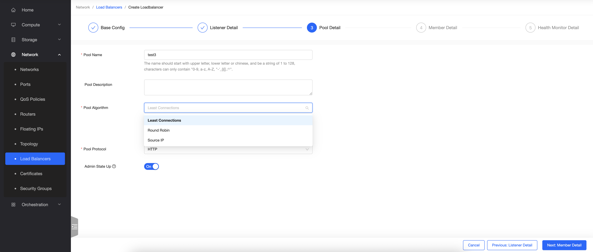
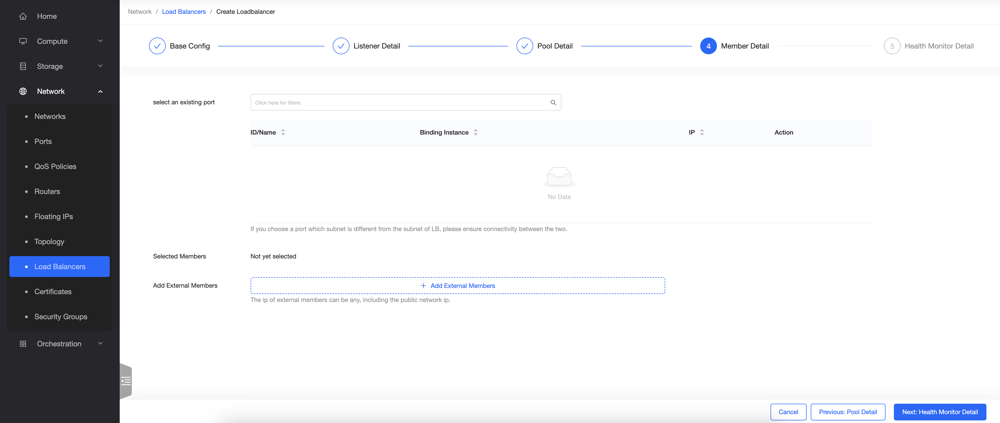
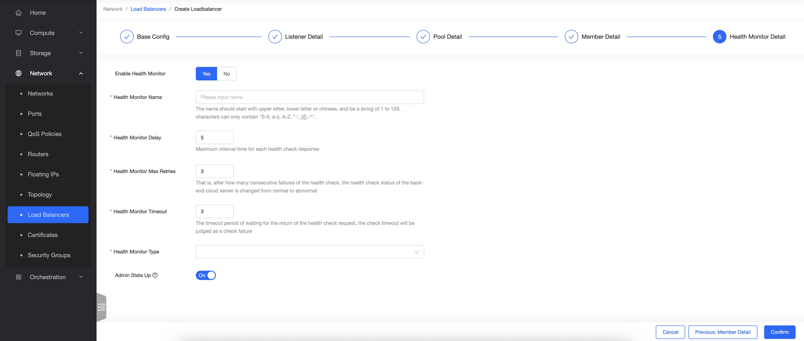

Altra funzionalità a livello di rete che è stata implementata è la possibilità di creare un **Load Balancer** nativo all’interno di Openstack.

Per procedere con il deploy bisogna seguire il wizard d’installazione e definire le varie configurazioni del Listener e del Pool su cui dirottare il traffico.

- Si parte definendo le configurazioni di base, come la rete e l’IP di riferimento:

- Si procede con le impostazioni del Listener, scegliendo il protocollo desiderato:

- Successivamente si sceglie l’algoritmo del Pool, per la tipologia di instradamento delle connessioni, e il protocollo:

- Definire quindi i membri:

- E scegliere infine se attivare l’Health Monitor:

> [!WARNING]
> Il Load Balancer **genera consumo** a livello di fatturazione, in base al profilo scelto.