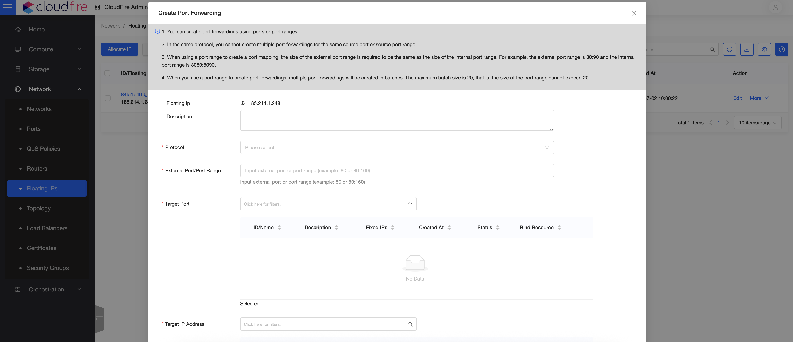

Per quanto riguarda i Floating IP, è stata introdotta la **possibilità di configurare regole di port forwarding** in alternativa all’associazione con NAT 1:1 su IP privato.

Per configurare le regole desiderate, bisogna evitare di assegnare l’IP alla VM scegliendo invece la voce “Create Port Forwarding”.

> [!INFO]
> Nel caso in cui la voce “Create Port Forwarding” fosse assente, vuol dire che l’IP è già stato assegnato a una VM con NAT 1:1.  
> Si può **disassociare l’IP** dalla VM e procedere poi con la configurazione delle regole.