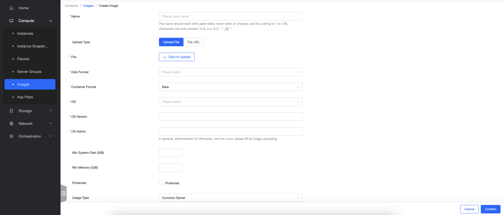

È stata introdotta la possibilità di **caricare immagini di sistemi operativi e appliance in autonomia**, rispettando i parametri di Openstack per garantirne la possibilità di boot.

> [!WARNING]
> Le immagini caricate **cubano spazio a livello di fatturazione**, in maniera equivalente ai volumi.

> [!INFO]
> Consigliamo di consultare il team di supporto di CloudFire prima di procedere in autonomia con il caricamento delle immagini, per assicurarsi di caricare il file adeguato.