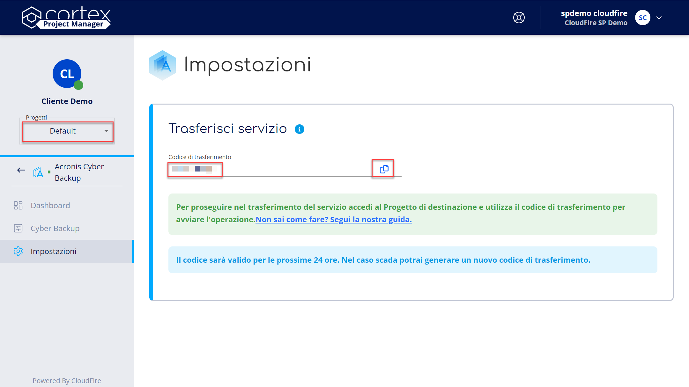
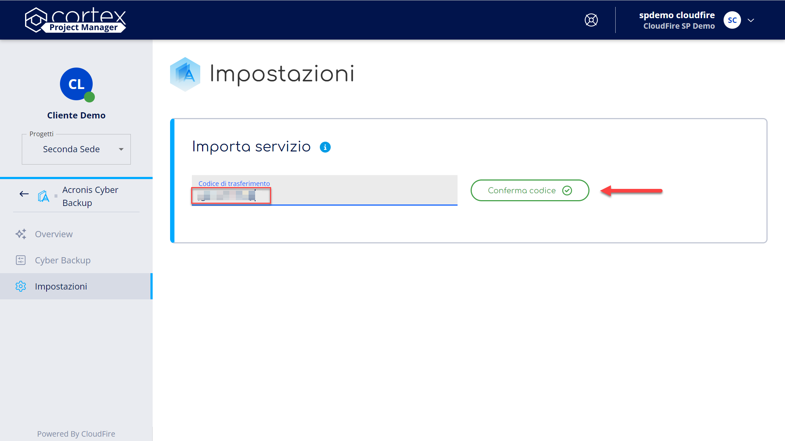
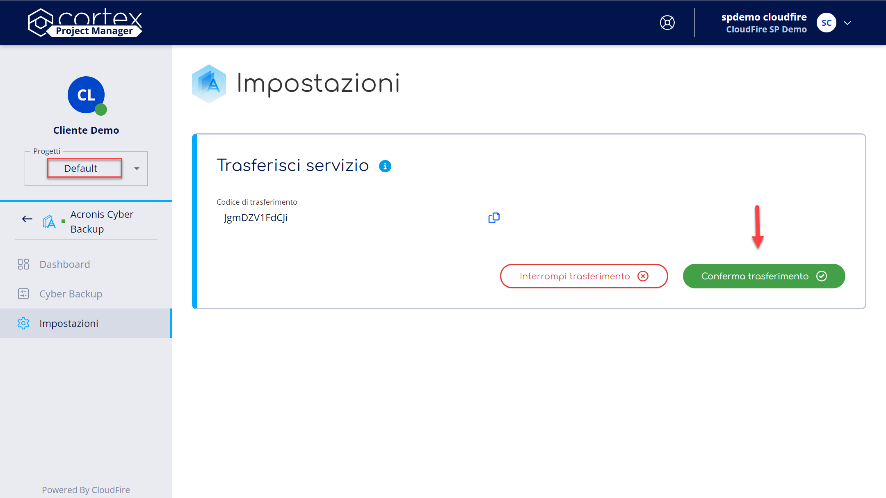

Questa pagina spiega come trasferire i servizi tra progetti.

Il **trasferimento** di un servizio tra due differenti progetti è l’attività che permette di migrare configurazioni ed informazioni del servizio da un progetto di origine ad un progetto di destinazione, mantenendo intatto dati e attività al suo interno.

# Trasferisci un servizio da un progetto di origine

Per avviare il processo di trasferimento è necessario seguire i seguenti passaggi:

1. Accedi al **Project Manager** di cui intendi trasferire il/ i servizi;
2. Naviga verso il **progetto di origine**, dal selettore posto nel menù di navigazione laterale sotto al nome del Project Manager selezionato;
3. Accedi al **servizio** interessato dalle voci di menù laterali;
4. Seleziona la voce **impostazioni** dalle voci di menù laterali;
5. Accedi alla sezione **Trasferisci servizio** del **progetto di origine**;
6. Premi sul bottone **Genera Codice** per generare il codice di trasferimento;
7. Premi su **copia** per copiare il codice da utilizzare successivamente.

> [!INFO]
> Il codice generato sarà **valido** per le successive **24 ore** dal momento della generazione dello stesso. Nel caso scada potrai generare un nuovo codice di trasferimento.

# Importa un servizio su un progetto di destinazione

Per proseguire nell’operazione ed importare il servizio sul progetto di destinazione occorre seguire i seguenti passaggi:

1. Accedi al **Project Manager** di cui intendi importare il/ i servizi;
2. Naviga verso il **progetto di destinazione**, dal selettore posto nel menù di navigazione laterale sotto al nome del Project Manager selezionato;
3. Accedi al **servizio** interessato dalle voci di menù laterali;
4. Seleziona la voce **impostazioni** dalle voci di menù laterali;
5. Accedi alla sezione **Importa servizio** del **progetto di destinazione**;
6. Incolla il **Codice di trasferimento**, precedentemente copiato, nel campo indicato;
7. Premi sul bottone **Conferma Codice** per confermare l’operazione.

# Conferma il trasferimento del servizio

Per completare il trasferimento del servizio occorre seguire i seguenti passaggi:

1. Accedi alla sezione **trasferimento del servizio** del **progetto di origine**;
2. Premi sul bottone **Conferma trasferimento** per confermare l’operazione.
3. **Conferma nuovamente** il trasferimento come indicato nella finestra di dialogo.

> [!TIP]
> Tutti i dati e le impostazioni del servizio verranno trasferite sul **progetto di destinazione.**

> [!INFO]
> La procedura di trasferimento ed importazione è **istantanea**, se il trasferimento non risulta completato correttamente ti invitiamo ad aprire un [**Case**](../../../knowledge-base/account-manager/supporto/case.md)al nostro supporto.