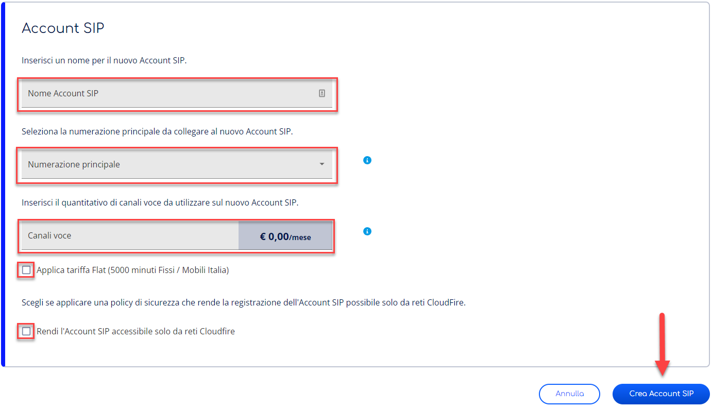

> [!NOTE]
> Stiamo aggiornando la tua esperienza utente in Cortex. In questo periodo di transizione, è possibile che alcune guide non siano completamente allineate con le novità sul portale.

Questa pagina spiega come creare ed eliminare gli Account SIP

- **Creare** un Account permette di applicarvi la prima configurazione generarne le credenziali SIP.
- **Eliminare** un Account cancella tutti i dati a questo collegati.

# Informazioni sugli Account SIP

Gli Account SIP sono profili contenenti i dati di configurazione e di autenticazione mediante il protocollo SIP. Sono utilizzati per effettuare e ricevere chiamate VoIP e per il collegamento agli Utenti Teams.

## Stati dell’Account SIP

Un Account può assumere i seguenti stati:

- **Attivo**: Account SIP attivo e configurabile su qualsiasi device SIP tramite autenticazione utente e password;
- **Da attivare**: Account SIP da attivare;
- **Collegato a Teams**: Account SIP correttamente collegato con Talky Time Direct Routing per l’integrazione con Microsoft Teams®.
- **Disattivo**: Account SIP la cui registrazione SIP è sospesa;

# Accedi alla sezione Account SIP

Per accedere al sezione Account SIP puoi seguire i seguenti passaggi:

1. Accedi al servizio **SIP Account** nella categoria **Unified Communication.** Non sai come fare? Segui la nostra [**guida**](../gestione-del-servizio-sip-account.md)**.**
2. Seleziona la voce **Account SIP** dalle tab di navigazione in alto.

## Crea un Account SIP

Per creare un Account SIP è sufficiente seguire i seguenti passaggi:

1. Premi su **Nuovo Account SIP**.
2. Inserisci i dati richiesti nella finestra di dialogo e dopo aver controllato i dati inseriti nella pagina conferma cliccando il bottone **Crea Account SIP**.
1.   **Nome Account SIP**: Identificativo per l’Account SIP all’interno del servizio
2.   **Numerazione Principale**: Numerazione permanentemente collegata all’Account SIP che verrà utilizzata per le chiamate in ingresso ed uscita. Potrai selezionare tra tutte le Numerazioni in stato **Attivo** non collegate ad altri Account SIP. Potrai collegare ulteriori Numerazioni dal [Dettaglio Account SIP](./gestione-account-sip/configurazione-account-sip.md).
3.   **Canali voce**: Quantitativo di chiamate contemporanee che è possibile effettuare sull’Account SIP. Vengono considerate sia le chiamate in ingresso che quelle in uscita.
4.   **Applica tariffa Flat**: Di default viene applicato il listino a consumo, tuttavia è possibile scegliere di cambiare ponendo una spunta e applicare la tariffa Flat.
5.   **Rendi l’Account SIP accessibile solo da reti CloudFire**: Opzione per aumentare la sicurezza dell'Account SIP. Spunta tale opzione se ti ritrovi nei seguenti due casi:
  
  1.   se utilizzi l’integrazione con il Direct Routing con Talky Time
  
  2.   se il trunk che intendi configurare su uno specifico apparato naviga attraverso la connettività di CloudFire.
3. Una volta confermato si aprirà una finestra di dialogo, conferma nuovamente cliccando su **Crea Account SIP**.

> [!WARNING]
> Una volta confermato l’Account SIP creato **non è ancora attivo.** Tuttavia puoi configurare il tuo dispositivo con l’Account SIP creato. L’Account SIP non riceverà chiamate finche non sarà attivo.

> [!TIP]
> Se non visualizzi alcuna Numerazione nella selezione per la Numerazione Principale assicurati di avere almeno una Numerazione in stato **Abilitato** non collegata ad alcun Account SIP.

> [!INFO]
> La **Numerazione Principale** verrà presentata in tutte le chiamate in uscita provenienti da questo Account SIP.

> [!WARNING]
> Una volta confermata la creazione la **Numerazione Principale** verrà legata all’Account SIP e non sarà più utilizzabile altrove. Per rendere nuovamente questa Numerazione disponibile occorrerà eliminare l’Account SIP.

> [!NOTE]
> Il costo del traffico telefonico può essere modificato in qualsiasi momento. Controlla i tuoi consumi nell’apposita sezione [**Dettaglio traffico telefonico**](../../../../knowledge-base/account-manager/riepilogo-costi/dettaglio-traffico-telefonico.md)**.**

# Disattiva un Account SIP

Per disattivare un Account SIP è sufficiente seguire questi passaggi:

1. Nella tab **Account SIP**, nella finestra di gestione degli Account in corrispondenza dell’Account che si intende **disattivare** e premi il bottone Azione: **disattiva**.
2. Conferma ulteriormente premendo il bottone **Elimina** nella finestra di dialogo per eliminare l’Account SIP, visualizzerai nuovamente la pagina Account SIP senza più l’Account SIP eliminato.

# Elimina un Account SIP

Per eliminare un Account SIP è sufficiente seguire questi passaggi:

1. Nella tab **Account SIP**, nella finestra di gestione degli Account in corrispondenza dell’Account **Disabilitato** che si intende eliminare e premi il bottone Azione: **Elimina**.
2. Conferma ulteriormente premendo il bottone **Elimina** nella finestra di dialogo per eliminare l’Account SIP, visualizzerai nuovamente la pagina Account SIP senza più l’Account SIP eliminato.

> [!WARNING]
> Per eliminare un Account SIP è necessario scollegare le numerazioni aggiuntive e rimuovere le regole Caller ID.

> [!WARNING]
> Eliminare un Account libererà la Numerazione Principale collegata.

Da questa sezione:
