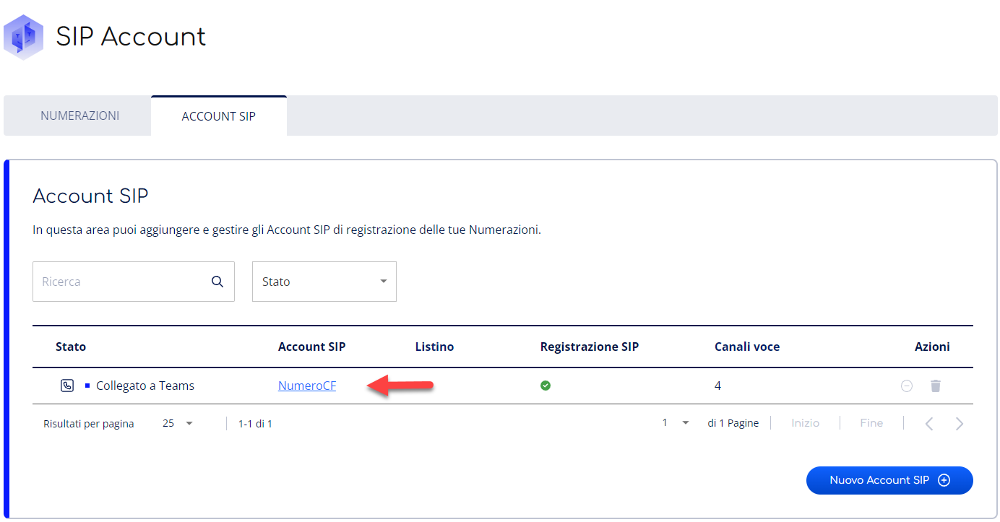
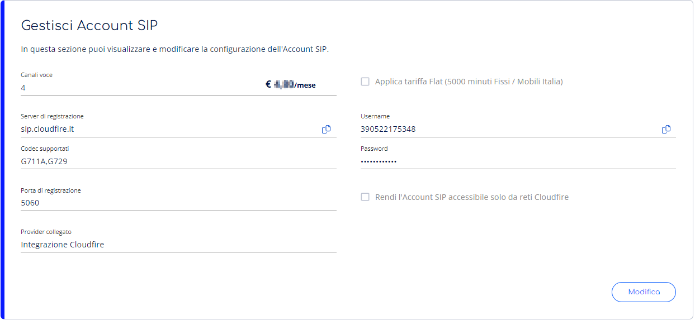
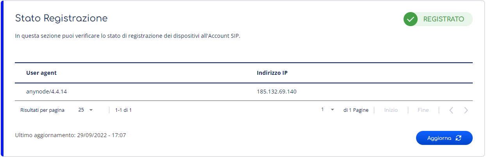
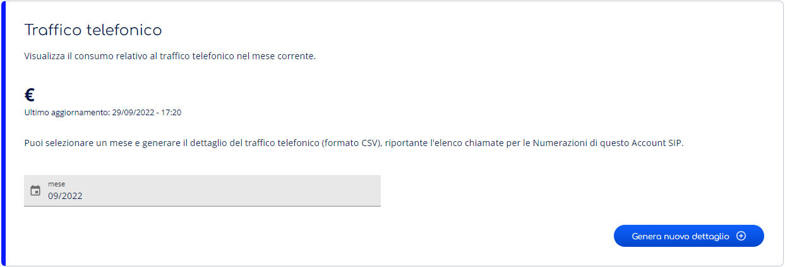

> [!NOTE]
> Stiamo aggiornando la tua esperienza utente in Cortex. In questo periodo di transizione, è possibile che alcune guide non siano completamente allineate con le novità sul portale.

Questa pagina spiega come configurare un Account SIP, cioè modificare i parametri e collegare all’account ulteriori numerazioni, abilitare e disabilitare l’account.

Per configurare l’Account SIP occorre accedere alla sezione di dettaglio di Account SIP.

# Accedi alla sezione di dettaglio di Account SIP

In questa sezione puoi visionare lo stato dell’Account, i suoi dettagli ed i suoi parametri di configurazione SIP, compresi **Username** e **Password** di registrazione, modificarne la configurazione, abilitare e disabilitare l’account.

> [!NOTE]
> Alcune azioni rapide sono anche disponibili direttamente nella pagina Account SIP, all’interno del menu Azioni di ciascun Account.

> [!INFO]
> Le azioni disponibili in fase di configurazione dipendono dallo [**Stato dell’Account**](../gestione-account-sip.md)**.**

Per accedere alla sezione di dettaglio di un Account SIP è sufficiente seguire i seguenti passaggi:

1. Accedi ad **Account SIP**. Non sai come fare? Segui la nostra [**guida**](../../gestione-del-servizio-sip-account.md)**.**
2. Premi sul nome dell’**Account SIP** per entrare nel dettaglio e nella gestione dell’Account stesso
3. Seleziona la Tab **Dettaglio.**

## Gestisci Account SIP

In questa sezione puoi modificare la configurazione, Abilitare e Disabilitare l’Account SIP.

### Informazioni Dettaglio Account SIP

Un Account presenta i seguenti dettagli e parametri di configurazione SIP:

Nella sezione ***Gestisci Account SIP*** trovi le seguenti voci:

- **Canali voce:** Quantitativo di chiamate contemporanee che è possibile effettuare sull’Account. Vengono considerate sia le chiamate in ingresso che quelle in uscita.
- **Server di registrazione:** URL del server di registrazione dell’Account tramite protocollo SIP. Il valore di default è sip.cloudfire.it. Nel campo è presente un bottone **Copia** per copiarne rapidamente il contenuto negli appunti.
- **Codec supportati:** Elenco dei codec VoIP supportati dall’Account. I codec supportati di default sono **G711A** e **G729**.
- **Porta di registrazione:** Porta UDP di registrazione dell’Account tramite protocollo SIP. Il valore di default è **5060**.
- **Applica tariffa**: applicazione tariffa Flat.
- **Username:** Username di registrazione dell’Account tramite protocollo SIP. Nel campo è presente un bottone **Copia** per copiarne rapidamente il contenuto negli appunti.
- **Password:** Password di registrazione dell’Account tramite protocollo SIP. Nel campo è presente un bottone **Copia** per copiarne rapidamente il contenuto negli appunti.
- **Rendi l’Account SIP accessibile solo da reti CloudFire**

Nella sezione ***Stato Registrazione*** viene visualizzato lo stato di registrazione dell’account:

- **Stato non registrato:** Account SIP ancora non registrato
- **Stato registrato:** Account SIP configurato sul dispositivo, oppure completata l’integrazione Talky Time Direct Routing.

### Modifica Account

Per modificare un Account è sufficiente seguire questi passaggi:

1. Accedi al Dettaglio dell’Account che vuoi modificare e premi il bottone **Modifica** nella sezione Gestisci Account.
2. Modifica i dati nei campi sbloccati:
1.   Nome Account
2.   Listino
3.   Canali voce
3. Premi il bottone **Conferma** in basso a destra nella stessa sezione.
4. Visualizzerai nuovamente la pagina Dettaglio Account con i nuovi dati inseriti nei campi della sezione Gestisci Account.

### Genera Password di autenticazione sicura

Per generare una nuova Password di autenticazione dell'Account è sufficiente seguire i seguenti passaggi:

1. Accedi al Dettaglio dell’Account del quale vuoi rigenerare la Password e premi il bottone **Modifica** nella sezione Gestisci Account.
2. Premi sul bottone **Genera password sicura** sotto al campo Password. Da qui hai la possibilità di visualizzare la password cliccando sul bottone mostra/nascondi.
3. Visualizzerai nuovamente la pagina Dettaglio Account con la nuova Password generata e disponibile per la copia nella sezione Gestisci Account.

### Abilita Account

> [!TIP]
> Abilitare un Account ne ripristina la registrazione SIP.

Per abilitare un Account è sufficiente seguire questi passaggi:

1. Accedi alla pagina di gestione dell'Account SIP che vuoi abilitare e premi il bottone verde **Attiva** in corrispondenza dell’Account scelto.
2. Premi il bottone **Attiva** nella finestra di dialogo che si apre successivamente per confermare l’operazione. Visualizzerai nuovamente la pagina Dettaglio Account con lo stato **Abilitato**.

> [!INFO]
> La registrazione SIP viene automaticamente ripristinata all’abilitazione, visualizzerai lo stato **Registrato** nella sezione Stato registrazione. Puoi forzare l’aggiornamento della lista dei dispositivi registrati premendo il bottone **Sincronizza** in basso a destra nella sezione Stato registrazione.

> [!WARNING]
> Il bottone **Abilita** risulta visibile solo se l’Account è in stato **Disabilitato**.

### Disabilita Account

> [!WARNING]
> Disabilitare un Account ne interrompe la registrazione SIP.

Per disabilitare un Account è sufficiente seguire questi passaggi:

1. Accedi alla pagina di gestione dell'Account SIP che vuoi disabilitare e premi il bottone verde **Attiva** in corrispondenza dell’Account scelto.
2. Premi il bottone **Disabilita** nella finestra di dialogo per disabilitare l’Account, visualizzerai nuovamente la pagina Dettaglio Account con lo stato **Disabilitato**.

> [!INFO]
> La registrazione SIP viene automaticamente interrotta alla disabilitazione, visualizzerai lo stato **Non registrato** nella sezione Stato registrazione.

> [!WARNING]
> Il bottone **Disabilita** risulta visibile solo se l’Account è in stato **Abilitato**.

### Stato registrazione

Nella sezione Stato Registrazione, nella pagina di dettaglio di un account SIP puoi visionare l’elenco dei dispositivi SIP registrati tramite questo Account. Ogni dispositivo presenterà il suo **User Agent** e l’**Indirizzo IP** di registrazione.

La registrazione può assumere i seguenti stati:

- **Registrato**: Registrazione SIP avvenuta con successo su almeno un dispositivo
- **Non registrato**: Registrazione SIP fallita o nessun dispositivo configurato per la registrazione.

Puoi forzare l’aggiornamento della lista dei dispositivi collegati premendo il bottone **Aggiorna** in basso a destra nella sezione. In basso a sinistra puoi visionare data ed ora dell’ultimo aggiornamento.

### Traffico Telefonico

Nella sezione Traffico Telefonico, nella pagina di dettaglio di un account SIP puoi generare ed effettuare il download del dettaglio del traffico telefonico (formato CSV) specifico dell’Account SIP selezionato effettuato nel mese corrente o nei mesi precedenti.

Per generare ed effettuare il download del dettaglio dei traffico telefonico è sufficiente seguire i seguenti passaggi:

1. Seleziona o inserisci il **mese** e l’**anno** di cui vuoi richiedere il dettaglio, utilizzando il calendario o inserendo il valore nel formato **MM/AAAA**;
2. Premi il bottone **Genera dettaglio** ed attendi il termine dell’operazione;
3. Premi il bottone di **download**, contenente il nome del file ed il periodo di riferimento selezionato, per avviare il download del file.

Una volta generato, il dettaglio traffico telefonico rimane disponibile in pagina per futuri download.

Se ti occorre generare un nuovo dettaglio premi il bottone **Genera nuovo dettaglio** e segui nuovamente la procedura, selezionando il nuovo periodo.

> [!NOTE]
> Il dettaglio del traffico Telefonico è relativo all’Account SIP selezionato. Per visionare il dettaglio di tutti gli Account SIP abilitati [**segui questa guida**](../../../../../knowledge-base/account-manager/riepilogo-costi/dettaglio-traffico-telefonico.md)**.**

> [!INFO]
> Non sai come operare sul Dettaglio traffico telefonico? [**Segui la nostra guida**](../../../../../knowledge-base/account-manager/riepilogo-costi/dettaglio-traffico-telefonico.md)**.**

