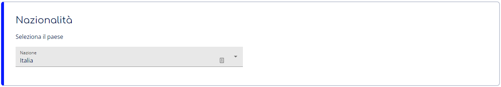
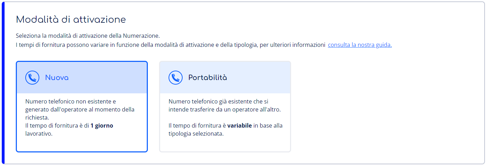
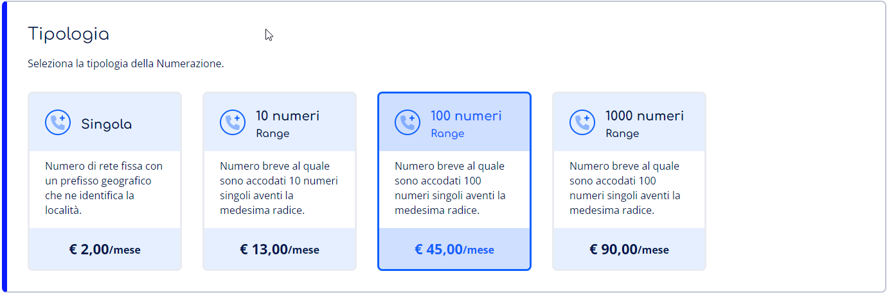
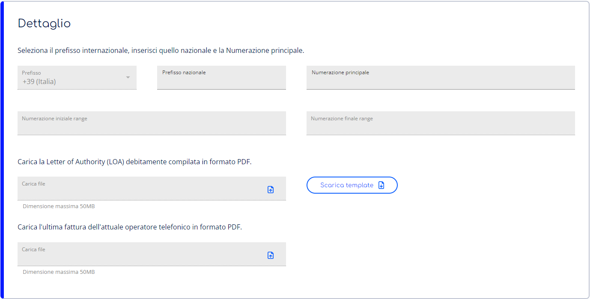
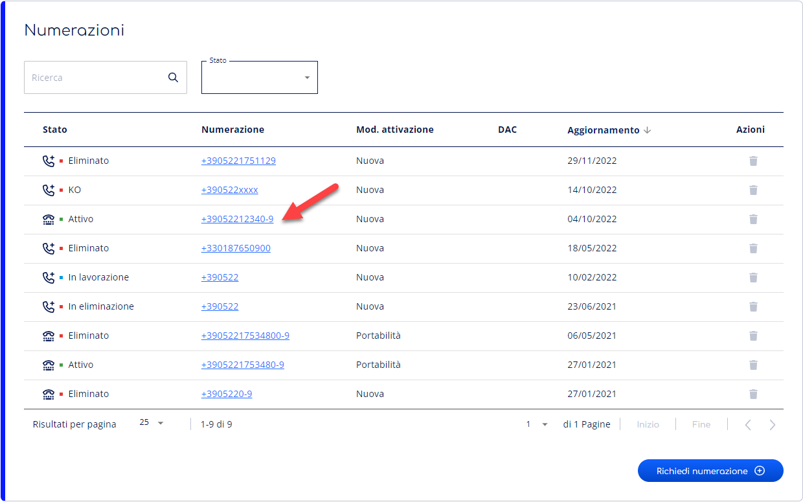

> [!NOTE]
> Stiamo aggiornando la tua esperienza utente in Cortex. In questo periodo di transizione, è possibile che alcune guide non siano completamente allineate con le novità sul portale.

Questa pagina spiega come richiedere l’Attivazione e la Cessazione delle Numerazioni telefoniche.

- **Attivare** una Numerazione significa richiedere la generazione di una nuova Numerazione telefonico oppure effettuare portabilità di una Numerazione esistente.
- **Eliminare** una Numerazione significa richiederne la dismissione completa.

# Informazioni sulle Numerazioni

Le Numerazioni possono essere suddivise per **Modalità di attivazione** e per **Tipologia**. Questi fattori determinano le tempistiche di attivazione di una Numerazione e sono assolutamente indipendenti l'uno dall’altro.

### Nazionalità

Per attivare e richiedere una numerazione è necessario selezionare il paese di riferimento.

### Modalità di attivazione

Le Numerazioni possono avere due diverse modalità di attivazione: **Nuova** o in **Portabilità.**

- **Nuova** → Una Numerazione Nuova è un numero telefonico generato e fornito ex novo da un operatore.
- **Portabilità** → Una Numerazione in Portabilità è un numero telefonico già attivo, trasferito da un operatore cedente (donating) ad uno ricevente (donor).

> [!WARNING]
> Per richiedere la Portabilità per una Numerazione sono necessari:
> - **Codice di migrazione** → Codice alfanumerico lungo fino a 18 caratteri necessario per validare la richiesta di Portabilità. Solitamente è riportato sulla fattura dell’operatore cedente (donating) relativa alla Numerazione per la quale richiedere la Portabilità.
> - **Letter of Authority** → Documento legale che garantisce a CloudFire di poter agire per conto del cliente in relazione alla richiesta di Portabilità della Numerazione. Questa deve essere debitamente compilata, firmata e timbrata.  
> Scarica la [Letter of Authority](https://cloudfireit.atlassian.net/wiki/download/attachments/1966249500/CloudFire_Letter_of_authority.pdf?api=v2).
> - **Ultima fattura dell’operatore cedente** (donating) riportante la Numerazione per la quale richiedere la Portabilità.

### Tipologia

Le Numerazioni possono essere di Tipologia **Singola** o **Range**.

- **Singola** → Una Numerazione Singola è un numero telefonico di rete fissa con un prefisso geografico che ne identifica la località.
- **Range 10/100/1000 numeri** → Una Numerazione Range è un numero telefonico breve al quale sono accodati 10/100/1000 numeri singoli avente la medesima radice. Viene identificata anche come GNR (Gruppo Numerazione Ridotta).

> [!INFO]
> I tempi tecnici per l’attivazione di una Numerazione variano sulla base della Modalità di attivazione e della Tipologia selezionate:
> - La fornitura di una Numerazione **Nuova** di Tipologia **Singola** o **Range** richiede fino ad **1 giorno lavorativo**.
> - La fornitura di una Numerazione in **Portabilità** di Tipologia **Singola** richiede fino a **16 giorni lavorativi**.
> - La fornitura di una Numerazione in **Portabilità** di Tipologia **Range** richiede fino a **21 giorni lavorativi**.

# Accedi alla sezione Numerazioni

Per accedere al sezione Numerazioni puoi seguire i seguenti passaggi:

1. Accedi al servizio **SIP Account** nella categoria **Unified Communication.** Non sai come fare? Segui la nostra [**guida**](../gestione-del-servizio-sip-account.md)**.**
2. Seleziona la voce **Numerazioni** dalle tab di navigazione in alto.

## Attiva una Numerazione

### Richiedi una numerazione

Per richiedere l'attivazione di una Numerazione è sufficiente seguire i seguenti passaggi:

1. Premi sul bottone **Richiedi numerazione;**
2. Seleziona la **Nazionalità** dal menù a tendina;
3. Seleziona la **Modalità di attivazione: Nuova**;
4. Seleziona la **Tipologia** della nuova Numerazione. Puoi scegliere tra Singola, range di 10 numeri, range di 100 numeri e range di 1000 numeri;
5. Seleziona il **prefisso internazionale** ed inserisci il **prefisso nazionale** della Numerazione (es. 0522);
6. Inserisci i **dati anagrafici** relativi al cliente ed alla sede di attivazione della Numerazione;
7. Premi poi il bottone **Richiedi numerazione.**

### Richiedi la portabilità di una numerazione

Per richiedere la portabilità di una Numerazione è sufficiente seguire i seguenti passaggi:

1. Premi sul bottone **richiedi numerazioni;**
2. Seleziona la **Nazionalità** dal menù a tendina;
3. Seleziona la **Modalità di attivazione: Portabilità;**
4. Seleziona la **Tipologia** della nuova Numerazione. Puoi scegliere tra Singola, range di 10 numeri, range di 100 numeri e range di 1000 numeri;
5. Inserire il dettaglio dei seguenti campi;
1.   il **prefisso internazionale** ed inserisci il **prefisso nazionale** della Numerazione (es. 0522)
2.   la **Numerazione principale** sprovvista di prefisso nazionale
3.   il **Codice di migrazione** relativo alla Numerazione,
4.   la **Letter of Authority** debitamente compilata
5.   l’**ultima fattura dell’operatore cedente** (donating)
6. Inserisci i **dati anagrafici** relativi al cliente ed alla sede di attivazione della Numerazione.
7. Premi poi il bottone **Richiedi numerazione.**
8. Conferma la richiesta di numerazione e premi su **Richiedi** per confermare nuovamente.

In seguito alla richiesta, nella pagina di riepilogo Numerazioni potrai visualizzare le nuove richieste, il loro stato e richiedere ulteriori numerazioni. Gli stati possono essere:

- stato **Acquisito**;
- stato **In lavorazione**;
- stato **Attivo**;
- stato **KO**;

> [!INFO]
> In caso siano richiesti ulteriori dettagli per l’attivazione il nostro reparto Delivery ti contatterà entro **2 giorni lavorativi**. Se trascorso questo tempo non ricevi alcuna comunicazione ti invitiamo ad aprire un [**Case**](#) al nostro supporto.

### Richiesta in lavorazione

Una volta che il nostro reparto Delivery processerà la richiesta la vedrai passare allo stato **In lavorazione** e questa risulterà effettivamente in carico all’operatore telefonico.

> [!INFO]
> In caso di Numerazione in **Portabilità** vedrai anche valorizzato il campo **DAC** con la data effettiva di migrazione della Numerazione dall’operatore cedente (donating) all’operatore ricevente (donor).

> [!WARNING]
> I tempi tecnici di fornitura delle Numerazioni sono indicati nel paragrafo [Tipologia](https://cloudfireit.atlassian.net/wiki/spaces/~239475519/pages/2053701758/Richiesta+numerazione#Tipologia) e non sono in alcun modo alterabili. Inoltre, una volta finalizzata la data di Portabilità della Numerazione (DAC) non è possibile modificarla.

### Esito negativo durante la lavorazione (Numerazione in Portabilità)

Durante il processo di attivazione di una Numerazione in Portabilità la richiesta potrebbe essere **bocciata** dagli operatori cedente o ricevente per problemi o incongruenze nella richiesta.

I problemi più comuni sono:

- Codice di migrazione errato
- Letter of Authority o ultima fattura dell’operatore donating non valida
- Rifiuto da parte dell’operatore donating per insoluto amministrativo

> [!INFO]
> In caso di di bocciatura della richiesta di Portabilità verrai contattato dal nostro reparto Delivery che ti comunicherà il problema evidenziato e ti assisterà nell’invio di una nuova richiesta.

### Richiesta espletata

Alla generazione della Numerazione (in caso di Nuova attivazione) o al raggiungimento della DAC (in caso di Portabilità) lo stato della richiesta passa ad **Attivo** e vengono generati tutti i numeri telefonici appartenenti alla Numerazione e possono essere visualizzati nel Dettaglio di quest’ultima.

Da questo momento puoi Creare un Account e collegarvi le Numerazioni così da impiegarle su dispositivi SIP o per gli Utenti Teams.

## Accedi al riepilogo delle Numerazioni

Nella sezione SIP Account, una volta richiesta almeno una numerazione, è possibile visionare:

- il riepilogo delle numerazioni attive, acquistate, in lavorazione, KO, in eliminazione ed eliminate;
- modalità di attivazione;
- DAC - Data attesa di consegna;
- le possibili azioni da effettuare.

Per accedere al riepilogo delle numerazioni puoi seguire i seguenti passaggi:

1. Seleziona la voce **Numerazioni** dalle tab di navigazione in alto.

### Accedi al dettaglio della numerazione

Nella pagina di Dettaglio della Numerazione puoi visionarne i dettagli, la configurazione e l’Elenco numerazioni.

Per accedere al Dettaglio della Numerazione è sufficiente seguire i seguenti passaggi:

1. Accedi al **riepilogo delle numerazioni**;
2. Premi sulla **numerazione** di cui vuoi conoscere il dettaglio.

### Dettaglio e configurazione

In questa sezione puoi visionare tutti i dettagli inseriti durante la richiesta di attivazione della Numerazione, oltre all’eventuale data di espletamento della Portabilità (**DAC**) ed al **Codice di migrazione in uscita**.

> [!INFO]
> Puoi utilizzare il **Codice di migrazione in uscita** per richiedere la Portabilità della Numerazione verso un altro operatore ricevente (donor).

### Elenco numeri

In questa sezione sono indicati tutti i numeri telefonici appartenenti alla Numerazione e gli eventuali Account ai quali questi sono collegati. I numeri vengono mostrati per intero, provvisti di prefisso internazionale.

> [!NOTE]
> Sulla base della Tipologia di Numerazione, vengono quindi mostrati:
> - **1 numero** in caso di Numerazione **Singola**
> - **10 numeri** in caso di Numerazione **Range 10 numeri**. Questi sono composti dalla radice con l’aggiunta di una cifra al termine del numero che va da **0** a **9**.
> - **100 numeri** in caso di Numerazione **Range 100 numeri**. Questi sono composti dalla radice con l’aggiunta di due cifre al termine del numero che vanno da **00** a **99**.
> - **1000 numeri** in caso di Numerazione **Range 1000 numeri**. Questi sono composti dalla radice con l’aggiunta di tre cifre al termine del numero che vanno da **000** a **999**.

# Elimina una Numerazione

Per richiedere l’eliminazione della Numerazione è sufficiente seguire i seguenti passaggi:

1. Nella sezione Numerazioni, premi il bottone **Azioni** in corrispondenza della Numerazione che vuoi eliminare e seleziona il simbolo di **Eliminazione**.
2. Premi il bottone **Elimina** nella finestra di dialogo per richiedere l’eliminazione, visualizzerai nuovamente la pagina Numerazioni con la richiesta in stato **In eliminazione**.  
Quando la richiesta verrà espletata visualizzerai la Numerazione in stato **Eliminato**

> [!WARNING]
> Una numerazione **Eliminata** non può più essere collegata ad alcun Account.

> [!INFO]
> La procedura di eliminazione può impiegare fino a **2 giorni lavorativi** per essere completata. Se trascorso questo tempo la Numerazione non risulta ancora eliminata ti invitiamo ad aprire un [**Case**](#) al nostro supporto.

Approfondisci la [guida](../gestione-del-servizio-sip-account/gestione-account-sip.md) per la creazione e gestione di Account SIP.