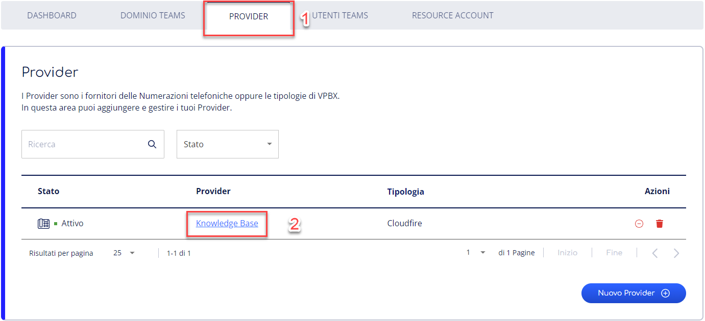
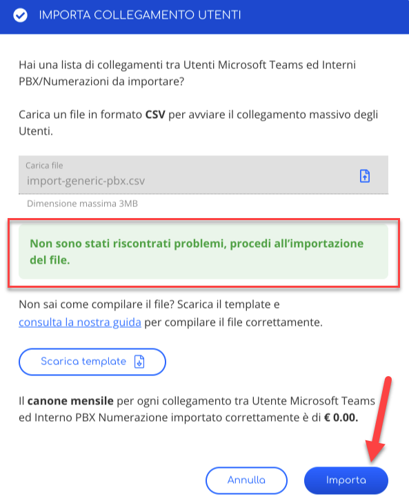

> [!NOTE]
> Stiamo aggiornando la tua esperienza utente in Cortex. In questo periodo di transizione, è possibile che alcune guide non siano completamente allineate con le novità sul portale.

Questa guida spiega come configurare più utenti mediante un unico file.csv che puoi raggiungere nella sezione **Direct Routing di Talky Time - Utenti Teams**.

> [!NOTE]
> Per ciascun utente da importante è necessario fornire i seguenti campi nel seguente formato e ordine:
> ***provider,upn,provider\_prefix,number,provider\_number,country\_prefix,username,password;***

|     |     |     |
| --- | --- | --- |
| ***provider*** | Si intende il nome del provider indicato nella sezione **provider** nella finestra di dialogo **Account SIP.** |  |
| ***upn*** | Si intende l'Username dell'utente Microsoft da associare. | Ad esempio [nome.cognome@dominio.it](mailto:nome.cognome@dominio.it) |
| ***provider\_prefix*** | Si intende il prefisso relativo al **Provider**  > [!NOTE] > Tale indicazione è da compilare **solamente** in caso di SIP Trunk.   > Se la numerazione ha come operatore CloudFire utilizzare 39, altrimenti contattate il vostro provider.   > Tale dato lo hai inserito, in caso di SIP Trunk, durante il processo di creazione di un nuovo provider come nell’immagine allegata qui di seguito. |  |
| ***number*** | Si intente il numero di telefono da associare all’utente, equivalente a Numerazione principale  > [!NOTE] > In caso di SIP Trunk o di SIP Extension utilizza il numero del formato Nazionale es. 0522 17534. |  |
| ***provider\_number*** | Si intende l'interno PBX da associare all'utente microsoft teams. | > [!NOTE] > Da compilare soltanto nel caso in cui il provider inserito sia di tipologia **PBX**. |
| ***country\_prefix*** | Si intende il prefisso internazionale | > [!NOTE] > Da compilare solo in caso di SIP Trunk nel formato E.164 es. +39 per Italia, +1 per USA) |
| ***username*** | Si intente l’Username dell'account SIP associato al number  > [!NOTE] > in caso di SIP TRUNK solo il numero PRINCIPALE avrà questo campo compilato. In tutti gli altri casi ogni number avrà il proprio username. |  |
| ***password*** | Si intende la Password dell' account SIP associato al number  > [!NOTE] > in caso di SIP TRUNK solo il numero PRINCIPALE avrà questo campo compilato. In tutti gli altri casi ogni number avrà la propria password. |  |

## Procedura di Import

1. Accedi al **progetto** in cui vuoi collegare gli utenti, clicca su **Direct Routing** nel menù a sinistra, e seleziona **Utenti Teams** nella tab in alto.
2. Premi su **Importa**.
3. Una colta aperta la finestra per importare collegamento utenti e premi sull'**icona di upload del file**

4\. Seleziona il file .csv compilato come illustrato nella sezione superiore della presente guida.

> [!NOTE]
> Durante l’upload viene eseguito un controllo nella formattazione del file .csv.

5\. Nel momento in cui tutti i controlli risultano corretti e il documento di importazione completo, premi su **Importa** per procedere all’impor massivo degli Utenti.

6\. Una volta concluso l’import degli utenti verrà eseguito il collegamento degli utenti con le numerazioni. Lo stato degli Utenti potrà essere **In collegamento**, **Collegato**.

7\. Come per gli altri Utenti Microsoft Teams, per visionare e modificare il dettaglio di ciascun utente Microsoft Teams premi sul nome dell’Utente Microsoft Teams. Una volta premuto puoi visionare il dettaglio dell’utente, lo stato e modificarlo.

Per scollegare l’utente Microsoft Teams è necessario premere sull’azione **Scollega utente** in alto a sinistra.

## Troubleshoot

### Errori di formattazione del file

In caso di errore presente nel file di import quali:

- campi compilati rispetto al previsto
- errori di formattazione

verrà generato **errore** relativo alla **verifica del file .csv** che si prova a caricare come nell’immagine di seguito.

### Errori relativi agli utenti

In caso di errore presente upload di file quali:

- parametri di configurazione di un utente già associato

verrà generato **errore** relativo alla **verifica del file .csv** che si prova a caricare come nell’immagine di seguito.

**Per risolvere il problema è necessario rimuovere gli utenti già configurati dal file.csv**

