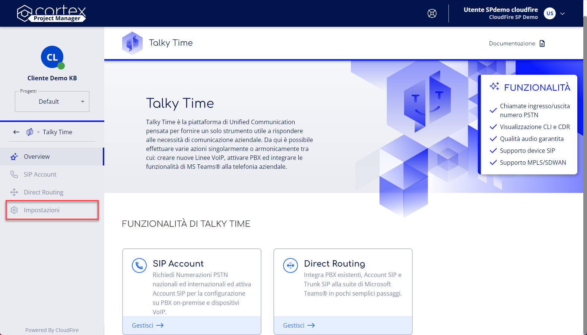

> [!NOTE]
> Stiamo aggiornando la tua esperienza utente in Cortex. In questo periodo di transizione, è possibile che alcune guide non siano completamente allineate con le novità sul portale.

Questa pagina definisce i passaggi da seguire per la gestione delle impostazioni del servizio di Talky Time.

1. Accedi al servizio **Talky Time**. Non sai come fare? Segui la nostra [**guida**](https://cloudfireit.atlassian.net/wiki/spaces/KB/pages/1966249437/Gestione+del+servizio+-+Talky+Time#Accedi-al-servizio-Talky-Time)**.**
2. Seleziona la voce **Impostazioni** dal menù di navigazione laterale.

Dalla sezione impostazioni:
