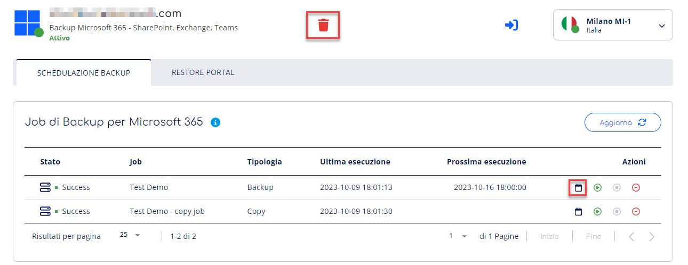
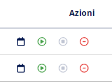
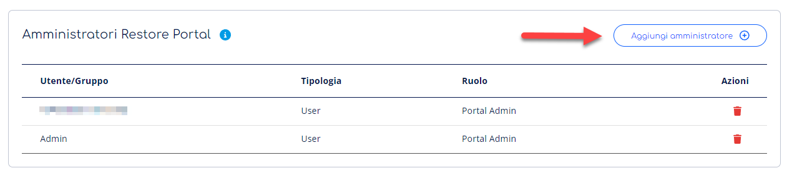
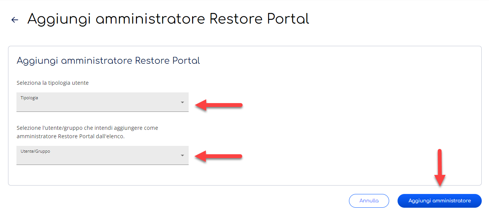
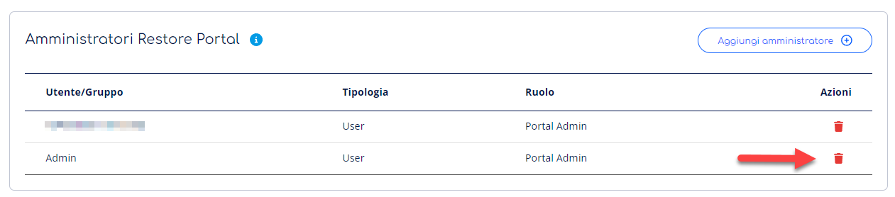

> [!NOTE]
> Stiamo aggiornando la tua esperienza utente in Cortex. In questo periodo di transizione, è possibile che alcune guide non siano completamente allineate con le novità sul portale.

Questa pagina spiega come attivare Backup di Microsoft 365 di Veeam Cloud Platform.

Il servizio Backup 365 elimina il rischio di perdere l’accesso e il controllo sui tuoi dati Microsoft 365 inclusi Exchange Online, SharePoint Online, OneDrive for business e Microsoft Teams.

# Accedi a Backup Microsoft 365

Per accedere a Backup Microsoft 365 è sufficiente seguire i seguenti passaggi:

1. Accedi al servizio **Veeam Cloud Platform**. Non sai come fare? Segui la nostra [**guida**](../gestione-del-servizio-veeam-cloud-platform.md)**.**
2. Seleziona la voce **Backup Microsoft 365** dalle voci presenti in tab.

# Attiva Backup Microsoft 365

Per attivare Backup Microsoft 365 è sufficiente seguire i seguenti passaggi:

1. Accedi alla voce **Backup Microsoft 365** del servizio **Veeam Cloud Platform** dalla tab;
2. Premi il bottone **Attiva Backup Microsoft 365** nell’Overview;
3. **Inserisci il dominio Microsoft** (Microsoft Initial Domani Name) dell’organizzazione di cui vuoi fare il backup. Scopri come trovare il Microsoft Initial Domain Name da Microsoft 365 Admin Center e premi sul bottone **prosegui**;
4. **Copia** il codice, utile ad autorizzare il collegamento tra Veeam e la tua organizzazione Microsoft, con il bottone copia e premi su **autorizza su Microsoft**;
5. Si aprirà una pagina **Pop up;**
6. Inserisci **il codice** precedentemente copiato e premi su accetta;
7. Conferma la creazione della tua organizzazione Microsoft su Veeam e attiva il Restore Portal premendo sul bottone **Completa attivazione.**

> [!INFO]
> Il codice creato ha una validità di 10 minuti dalla sua generazione, se il codice non viene accettato, torna allo step precedente per rigenerarlo e ripeti l’operazione utilizzando il nuovo codice.

> [!NOTE]
> L’intera procedura può a impiegare fino a circa **10 min.** Se trascorso questo tempo il servizio non risulta ancora in stato **Attivo** potrai eliminare il servizio e avviare nuovamente l’attivazione.

> [!WARNING]
> Qualora non rispettassi i requisiti richiesti o il codice fosse scaduto, il processo viene automaticamente **interrotto**. Dovrai procedere nuovamente al collegamento e premere sul bottone **elimina** in alto.

# Elimina Backup Microsoft 365

Per eliminare un Backup Microsoft 365 è sufficiente seguire i seguenti passaggi:

1. Accedi alla voce **Backup Microsoft 365** del servizio **Veeam Cloud Platform** dalle tab in alto;
2. Premi il bottone **Elimina;**
3. **Conferma** la tua scelta ed elimina il **Backup Microsoft 365**.

> [!NOTE]
> L’intera procedura può a impiegare fino a circa **10 min**. Se trascorso questo tempo il servizio non risulta ancora in stato **Eliminato** ti invitiamo ad aprire un [**Case**](../../../../knowledge-base/account-manager/supporto/case.md) al nostro supporto.

# Accedi alla sezione schedulazione dei Backup

Una volta collegato il dominio Microsoft e creato l'organizzazione puoi schedulare i backup dal servizio Backup Microsoft 365.

Per accedere alla schedulazione dei Backup di Microsoft 365 è sufficiente seguire i seguenti passaggi:

1. Accedi a **Backup Microsoft 365** di Veeam Cloud Platform dalle tab;
2. Raggiungi la voce **Schedulazione Backup** dalla tab

## Crea Job di Backup e Gestisci la schedulazione

In questa sezione puoi accedere alla Veeam Service Provider Console per creare i **Job di Backup** per le risorse di Microsoft 365 e **gestirne la schedulazione.**

> [!NOTE]
> Troverai dei video esplicativi dei passaggi che puoi consultare in qualsiasi momento premendo sul bottone 

Per creare Job di Backup e gestire la schedulazione è sufficiente seguire questi Step:

### Accedi a Veeam Service Provider Console

1. Accedi a **Veeam Cloud Platform,** alla tab **Cloud Connect**
2. Copia l’**username;**
3. Premi il bottone **Accedi;**
4. Effettua il **login** alla **Veeam Service Provider Console** inserendo l’username appena copiato e la password salvata alla creazione del Cloud Connect

### Imposta i tuoi job di Backup

1. Dalla Veeam Service Provider Console, raggiungi la voce **Backup Jobs**, nella categoria Management
2. Raggiungi la voce **Microsoft 365 Object**;
3. Premi sul bottone **Create Job;**
4. Seleziona **Backup Job**;
5. Specifica il nome e la descrizione del Job e Concludi la creazione.

> [!TIP]
> Una volta creato un Job di Backup su Veeam Service Provider Console, trovi il dettaglio e la schedulazione in Veeam Cloud Platforrm

### Imposta la schedulazione dei Backup

1. Torna a **Backup Microsoft 365** su **Veeam Cloud Platform**, alla voce **Schedulazione Backup** nel menù a tendina;
2. Premi sul bottone **modifica schedulazione job di backup**;
3. Definisci quando vuoi il backup venga eseguito in autonomia: seleziona orario e giorno;
4. Definisci quando ritentare automaticamente i job non riusciti;
5. Conferma e salva le tue scelte.

## Altre azioni disponibili

Sono disponibili inoltre altre azioni in pagina tra queste:

- Per avviare i job di backup premi il bottone di **Avvio;**
- Per arrestare i job di backup premi il bottone di **Arresto;**
- Per disattivare i job di backup premi il bottone **Disattiva.**

# Accedi alla sezione Restore Portal

Per accedere alla sezione Restore Portal è sufficiente seguire i seguenti passaggi:

1. Accedi a **Backup Microsoft 365** di Veeam Cloud Platform dalle tab;
2. Raggiungi la voce **Restore Portal** dal menù a tendina.

# Accedi al Restore Portal

Il Restore Portal è il portale utile a ripristinare i dati creati dai backup per le risorse Microsoft 365. Effettua il login con le credenziali del tuo Account Microsoft.

Scopri i casi di utilizzo da questa [**guida**](https://helpcenter.veeam.com/docs/vbo365/guide/ssp_operation_scenarios.html?ver=70).

Per accedere al Restore Portal è sufficiente seguire i seguenti passaggi:

1. Accedi alla sezione Restore Portal di **Backup Microsoft 365** di Veeam Cloud Platform dalle tab;
2. Raggiungi la voce **Restore Portal;**
3. Premi il bottone **Accedi al Restore Portal.**

# Aggiungi Amministratori di Restore Portal

É possibile definire e gestire degli utenti amministratori di Restore Portal che hanno accesso a tutti i backup effettuati per la tua organizzazione.

> [!NOTE]
> Ogni utente può effettuare solo il restore della propria casella.
> Gli Utenti o i gruppi definiti **Amministratori di Restore Portal** hanno accesso a tutti i backup effettuati dall’organizzazione.

Per aggiungere amministratori di Restore Portal è sufficiente seguire i seguenti passaggi:

1. Accedi alla sezione Restore Portal di **Backup Microsoft 365** di Veeam Cloud Platform dalle tab;
2. Raggiungi la voce **Amministratori Restore Portal;**
3. Premi il bottone **Aggiungi amministratore;**
4. Seleziona la **tipologia** di **utente** tra Utente o Gruppo di utente dal menù drop down;
5. Seleziona l’utente o il gruppo di utenti che intendi aggiungere come Amministartore di Restore Portal dal menù drop down.
6. Conferma la tua scelta e premi il bottone **aggiungi amministratore**.

# Elimina Amministratori di Restore Portal

É possibile eliminare gli utenti amministratori di Restore Portal che hanno accesso a tutti i backup effettuati per la tua organizzazione.

Per aggiungere amministratori di Restore Portal è sufficiente seguire i seguenti passaggi:

1. Accedi alla sezione Restore Portal di **Backup Microsoft 365** di Veeam Cloud Platform;
2. Raggiungi la voce **Amministratori Restore Portal;**
3. Premi il bottone **Elimina** in corrispondenza di ogni utente amministratore esistente**;**
4. **Conferma** la tua scelta.

