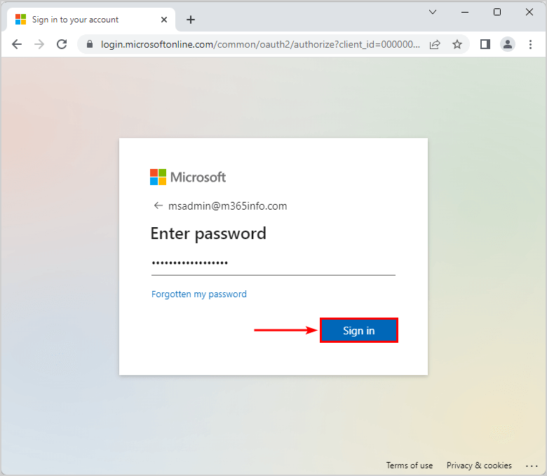
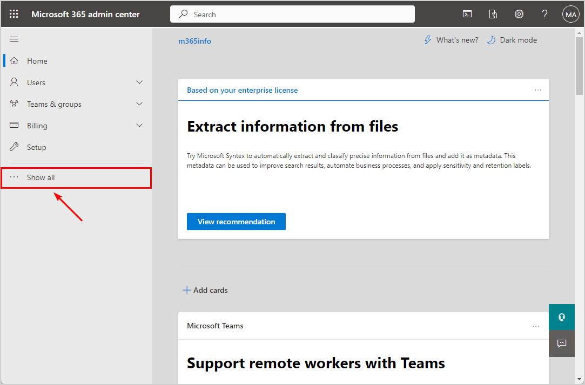
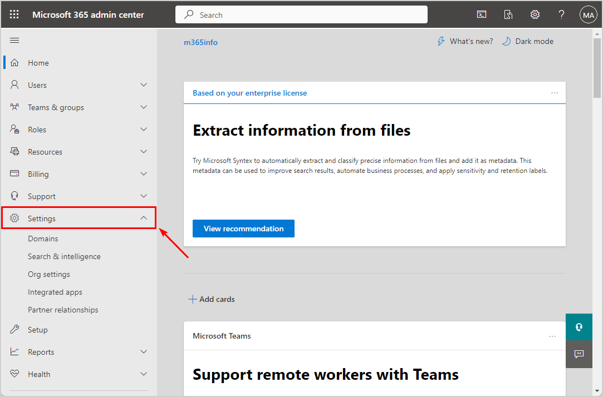
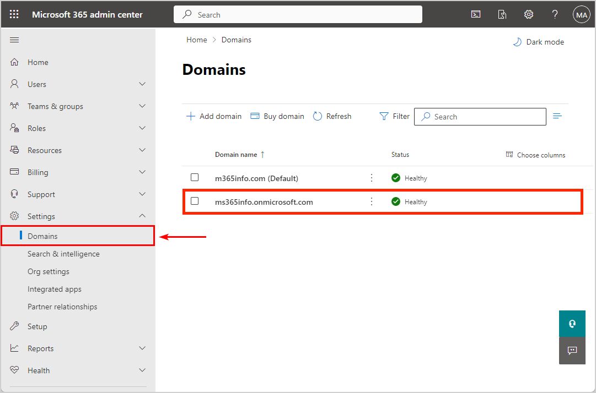

Per trovare il Microsoft Initial Domain Name della tua organizzazione dall’interfaccia di amministrazione di Microsoft 365 puoi seguire i seguenti passaggi

1. Accedi al portale [Microsoft 365 admin center](https://admin.microsoft.com/);
2. Inserisci le tue credenziali di amministratore e accedi;

1. Dal menu del portale sulla sinistra, fai click su **Mostra tutto** (Show all);

1. Espandi la sezione Impostazioni facendo click sull’etichetta **impostazioni**;

1. Clicca sulla voce **Domini** dalle voci di domini, in cui trovi un elenco di tutti i nomi di dominio;
2. Cerca il nome di dominio del tuo tenant che include [onmicrosoft.com](http://onmicrosoft.com) dall’elenco o utilizzando la barra di ricerca in alto a destra;

> [!TIP]
> Una volta trovato il Domain Name è possibile inserirlo in fase di attivazione di Veeam Backup for Microsoft 365.