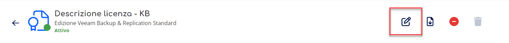
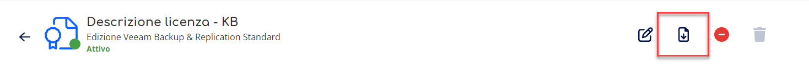
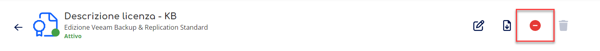
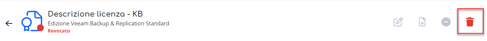

> [!NOTE]
> Stiamo aggiornando la tua esperienza utente in Cortex. In questo periodo di transizione, è possibile che alcune guide non siano completamente allineate con le novità sul portale.

Questa pagina spiega come richiedere e revocare licenze Veeam Rental da Veeam Cloud Platform. Le licenze Veeam Cloud Platform sono necessarie per soluzioni di backup complete, puoi sfruttare la flessibilità di selezionare l’edizione che soddisfa maggiormente le tue richieste, gestire e modificare in modo semplice e on demand licenze e dispositivi associati.

# Accedi alla sezione Licenze Rental

Per accedere alla sezione licenze è sufficiente seguire i seguenti passaggi:

1. Accedi al servizio **Veeam Cloud Platform**. Non sai come fare? Segui la nostra [**guida**](../gestione-del-servizio-veeam-cloud-platform.md)**.**
2. Seleziona la voce **Licenze Rental** dalla tab in alto.

# Attiva la funzionalità licenze

Per attivare nuove licenze è sufficiente seguire i seguenti passaggi:

1. Accedi alla sezione **Licenze;**
2. Premi il bottone **Attiva Licenze;**
3. Nella sezione seleziona **l’edizione** scegli l’edizione del prodotto per visualizzare le licenze disponibili per l’acquisto. Puoi scegliere tra:
-   Veeam Backup & Replication Standard
-   Veeam Backup & Replication Enterprise
-   Veeam Backup & Replication Enterprise Plus
-   Veeam Data Platform - Foundation
-   Veeam Data Platform - Advanced
-   Veeam Data Platform - Premium
-   Microsoft 365
-   Veeam One
-   Kasten
4. Nella sezione **seleziona** **Licenze**, inserisci un nome e il quantitativo di licenze che vuoi attivare in ciascuna riga.  
Nella tabella vengono riportati i costi di acquisto unitari e costo totale.
5. Una volta definito le licenze nella tabella, puoi visualizzare nella sezione **Costo stimato** il riepilogo che fornisce una stima dei costi basati sulla configurazione selezionata. Puoi indicare un quantitativo di tempo in mesi per avere una previsione dei costi in quell’intervallo.
6. Premi sul bottone **attiva licenze**.
7. Lo stato della licenza sarà in un primo momento in **Creazione** e successivamente in **Attivo**.

> [!TIP]
> Verrà generato un **file di licenza (.lic)** che potrai scaricare ed utilizzare all'interno della piattaforma Veeam Backup & Replication.

> [!INFO]
> La procedura di attivazione può impiegare fino a **10 minuti** per essere completata. Se trascorso questo tempo la licenza non risulta ancora attiva ti invitiamo ad aggiornare la pagina e successivamente ad aprire un [**case**](../../../../knowledge-base/account-manager/supporto.md) al nostro supporto.

## Stato Licenze

Una licenza può assumere i seguenti stati:

- **Attivo** → la licenza è stata correttamente acquistata e attivata
- **Creazione** → la licenza è in fase di creazione, occorre attendere il passaggio allo stato **In aggiornamento**
- **In aggiornamento** → la licenza è in fase di aggiornamento, è lo stato che intercorre tra la creazione e attivazione, ed eventualmente tra attivazione e revoca. Se trascorsi **10 Minuti** la licenza non risulta ancora attiva ti invitiamo ad aggiornare la pagina e successivamente ad aprire un [**Case**](#) al nostro supporto.
- **Revocato** → la licenza è stata revoca, non comporta alcun costo, tuttavia viene ancora visualizzata nel dettaglio delle licenze come storico delle licenze utilizzate
- **In eliminazione** → la licenza, prima revocata, ora è stata eliminata e non comporta alcune modifiche se non la mancata visualizzazione della licenza in tabella.

# Accedi al riepilogo delle Licenze

Nella sezione Licenze Veeam Cloud Platform è riportato l’elenco delle licenze attive, revocate, in creazione e in aggiornamento, comprensivi di descrizione, edizione, data dell’ordine, canone mensile, stato e possibili azioni da effettuare.

Per accedere alla sezione di riepilogo delle licenze puoi seguire i seguenti passaggi:

1. Seleziona la voce **Licenze Rental** dalla tab in alto.

## Accedi al dettaglio della licenza

Nella sezione di gestione licenze puoi:

- visualizzare l’elenco dei dispositivi attivi per la licenza selezionati
- modificare la descrizione della licenza selezionata
- scaricare il file lic da installare la licenza selezionata
- Revocare la licenza
- Eliminare la licenza selezionata
- Attivare una nuova licenza

Per accedere alla sezione di dettaglio delle licenze puoi seguire i seguenti passaggi:

1. Accedi al **Riepilogo delle licenze**
2. Premi sulla **descrizione licenza** di cui sei interessato a conoscere il dettaglio

### Modifica una Licenza

Per modificare la descrizione della licenza selezionata puoi seguire i seguenti passaggi:

1. Premi sull’azione di **modifica**
2. Effettua le modifiche desiderate
3. Premi **Conferma**
4. Lo stato della licenza sarà in un primo momento in **aggiornamento** e successivamente in **Attivo**.

> [!INFO]
> La procedura di attivazione può impiegare fino a **10 minuti** per essere completata. Se trascorso questo tempo Veeam Cloud Connect non risulta ancora attivo ti invitiamo ad aprire un [**Case**](../../../../knowledge-base/account-manager/supporto.md) al nostro supporto.

### Scarica il File della Licenza

Per scaricare il file lic della licenza selezionata puoi seguire i seguenti passaggi:

1. Premi sull’azione di **Download**

### Revoca una Licenza

L’azione di revoca di una licenza comporta la disattivazione e l’eliminazione di tutte le funzionalità ad esso legate. É ancora possibile visualizzare la licenza nella tabella di riepilogo, ma non può essere riattivata.

Per disattivare la licenza selezionata puoi seguire i seguenti passaggi:

1. Premi sull’azione di **revoca**
2. Premi **Conferma**
3. Lo stato della licenza sarà in un primo momento in **aggiornamento** e successivamente in **Revocato**.

> [!WARNING]
> L’operazione non può essere annullata. Una volta revocata la licenza non è possibile attivarla nuovamente ed utilizzarla, è necessario creare e attivare una nuova licenza.

> [!INFO]
> La procedura di attivazione può impiegare fino a **10 minuti** per essere completata. Se trascorso questo tempo Veeam Cloud Connect non risulta ancora attivo ti invitiamo ad aprire un [**Case**](../../../../knowledge-base/account-manager/supporto.md) al nostro supporto.

### Elimina una licenza

Per eliminare la licenza selezionata dalla tabella di riepilogo puoi seguire i seguenti passaggi

1. Premi sull’azione di **eliminazione**
2. Premi **Conferma**

> [!WARNING]
> L’operazione non può essere annullata. Una volta revocata la licenza non è visualizzabile nella tabella.

> [!INFO]
> La procedura di attivazione può impiegare fino a **10 minuti** per essere completata. Se trascorso questo tempo Veeam Cloud Connect non risulta ancora attivo ti invitiamo ad aprire un [**case**](../../../../knowledge-base/account-manager/supporto.md) al nostro supporto.

