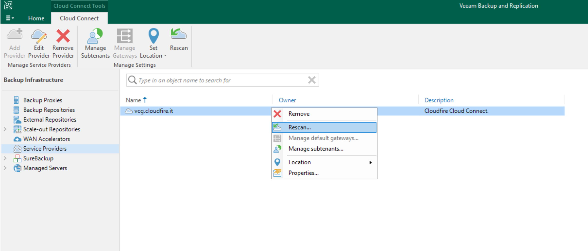
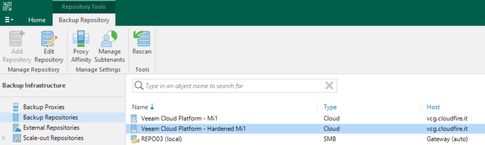
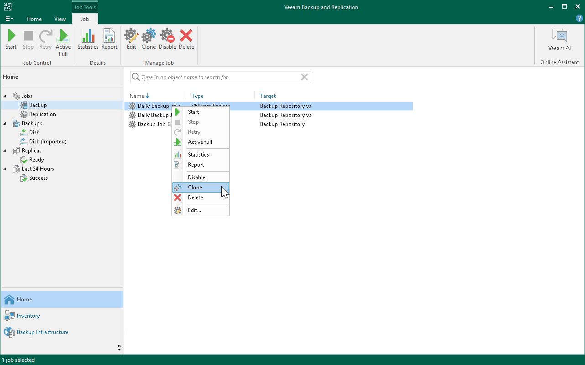
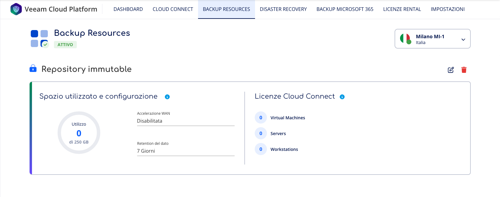

Di seguito verrà illustrata la procedura per migrare tutti job che utilizzano attualmente il nostro repository Cloud Connect verso i nostri nuovi **hardened repository**, con immutabilità.

> [!INFO]
> Si tratta di una riconfigurazione dei backup job, con una modifica dei puntamenti verso il nuovo cloud repository. **I restore point sul vecchio repository non verrano spostati**.

> [!WARNING]
> Tale procedura è valida attualmente solo per la region **Milano MI1**, la quale di default offre l’hardened repository.  
> Per la region Bologna BO-1 il repository di default è quello legacy.

1. **Rescan del Service Provider**  
Come prima cosa, bisognerà collegarsi al proprio server Veeam e sotto la voce *Backup Infrastructure* spostarsi dentro *Service Providers*. Da qui, selezionare selezionare il gateway CloudFire e poi far partire il **Rescan**.  

  
Spostandosi sotto la voce *Backup Repositories* sarà presente il nuovo Cloud repository, con la voce “Hardened”.  

  
2. **Configurazione dei backup job**  
Sarà quindi possibile ora **clonare** i backup job esistenti e specificare il nuovo repository.  
**Il job d’origine va disabilitato** per evitare che continui a scrivere sullo storage legacy, mentre il nuovo inizierà a trasferire i dati creando una nuova catena di backup sullo storage immutable.  

  
Una volta che sul nuovo repository si avrà il numero desiderato di restore point, sarà possibile eliminare il backup job d'origine e i relativi backup “orfani” sul vecchio storage. Successivamente, nella voce *Backup Resources* di *Veeam Cloud Platform*, si potrà procedere con l’**eliminazione del servizio “Repository legacy”** per far apparire in automatico il nuovo **“Repository immutable”**.  
