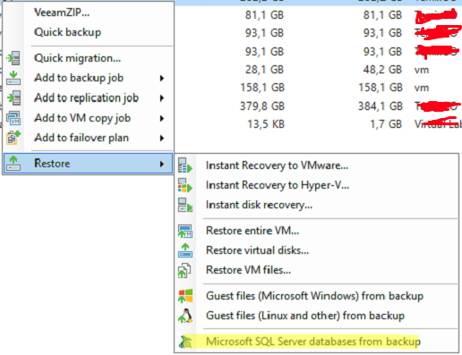
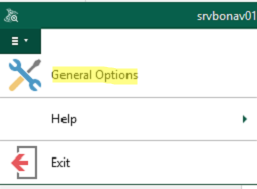
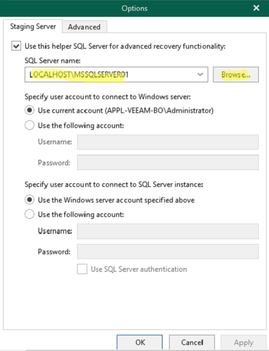

Veeam di default installa una versione di sql express che non permette l’apertura di database maggiori ai 10gb.  
Per ovviare alla problematica occorre installare **Microsoft SQL Developer** (sql senza limiti all’apertura di file di dati).

Una volta installato il programma:

[SQL2019-SSEI-Dev.exe](./attachments/SQL2019-SSEI-Dev.exe)

Bisogna configurare il nuovo server di staging all’interno di veeam explorer for SQL.

1. Aprire Veeam client
2. Selezionare la macchina dalla quale ripristinare la tabella sul quale è presente il db fare tasto destro e:
  
3\. Selezionare l’opzione evidenziata in figura.  
4\. Selezionare il restore point

5\. Selezionare il riquadro in alto a sinistra:

6\. Click su General Options:

Selezionare il server SQL appena installato.

7\. FINE