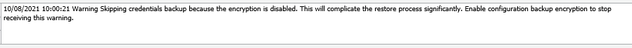

Per disabilitare il seguente errore di Veeam:

  
L’errore è dovuto alla mancanza di password di encryption sulle credenziali salvate sul db locale di veeam per accedere alle macchine associate alla console Veeam.

Per sopprimere il warning bisogna inserire sotto il seguente path dell’editor di registro:

`HKEY_LOCAL_MACHINE\SOFTWARE\Veeam\Veeam Backup and Replication Key`  
  
La seguente chiave DWORD e assegnarle il valore 1:

`"ConfigurationBackupSuppressEncryptionWarning", DWORD, value "1"`