## Modificare le credenziali d’accesso

1. Accedere a Cortex e recarsi sulla pagina del servizio Veeam Cloud Platform
2. Selezionare “Reimposta password” dal riquadro Veeam Cloud Connect e configurare una nuova password (consigliamo una password complessa: minimo 10 caratteri, maiuscole, minuscole, cifre e caratteri speciali)

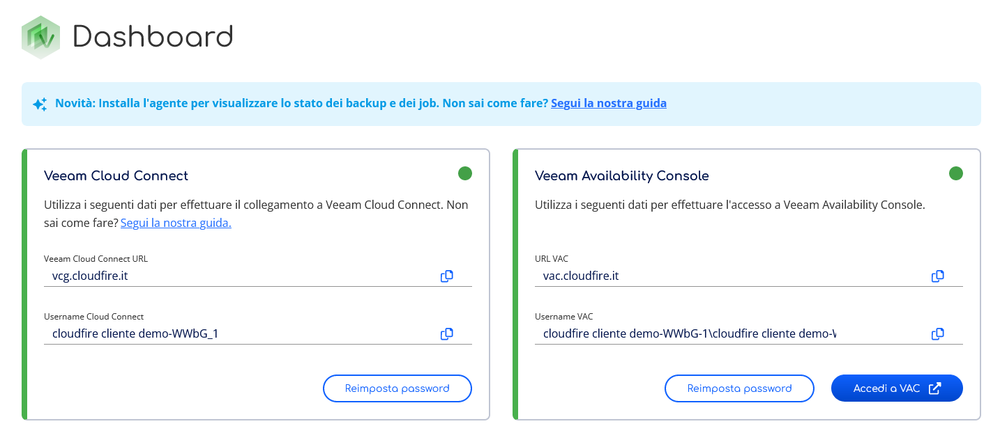

3\. Nel riquadro Veeam Cloud Connect sono inoltre presenti il nuovo gateway URL ([vcg.cloudfire.it](http://vcg.cloudfire.it)) e il nuovo username (… \_1), che serviranno nei passaggi successivi

## Modificare il Service Provider

1. Collegarsi alla console Veeam Backup and Replication
2. Sezione **Backup Infrastructure** → **Add Provider**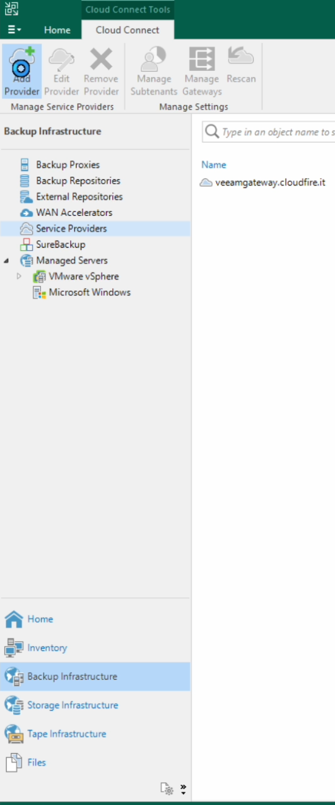
3. Configurare DNS name [**vcg.cloudfire.it**](http://vcg.cloudfire.it)  
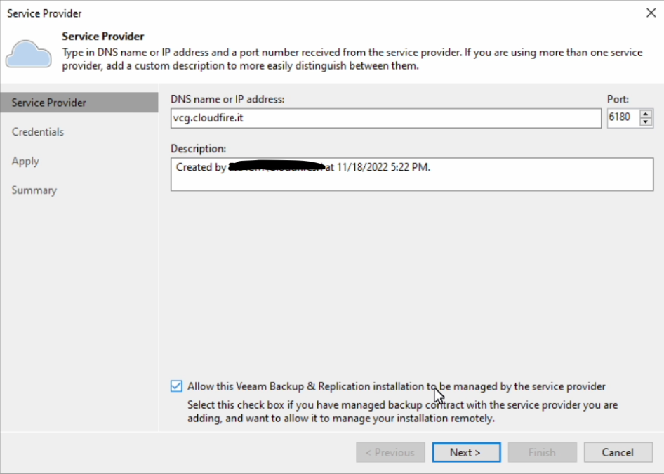
  
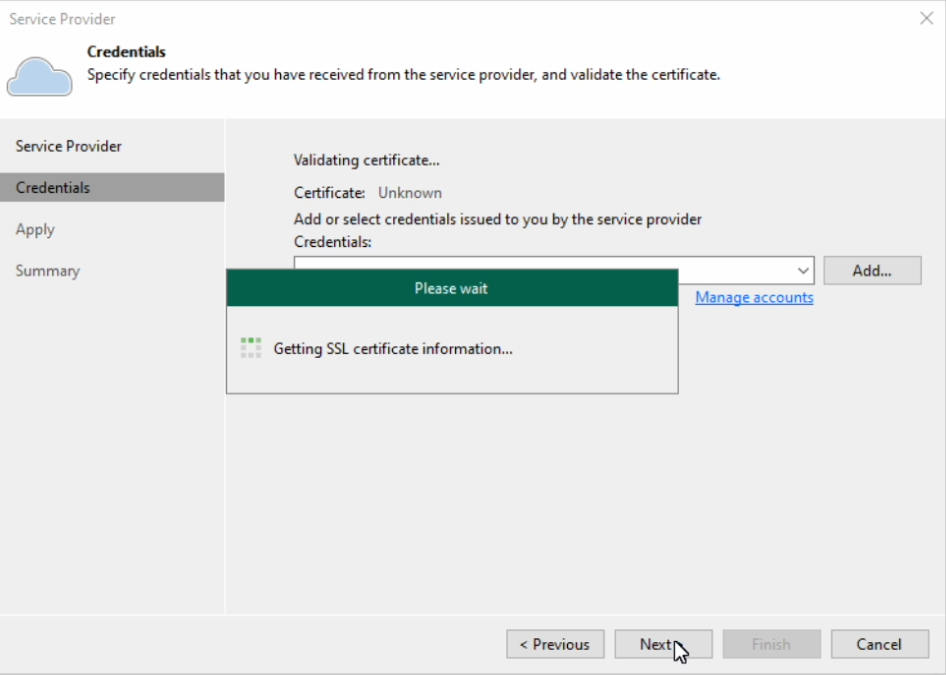

4\. Creare / Selezionare le nuove credenziali ( **username nuovo finisce con \_1** )  

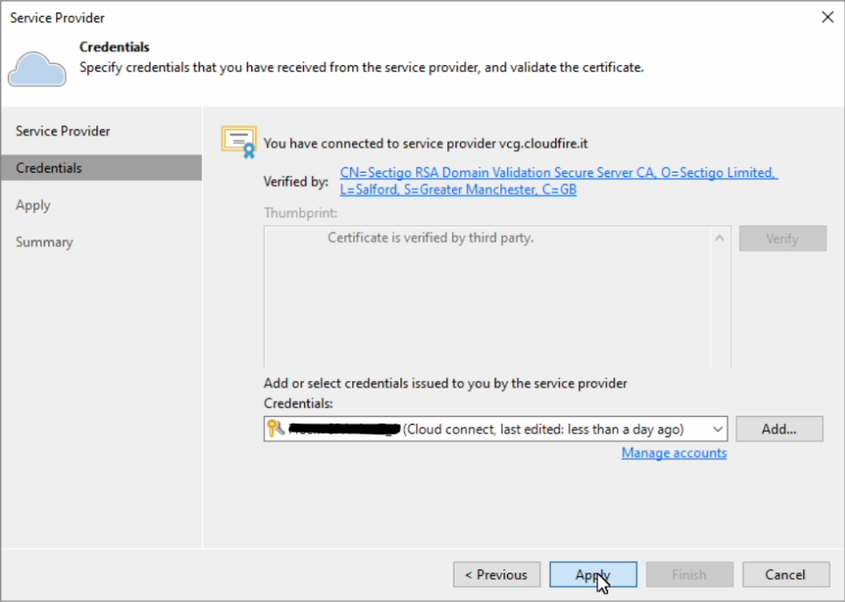

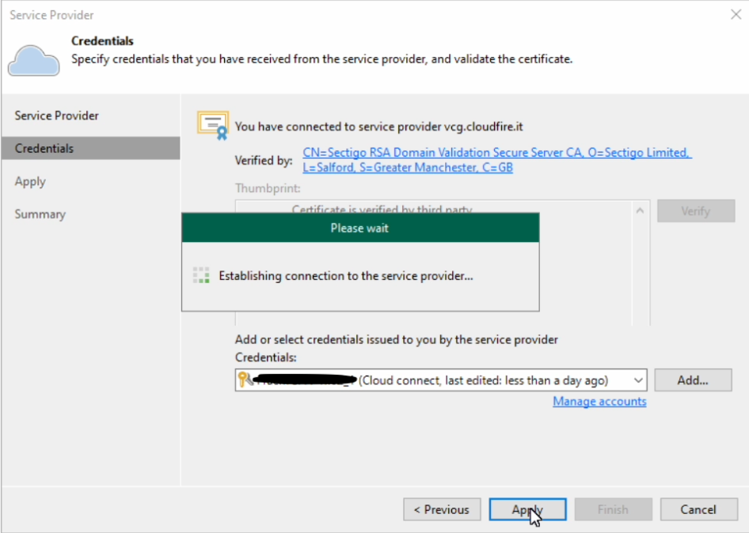

5\. Verificare che il Repository sia **Veeam Cloud Platform - Mi1**  

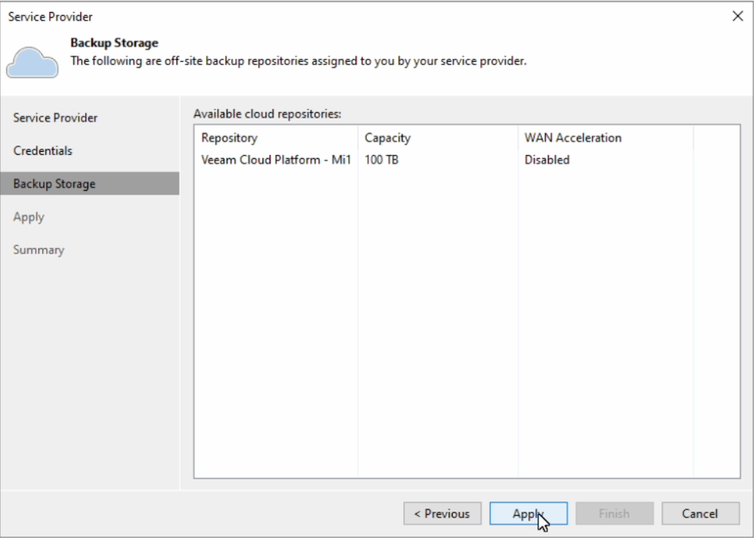

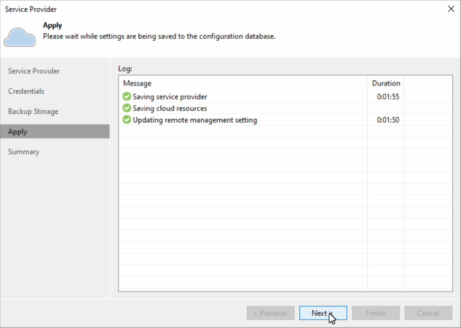

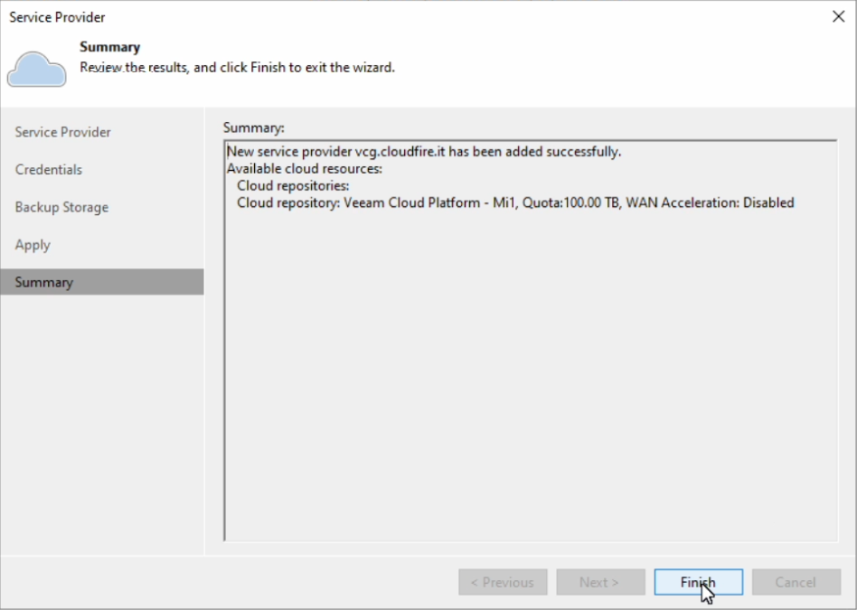

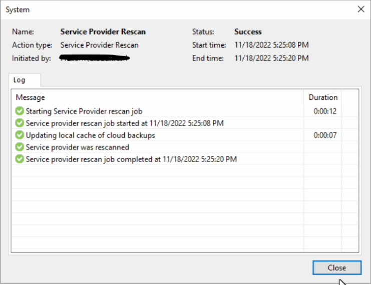

## Modificare Job di Backup Copy

1. Sezione **Home** → **Jobs** → **Backup Copy**  
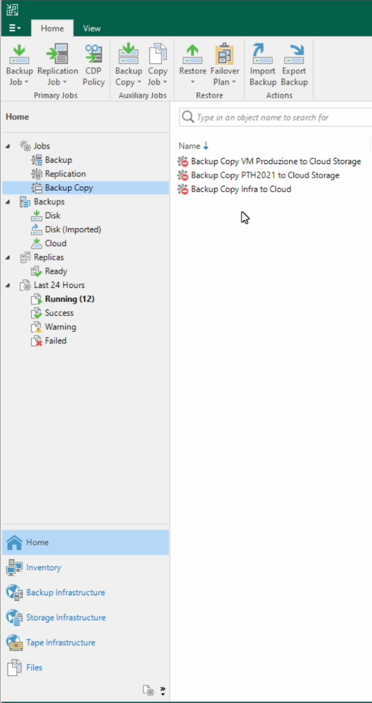
2. Selezionare un job per volta quindi **Disable**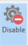
3. Clonare il primo job **Selezionando il job** → **Clone**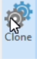
4. Editare il job **CLONATO** cliccando **Tasto DESTRO** → **Edit** : Portarsi alla voce **Target** quindi modificare dal menu a tendina il **Backup repository** da CloudFireMIrepo1 a **Veeam Cloud Platform - Mi1**  
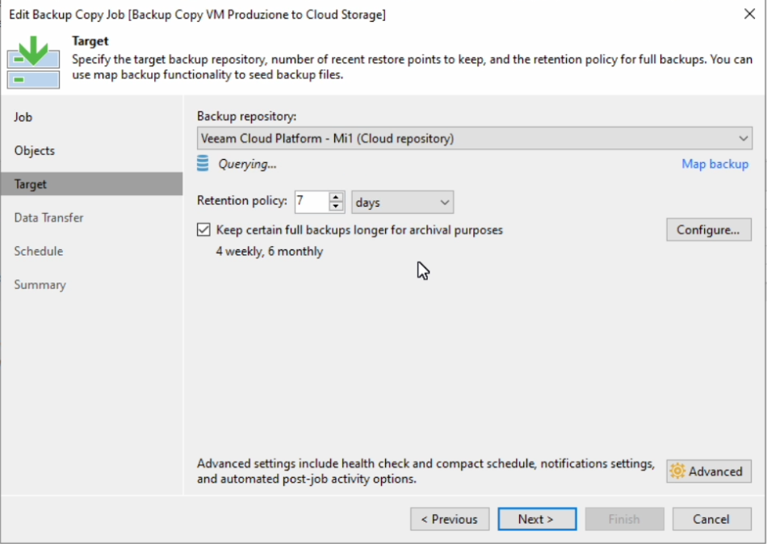
5. Selezionare **Next** fino al termine della procedura selezionando **Enable the job when I click Finish**  
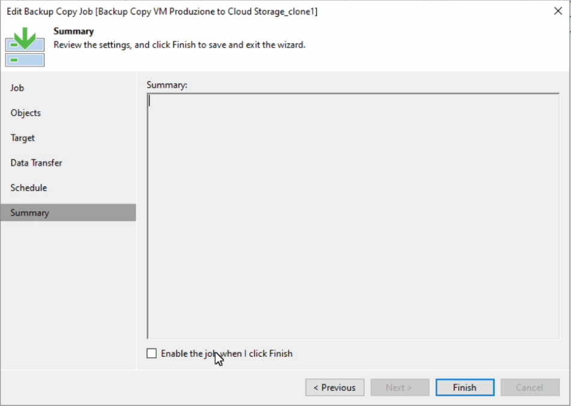

> [!CAUTION]
> Per gli altri tipi di job è necessario procedere con la modifica del **Backup Repository** nella sezione **Target**